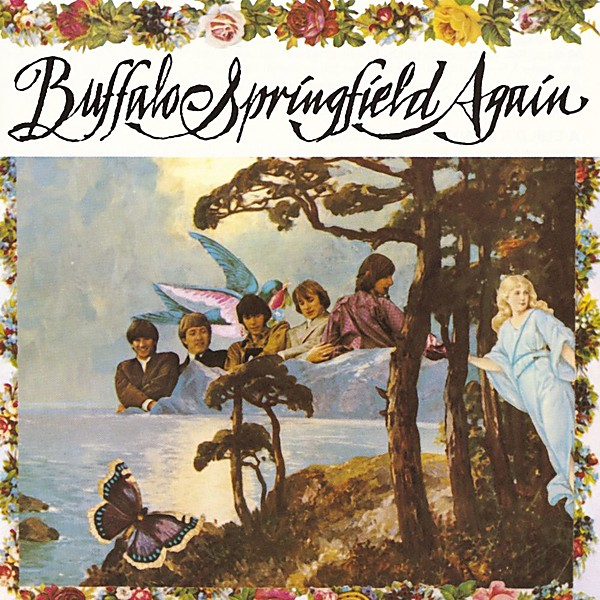

# Buffalo Springfield Again

By **Buffalo Springfield**

## Album Data

- **Catalog:** Beets
- **Format:** Digital, Album
- **Album:** Buffalo Springfield Again
- **Artist:** Buffalo Springfield
- **Albumartist:** Buffalo Springfield
- **Genre:** Psychedelic Rock
- **MusicBrainz Album Artist ID:** [22dc19af-d085-4c9b-adfb-22ec256251f1](https://musicbrainz.org/artist/22dc19af-d085-4c9b-adfb-22ec256251f1)
- **MusicBrainz Album ID:** [dea5becc-bfe5-3ad1-8453-423ed8825624](https://musicbrainz.org/release/dea5becc-bfe5-3ad1-8453-423ed8825624)
- **MusicBrainz Release Group ID:** [28768f4d-dd43-382d-a56f-79ddfa6597a9](https://musicbrainz.org/release-group/28768f4d-dd43-382d-a56f-79ddfa6597a9)
- **Year:** 1999
- **Catalog #:** 90391-2
- **Label:** ATCO Records
- **Total Tracks:** 10

## Album Tracks

### Track 01 - Mr. Soul

- **Artist:** Buffalo Springfield
- **Format:** MP3
- **Genre:** Psychedelic Rock
- **Length:** 2:48
- **MusicBrainz Track ID:** [09654919-2a53-46bc-9890-caf330ceb3d3](https://musicbrainz.org/recording/09654919-2a53-46bc-9890-caf330ceb3d3)
- **Title:** Mr. Soul
- **Track:** 01
- **Year:** 1999

### Track 02 - A Child’s Claim to Fame

- **Artist:** Buffalo Springfield
- **Format:** MP3
- **Genre:** Psychedelic Rock
- **Length:** 2:10
- **MusicBrainz Track ID:** [7eabaec8-52c9-42d6-b7c0-ff5b2247e0a0](https://musicbrainz.org/recording/7eabaec8-52c9-42d6-b7c0-ff5b2247e0a0)
- **Title:** A Child’s Claim to Fame
- **Track:** 02
- **Year:** 1999

### Track 03 - Everydays

- **Artist:** Buffalo Springfield
- **Format:** MP3
- **Genre:** Soul
- **Length:** 2:40
- **MusicBrainz Track ID:** [b877935b-2a0c-4801-9198-f3f51d57bd9f](https://musicbrainz.org/recording/b877935b-2a0c-4801-9198-f3f51d57bd9f)
- **Title:** Everydays
- **Track:** 03
- **Year:** 1999

### Track 04 - Expecting to Fly

- **Artist:** Buffalo Springfield
- **Format:** MP3
- **Genre:** Psychedelic Rock
- **Length:** 3:41
- **MusicBrainz Track ID:** [821010f2-636f-4605-82fd-0eff77ded494](https://musicbrainz.org/recording/821010f2-636f-4605-82fd-0eff77ded494)
- **Title:** Expecting to Fly
- **Track:** 04
- **Year:** 1999

### Track 05 - Bluebird

- **Artist:** Buffalo Springfield
- **Format:** MP3
- **Genre:** Folk Rock
- **Length:** 4:29
- **MusicBrainz Track ID:** [4863766d-aa30-4eff-843b-b5115325a997](https://musicbrainz.org/recording/4863766d-aa30-4eff-843b-b5115325a997)
- **Title:** Bluebird
- **Track:** 05
- **Year:** 1999

### Track 06 - Hung Upside Down

- **Artist:** Buffalo Springfield
- **Format:** MP3
- **Genre:** Rock And Roll
- **Length:** 3:27
- **MusicBrainz Track ID:** [beb472a2-d9f3-43b9-98cb-ffaf9864a86e](https://musicbrainz.org/recording/beb472a2-d9f3-43b9-98cb-ffaf9864a86e)
- **Title:** Hung Upside Down
- **Track:** 06
- **Year:** 1999

### Track 07 - Sad Memory

- **Artist:** Buffalo Springfield
- **Format:** MP3
- **Genre:** Folk Rock
- **Length:** 3:00
- **MusicBrainz Track ID:** [2a11c36e-4c14-4d78-bd96-a1e258a45248](https://musicbrainz.org/recording/2a11c36e-4c14-4d78-bd96-a1e258a45248)
- **Title:** Sad Memory
- **Track:** 07
- **Year:** 1999

### Track 08 - Good Time Boy

- **Artist:** Buffalo Springfield
- **Format:** MP3
- **Genre:** Soul
- **Length:** 2:13
- **MusicBrainz Track ID:** [111bdb5e-8731-4b0b-b6dd-df85b789e2bb](https://musicbrainz.org/recording/111bdb5e-8731-4b0b-b6dd-df85b789e2bb)
- **Title:** Good Time Boy
- **Track:** 08
- **Year:** 1999

### Track 09 - Rock & Roll Woman

- **Artist:** Buffalo Springfield
- **Format:** MP3
- **Genre:** Progressive Rock
- **Length:** 2:36
- **MusicBrainz Track ID:** [623ed55e-1dc8-4bff-9c55-c7026b789165](https://musicbrainz.org/recording/623ed55e-1dc8-4bff-9c55-c7026b789165)
- **Title:** Rock & Roll Woman
- **Track:** 09
- **Year:** 1999

### Track 10 - Broken Arrow

- **Artist:** Buffalo Springfield
- **Format:** MP3
- **Genre:** Folk Rock
- **Length:** 6:14
- **MusicBrainz Track ID:** [cdb7ea04-5c38-4669-926d-fe7830ae1ce6](https://musicbrainz.org/recording/cdb7ea04-5c38-4669-926d-fe7830ae1ce6)
- **Title:** Broken Arrow
- **Track:** 10
- **Year:** 1999

## See also

- [Buffalo Springfield](Buffalo_Springfield.md)
- [Roon: Buffalo Springfield Again](../../Roon/Buffalo_Springfield/Buffalo_Springfield_Again.md)
- [Roon: Buffalo Springfield](../../Roon/Buffalo_Springfield/Buffalo_Springfield.md)
- [Roon: Last Time Around](../../Roon/Buffalo_Springfield/Last_Time_Around.md)
- [Roon: Retrospective](../../Roon/Buffalo_Springfield/Retrospective-_The_Best_Of_Buffalo_Springfield.md)
- [Roon: What's That Sound? - Complete Albums Collection (Remastered) (2018 Remaster)](../../Roon/Buffalo_Springfield/Whats_That_Sound_-_Complete_Albums_Collection_Remastered_2018_Remaster.md)
- [Vinyl: ](../../Vinyl/Buffalo_Springfield/Buffalo_Springfield.md)
- [Vinyl: Last Time Around](../../Vinyl/Buffalo_Springfield/Last_Time_Around.md)
- [Vinyl: Rock 'N' Roll Woman / A Child's Claim To Fame](../../Vinyl/Buffalo_Springfield/Rock_N_Roll_Woman_-_A_Childs_Claim_To_Fame.md)
