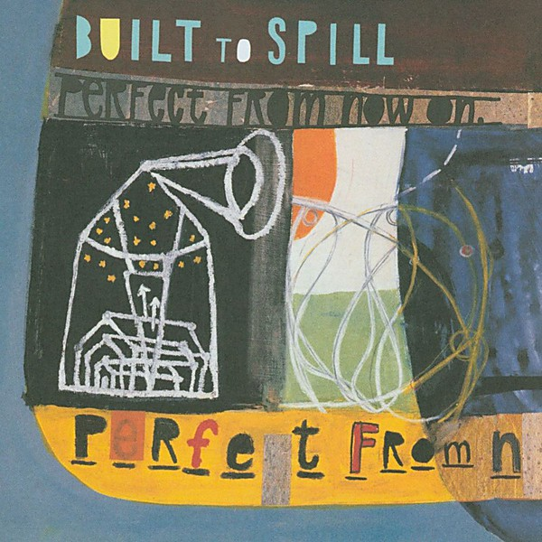

# Perfect From Now On

By **Built to Spill**

## Album Data

- **Catalog:** Beets
- **Format:** Digital, Album
- **Album:** Perfect From Now On
- **Artist:** Built To Spill
- **Albumartist:** Built to Spill
- **Genre:** Indie Rock
- **MusicBrainz Album Artist ID:** [3ac482b8-1494-4071-a0e9-f192f9d2c2b0](https://musicbrainz.org/artist/3ac482b8-1494-4071-a0e9-f192f9d2c2b0)
- **MusicBrainz Album ID:** [524c5a17-1f08-4d05-8bb5-bed5735dd96e](https://musicbrainz.org/release/524c5a17-1f08-4d05-8bb5-bed5735dd96e)
- **MusicBrainz Release Group ID:** [e79d22e8-bad6-4b4b-a7b1-ea62796b7eee](https://musicbrainz.org/release-group/e79d22e8-bad6-4b4b-a7b1-ea62796b7eee)
- **Year:** 1997
- **Catalog #:** 49363-2
- **Label:** Warner Bros. Records
- **Total Tracks:** 10

## Album Tracks

### Track 01 - Goin’ Against Your Mind

- **Artist:** Built to Spill
- **Format:** ALAC
- **Genre:** Indie Rock
- **Length:** 8:42
- **MusicBrainz Track ID:** [b9d7d28f-f3a4-40ff-9a3a-ebe382c3ee92](https://musicbrainz.org/recording/b9d7d28f-f3a4-40ff-9a3a-ebe382c3ee92)
- **Title:** Goin’ Against Your Mind
- **Track:** 01
- **Year:** 2006

### Track 02 - Traces

- **Artist:** Built to Spill
- **Format:** ALAC
- **Genre:** Indie Rock
- **Length:** 4:42
- **MusicBrainz Track ID:** [71b4fdd3-d388-4076-b74f-f0ad33b4d069](https://musicbrainz.org/recording/71b4fdd3-d388-4076-b74f-f0ad33b4d069)
- **Title:** Traces
- **Track:** 02
- **Year:** 2006

### Track 03 - Liar

- **Artist:** Built to Spill
- **Format:** ALAC
- **Genre:** Indie Rock
- **Length:** 5:11
- **MusicBrainz Track ID:** [1c4a3f86-4b4c-47b4-b55f-e75e43d88f14](https://musicbrainz.org/recording/1c4a3f86-4b4c-47b4-b55f-e75e43d88f14)
- **Title:** Liar
- **Track:** 03
- **Year:** 2006

### Track 04 - Saturday

- **Artist:** Built to Spill
- **Format:** ALAC
- **Genre:** Indie Rock
- **Length:** 2:24
- **MusicBrainz Track ID:** [4637b459-8bda-4fff-b4aa-75a04684759a](https://musicbrainz.org/recording/4637b459-8bda-4fff-b4aa-75a04684759a)
- **Title:** Saturday
- **Track:** 04
- **Year:** 2006

### Track 05 - Wherever You Go

- **Artist:** Built to Spill
- **Format:** ALAC
- **Genre:** Indie Rock
- **Length:** 6:10
- **MusicBrainz Track ID:** [9a943c69-ed74-4eb2-8d7d-1c4f018d7b8f](https://musicbrainz.org/recording/9a943c69-ed74-4eb2-8d7d-1c4f018d7b8f)
- **Title:** Wherever You Go
- **Track:** 05
- **Year:** 2006

### Track 06 - Conventional Wisdom

- **Artist:** Built to Spill
- **Format:** ALAC
- **Genre:** Indie Rock
- **Length:** 6:21
- **MusicBrainz Track ID:** [c439c57a-c11e-458f-92fd-050c7babec32](https://musicbrainz.org/recording/c439c57a-c11e-458f-92fd-050c7babec32)
- **Title:** Conventional Wisdom
- **Track:** 06
- **Year:** 2006

### Track 07 - Gone

- **Artist:** Built to Spill
- **Format:** ALAC
- **Genre:** Indie Rock
- **Length:** 5:41
- **MusicBrainz Track ID:** [bdee42a9-e201-4469-8109-c8643e14ef2d](https://musicbrainz.org/recording/bdee42a9-e201-4469-8109-c8643e14ef2d)
- **Title:** Gone
- **Track:** 07
- **Year:** 2006

### Track 08 - Mess With Time

- **Artist:** Built to Spill
- **Format:** ALAC
- **Genre:** Indie Rock
- **Length:** 5:42
- **MusicBrainz Track ID:** [6a12bb6f-aa0f-44da-b666-f434c950563c](https://musicbrainz.org/recording/6a12bb6f-aa0f-44da-b666-f434c950563c)
- **Title:** Mess With Time
- **Track:** 08
- **Year:** 2006

### Track 09 - Just a Habit

- **Artist:** Built to Spill
- **Format:** ALAC
- **Genre:** Indie Rock
- **Length:** 4:27
- **MusicBrainz Track ID:** [a4905147-01c9-4ac2-8759-a23f4bb5e4eb](https://musicbrainz.org/recording/a4905147-01c9-4ac2-8759-a23f4bb5e4eb)
- **Title:** Just a Habit
- **Track:** 09
- **Year:** 2006

### Track 10 - The Wait

- **Artist:** Built to Spill
- **Format:** ALAC
- **Genre:** Indie Rock
- **Length:** 5:00
- **MusicBrainz Track ID:** [5b0a4e79-2c2d-46b8-b9b0-95a6eac119ba](https://musicbrainz.org/recording/5b0a4e79-2c2d-46b8-b9b0-95a6eac119ba)
- **Title:** The Wait
- **Track:** 10
- **Year:** 2006

## See also

- [You in Reverse](You_in_Reverse.md)
