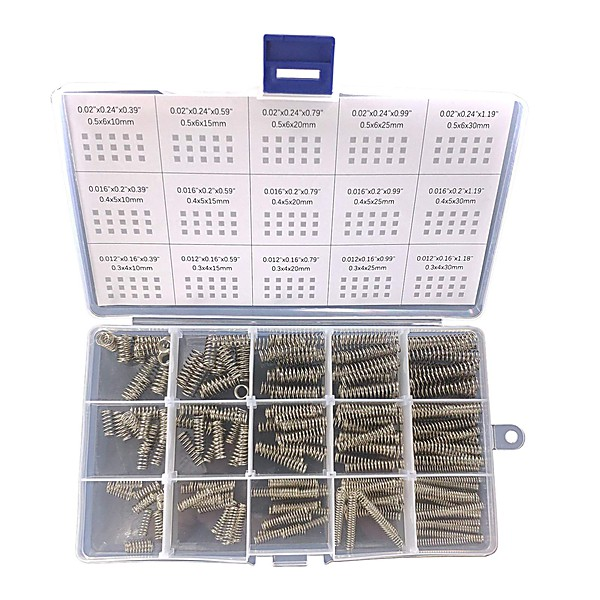

# Napalm Springs

By **Butterfly Jones**

## Album Data

- **Catalog:** Beets
- **Format:** Digital, Album
- **Album:** Napalm Springs
- **Artist:** Butterfly Jones
- **Albumartist:** Butterfly Jones
- **Genre:** Unknown
- **MusicBrainz Album Artist ID:** [18fdcd1e-9811-476c-ab27-c77868a172cf](https://musicbrainz.org/artist/18fdcd1e-9811-476c-ab27-c77868a172cf)
- **MusicBrainz Album ID:** [d3ce59b0-d870-41eb-982b-04771e7e7251](https://musicbrainz.org/release/d3ce59b0-d870-41eb-982b-04771e7e7251)
- **MusicBrainz Release Group ID:** [102d40a0-cf59-3a95-9a9d-070d67c87bee](https://musicbrainz.org/release-group/102d40a0-cf59-3a95-9a9d-070d67c87bee)
- **Year:** 2001
- **Catalog #:** 79590-2
- **Label:** Vanguard
- **Total Tracks:** 14

## Album Tracks

### Track 01 - Napalm Springs

- **Artist:** Butterfly Jones
- **Format:** AAC
- **Genre:** Unknown
- **Length:** 4:19
- **MusicBrainz Track ID:** [d1921639-a2b5-4cf4-878d-16b5bd1398c7](https://musicbrainz.org/recording/d1921639-a2b5-4cf4-878d-16b5bd1398c7)
- **Title:** Napalm Springs
- **Track:** 01
- **Year:** 2001

### Track 02 - Suicide Bridge

- **Artist:** Butterfly Jones
- **Format:** AAC
- **Genre:** Unknown
- **Length:** 4:25
- **MusicBrainz Track ID:** [216ec31c-6c42-4746-9c2d-035591768150](https://musicbrainz.org/recording/216ec31c-6c42-4746-9c2d-035591768150)
- **Title:** Suicide Bridge
- **Track:** 02
- **Year:** 2001

### Track 03 - Anywhere but Now

- **Artist:** Butterfly Jones
- **Format:** AAC
- **Genre:** Unknown
- **Length:** 3:44
- **MusicBrainz Track ID:** [1fbd86eb-18ef-4c16-a1c2-468951008e99](https://musicbrainz.org/recording/1fbd86eb-18ef-4c16-a1c2-468951008e99)
- **Title:** Anywhere but Now
- **Track:** 03
- **Year:** 2001

### Track 04 - Sophie

- **Artist:** Butterfly Jones
- **Format:** AAC
- **Genre:** Unknown
- **Length:** 3:05
- **MusicBrainz Track ID:** [672c5bb9-2e94-41d8-b7b9-f4fd0753788a](https://musicbrainz.org/recording/672c5bb9-2e94-41d8-b7b9-f4fd0753788a)
- **Title:** Sophie
- **Track:** 04
- **Year:** 2001

### Track 05 - Alright

- **Artist:** Butterfly Jones
- **Format:** AAC
- **Genre:** Unknown
- **Length:** 6:01
- **MusicBrainz Track ID:** [0345584b-d0f6-4203-a64a-fcfa40b5d8e9](https://musicbrainz.org/recording/0345584b-d0f6-4203-a64a-fcfa40b5d8e9)
- **Title:** Alright
- **Track:** 05
- **Year:** 2001

### Track 06 - Are We in Love Again

- **Artist:** Butterfly Jones
- **Format:** AAC
- **Genre:** Unknown
- **Length:** 3:28
- **MusicBrainz Track ID:** [bce35cea-b5c4-497f-962d-99d0d61fc271](https://musicbrainz.org/recording/bce35cea-b5c4-497f-962d-99d0d61fc271)
- **Title:** Are We in Love Again
- **Track:** 06
- **Year:** 2001

### Track 07 - Wonder

- **Artist:** Butterfly Jones
- **Format:** AAC
- **Genre:** Unknown
- **Length:** 3:12
- **MusicBrainz Track ID:** [e62e2542-50f8-47d2-afea-b5a5f39b816b](https://musicbrainz.org/recording/e62e2542-50f8-47d2-afea-b5a5f39b816b)
- **Title:** Wonder
- **Track:** 07
- **Year:** 2001

### Track 08 - Sunshine and Ecstasy

- **Artist:** Butterfly Jones
- **Format:** AAC
- **Genre:** Unknown
- **Length:** 2:53
- **MusicBrainz Track ID:** [ba1d56d1-bd78-41f2-a559-60ecffa806ca](https://musicbrainz.org/recording/ba1d56d1-bd78-41f2-a559-60ecffa806ca)
- **Title:** Sunshine and Ecstasy
- **Track:** 08
- **Year:** 2001

### Track 09 - Blue Roses

- **Artist:** Butterfly Jones
- **Format:** AAC
- **Genre:** Unknown
- **Length:** 4:06
- **MusicBrainz Track ID:** [13136b2e-f2fa-4dfb-9387-06d464e4a0f5](https://musicbrainz.org/recording/13136b2e-f2fa-4dfb-9387-06d464e4a0f5)
- **Title:** Blue Roses
- **Track:** 09
- **Year:** 2001

### Track 10 - The Systematic Dumbing Down of Terry Constance Jones

- **Artist:** Butterfly Jones
- **Format:** AAC
- **Genre:** Unknown
- **Length:** 3:43
- **MusicBrainz Track ID:** [7e639e71-fc88-46af-8124-6d25120fb03a](https://musicbrainz.org/recording/7e639e71-fc88-46af-8124-6d25120fb03a)
- **Title:** The Systematic Dumbing Down of Terry Constance Jones
- **Track:** 10
- **Year:** 2001

### Track 11 - When People Are Mean

- **Artist:** Butterfly Jones
- **Format:** AAC
- **Genre:** Unknown
- **Length:** 2:44
- **MusicBrainz Track ID:** [fd800a74-5c68-48fa-9626-f0e826a1997d](https://musicbrainz.org/recording/fd800a74-5c68-48fa-9626-f0e826a1997d)
- **Title:** When People Are Mean
- **Track:** 11
- **Year:** 2001

### Track 12 - It's Cool Dude

- **Artist:** Butterfly Jones
- **Format:** AAC
- **Genre:** Unknown
- **Length:** 4:15
- **MusicBrainz Track ID:** [ef69f088-7572-4ca0-9c84-f2456a04fda9](https://musicbrainz.org/recording/ef69f088-7572-4ca0-9c84-f2456a04fda9)
- **Title:** It's Cool Dude
- **Track:** 12
- **Year:** 2001

### Track 13 - Dreamtime

- **Artist:** Butterfly Jones
- **Format:** AAC
- **Genre:** Unknown
- **Length:** 3:12
- **MusicBrainz Track ID:** [e4f7c816-c7d7-4158-bf14-eada45b39150](https://musicbrainz.org/recording/e4f7c816-c7d7-4158-bf14-eada45b39150)
- **Title:** Dreamtime
- **Track:** 13
- **Year:** 2001

### Track 14 - Please

- **Artist:** Butterfly Jones
- **Format:** AAC
- **Genre:** Unknown
- **Length:** 3:05
- **MusicBrainz Track ID:** [aa387267-d1bb-43f3-a4cd-0688df2f8fb7](https://musicbrainz.org/recording/aa387267-d1bb-43f3-a4cd-0688df2f8fb7)
- **Title:** Please
- **Track:** 14
- **Year:** 2001

## See also

- [Roon: Napalm Springs](../../Roon/Butterfly_Jones/Napalm_Springs.md)
