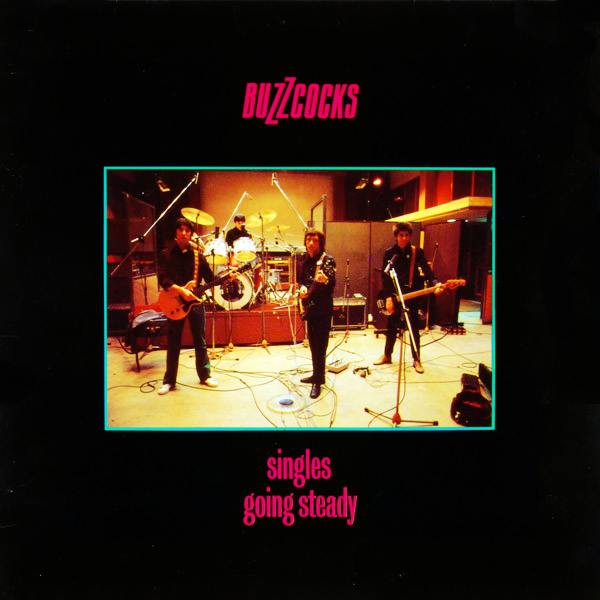

# Singles Going Steady

By **Buzzcocks**

## Album Data

- **Catalog:** Beets
- **Format:** Digital, Album
- **Album:** Singles Going Steady
- **Artist:** Buzzcocks
- **Albumartist:** Buzzcocks
- **Genre:** Pop Punk
- **MusicBrainz Album Artist ID:** [31e9c35b-2675-4632-8596-f9bd9286f6c8](https://musicbrainz.org/artist/31e9c35b-2675-4632-8596-f9bd9286f6c8)
- **MusicBrainz Album ID:** [5d127571-ea73-45ea-ad1b-7fa030696607](https://musicbrainz.org/release/5d127571-ea73-45ea-ad1b-7fa030696607)
- **MusicBrainz Release Group ID:** [6a537b72-0bd3-38c5-8aa1-0527e6e9a2f3](https://musicbrainz.org/release-group/6a537b72-0bd3-38c5-8aa1-0527e6e9a2f3)
- **Year:** 1992
- **Catalog #:** CD 001
- **Label:** I.R.S. Records
- **Total Tracks:** 16

## Album Tracks

### Track 01 - Orgasm Addict

- **Artist:** Buzzcocks
- **Format:** ALAC
- **Genre:** Punk Rock
- **Length:** 2:06
- **MusicBrainz Track ID:** [264a795b-7ab0-49f2-be2a-1f8dc53e97e9](https://musicbrainz.org/recording/264a795b-7ab0-49f2-be2a-1f8dc53e97e9)
- **Title:** Orgasm Addict
- **Track:** 01
- **Year:** 1992

### Track 02 - What Do I Get?

- **Artist:** Buzzcocks
- **Format:** ALAC
- **Genre:** Punk Rock
- **Length:** 2:57
- **MusicBrainz Track ID:** [d3892700-d0d1-45c2-99f7-66c610dd09b7](https://musicbrainz.org/recording/d3892700-d0d1-45c2-99f7-66c610dd09b7)
- **Title:** What Do I Get?
- **Track:** 02
- **Year:** 1992

### Track 03 - I Don’t Mind

- **Artist:** Buzzcocks
- **Format:** ALAC
- **Genre:** Pop Punk
- **Length:** 2:20
- **MusicBrainz Track ID:** [21fa8fa2-ccc2-4e67-bddd-56ece8cdebf3](https://musicbrainz.org/recording/21fa8fa2-ccc2-4e67-bddd-56ece8cdebf3)
- **Title:** I Don’t Mind
- **Track:** 03
- **Year:** 1992

### Track 04 - Love You More

- **Artist:** Buzzcocks
- **Format:** ALAC
- **Genre:** Punk Rock
- **Length:** 1:52
- **MusicBrainz Track ID:** [890f5d96-b1c9-4786-875d-879f31ef1936](https://musicbrainz.org/recording/890f5d96-b1c9-4786-875d-879f31ef1936)
- **Title:** Love You More
- **Track:** 04
- **Year:** 1992

### Track 05 - Ever Fallen in Love?

- **Artist:** Buzzcocks
- **Format:** ALAC
- **Genre:** Punk Rock
- **Length:** 2:43
- **MusicBrainz Track ID:** [ed2341bc-1db8-4464-826f-d8ad134099cb](https://musicbrainz.org/recording/ed2341bc-1db8-4464-826f-d8ad134099cb)
- **Title:** Ever Fallen in Love?
- **Track:** 05
- **Year:** 1992

### Track 06 - Promises

- **Artist:** Buzzcocks
- **Format:** ALAC
- **Genre:** Punk Rock
- **Length:** 2:37
- **MusicBrainz Track ID:** [d519a2fa-55c0-4a6f-a86a-d97072f806a5](https://musicbrainz.org/recording/d519a2fa-55c0-4a6f-a86a-d97072f806a5)
- **Title:** Promises
- **Track:** 06
- **Year:** 1992

### Track 07 - Everybody’s Happy Nowadays

- **Artist:** Buzzcocks
- **Format:** ALAC
- **Genre:** Punk Rock
- **Length:** 3:15
- **MusicBrainz Track ID:** [5e0b4dd2-ddfb-4d1c-9c82-d95ad81ac544](https://musicbrainz.org/recording/5e0b4dd2-ddfb-4d1c-9c82-d95ad81ac544)
- **Title:** Everybody’s Happy Nowadays
- **Track:** 07
- **Year:** 1992

### Track 08 - Harmony in My Head

- **Artist:** Buzzcocks
- **Format:** ALAC
- **Genre:** Punk Rock
- **Length:** 3:12
- **MusicBrainz Track ID:** [3d597987-f5fb-4a85-ae1f-0c5519bf6513](https://musicbrainz.org/recording/3d597987-f5fb-4a85-ae1f-0c5519bf6513)
- **Title:** Harmony in My Head
- **Track:** 08
- **Year:** 1992

### Track 09 - What Ever Happened To?

- **Artist:** Buzzcocks
- **Format:** ALAC
- **Genre:** Punk Rock
- **Length:** 2:14
- **MusicBrainz Track ID:** [4181efa0-c7c1-47d6-ba67-5adf891b0cb5](https://musicbrainz.org/recording/4181efa0-c7c1-47d6-ba67-5adf891b0cb5)
- **Title:** What Ever Happened To?
- **Track:** 09
- **Year:** 1992

### Track 10 - Oh Shit!

- **Artist:** Buzzcocks
- **Format:** ALAC
- **Genre:** Punk Rock
- **Length:** 1:39
- **MusicBrainz Track ID:** [c4a23e90-8c6f-4c53-957d-50822de243da](https://musicbrainz.org/recording/c4a23e90-8c6f-4c53-957d-50822de243da)
- **Title:** Oh Shit!
- **Track:** 10
- **Year:** 1992

### Track 11 - Autonomy

- **Artist:** Buzzcocks
- **Format:** ALAC
- **Genre:** Punk Rock
- **Length:** 3:47
- **MusicBrainz Track ID:** [1e2ef0e3-c4aa-462f-b441-b56fc8ca6927](https://musicbrainz.org/recording/1e2ef0e3-c4aa-462f-b441-b56fc8ca6927)
- **Title:** Autonomy
- **Track:** 11
- **Year:** 1992

### Track 12 - Noise Annoys

- **Artist:** Buzzcocks
- **Format:** ALAC
- **Genre:** Punk Rock
- **Length:** 2:54
- **MusicBrainz Track ID:** [75bcd993-eb72-401c-b65c-6203d1e90372](https://musicbrainz.org/recording/75bcd993-eb72-401c-b65c-6203d1e90372)
- **Title:** Noise Annoys
- **Track:** 12
- **Year:** 1992

### Track 13 - Just Lust

- **Artist:** Buzzcocks
- **Format:** ALAC
- **Genre:** Punk Rock
- **Length:** 3:03
- **MusicBrainz Track ID:** [65afb199-bba5-4f6d-b50e-6dcb957b8aea](https://musicbrainz.org/recording/65afb199-bba5-4f6d-b50e-6dcb957b8aea)
- **Title:** Just Lust
- **Track:** 13
- **Year:** 1992

### Track 14 - Lipstick

- **Artist:** Buzzcocks
- **Format:** ALAC
- **Genre:** Pop Punk
- **Length:** 2:41
- **MusicBrainz Track ID:** [86a31a3b-8908-4c18-a336-ab4f083f98aa](https://musicbrainz.org/recording/86a31a3b-8908-4c18-a336-ab4f083f98aa)
- **Title:** Lipstick
- **Track:** 14
- **Year:** 1992

### Track 15 - Why Can’t I Touch It?

- **Artist:** Buzzcocks
- **Format:** ALAC
- **Genre:** Pop Punk
- **Length:** 6:41
- **MusicBrainz Track ID:** [aaae6446-e7e3-45dc-9faa-a87af91132e7](https://musicbrainz.org/recording/aaae6446-e7e3-45dc-9faa-a87af91132e7)
- **Title:** Why Can’t I Touch It?
- **Track:** 15
- **Year:** 1992

### Track 16 - Something’s Gone Wrong Again

- **Artist:** Buzzcocks
- **Format:** ALAC
- **Genre:** Pop Punk
- **Length:** 4:34
- **MusicBrainz Track ID:** [2935d248-e7a6-4883-9ec0-9d8f8470b6a6](https://musicbrainz.org/recording/2935d248-e7a6-4883-9ec0-9d8f8470b6a6)
- **Title:** Something’s Gone Wrong Again
- **Track:** 16
- **Year:** 1992

## See also

- [Vinyl: ](../../Vinyl/Buzzcocks/Buzzcocks.md)
- [Vinyl: Strange Thing](../../Vinyl/Buzzcocks/Strange_Thing.md)
