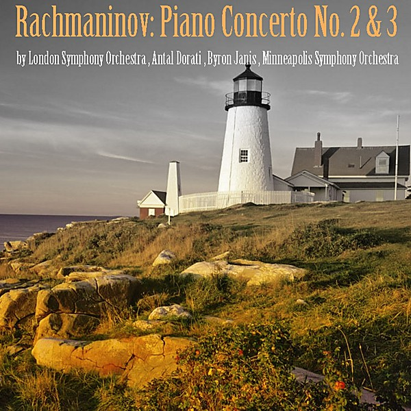

# Rachmaninoff

By **Byron Janis**

## Album Data

- **Catalog:** Beets
- **Format:** Digital, Album
- **Album:** Rachmaninoff
- **Artist:** Byron Janis
- **Albumartist:** Byron Janis
- **Genre:** Classical Music
- **MusicBrainz Album Artist ID:** 
- **MusicBrainz Album ID:** 
- **MusicBrainz Release Group ID:** 
- **Year:** 1991
- **Catalog #:** 
- **Label:** Mercury
- **Total Tracks:** 05

## Album Tracks

### Track 01 - Piano Concerto No. 2 in C minor, Op. 18

- **Artist:** Byron Janis
- **Format:** MP3
- **Genre:** Classical Music
- **Length:** 10:14
- **MusicBrainz Track ID:** 
- **Title:** Piano Concerto No. 2 in C minor, Op. 18
- **Track:** 01
- **Year:** 1991

### Track 02 - Piano Concerto No. 2 in C minor, Op. 18

- **Artist:** Byron Janis
- **Format:** MP3
- **Genre:** Classical Music
- **Length:** 9:54
- **MusicBrainz Track ID:** 
- **Title:** Piano Concerto No. 2 in C minor, Op. 18
- **Track:** 02
- **Year:** 1991

### Track 03 - Piano Concerto No. 2 in C minor, Op. 18

- **Artist:** Byron Janis
- **Format:** MP3
- **Genre:** Classical Music
- **Length:** 10:42
- **MusicBrainz Track ID:** 
- **Title:** Piano Concerto No. 2 in C minor, Op. 18
- **Track:** 03
- **Year:** 1991

### Track 04 - Preludes (10) for piano, Op.23

- **Artist:** Byron Janis
- **Format:** MP3
- **Genre:** Classical Music
- **Length:** 2:49
- **MusicBrainz Track ID:** 
- **Title:** Preludes (10) for piano, Op.23
- **Track:** 04
- **Year:** 1991

### Track 05 - Morceaux de fantaisie (5) (Second piece also known as Prelude No. 1, 'Bells of Moscow'), for piano, Op. 3

- **Artist:** Byron Janis
- **Format:** MP3
- **Genre:** Classical Music
- **Length:** 3:50
- **MusicBrainz Track ID:** 
- **Title:** Morceaux de fantaisie (5) (Second piece also known as Prelude No. 1, 'Bells of Moscow'), for piano, Op. 3
- **Track:** 05
- **Year:** 1991

