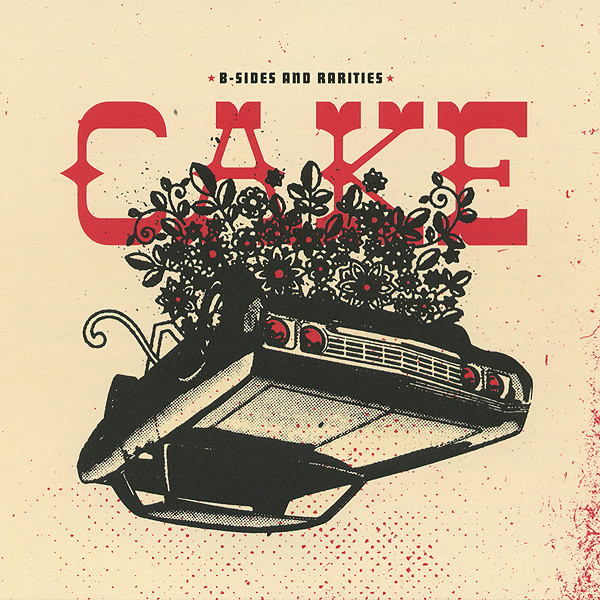

# B-Sides and Rarities

By **CAKE**

## Album Data

- **Catalog:** Beets
- **Format:** Digital, Album
- **Album:** B-Sides and Rarities
- **Artist:** Cake
- **Albumartist:** CAKE
- **Genre:** Pop Rock
- **MusicBrainz Album Artist ID:** [fa7b9055-3703-473a-8a09-adf2fe031a24](https://musicbrainz.org/artist/fa7b9055-3703-473a-8a09-adf2fe031a24)
- **MusicBrainz Album ID:** [5c0317d9-44fe-4a0d-9cf2-b5d157f2c215](https://musicbrainz.org/release/5c0317d9-44fe-4a0d-9cf2-b5d157f2c215)
- **MusicBrainz Release Group ID:** [3293dcae-c088-3fa3-ab4f-e5d66263f461](https://musicbrainz.org/release-group/3293dcae-c088-3fa3-ab4f-e5d66263f461)
- **Year:** 2007
- **Catalog #:** CKE7-69926
- **Label:** Independent Label Group
- **Total Tracks:** 02

## Album Tracks

### Track 01 - Bound Away

- **Artist:** CAKE
- **Format:** MP3
- **Genre:** Alternative Rock
- **Length:** 3:28
- **MusicBrainz Track ID:** [609e7568-2487-4537-ba46-c55d6e42f871](https://musicbrainz.org/recording/609e7568-2487-4537-ba46-c55d6e42f871)
- **Title:** Bound Away
- **Track:** 01
- **Year:** 2014

### Track 02 - Got to Move

- **Artist:** CAKE
- **Format:** MP3
- **Genre:** Indie Pop
- **Length:** 3:41
- **MusicBrainz Track ID:** [39c3b799-45c6-4117-8289-09203dc3a7e9](https://musicbrainz.org/recording/39c3b799-45c6-4117-8289-09203dc3a7e9)
- **Title:** Got to Move
- **Track:** 02
- **Year:** 2014

## See also

- [Bound Away](Bound_Away.md)
- [Comfort Eagle](Comfort_Eagle.md)
- [Fashion Nugget](Fashion_Nugget.md)
- [Long Time](Long_Time.md)
- [Motorcade of Generosity](Motorcade_of_Generosity.md)
- [Mustache Man (Wasted)](Mustache_Man_Wasted.md)
- [Pressure Chief](Pressure_Chief.md)
- [Prolonging the Magic](Prolonging_the_Magic.md)
- [Showroom of Compassion](Showroom_of_Compassion.md)
- [Sick of You](Sick_of_You.md)
- [The Winter](The_Winter.md)
- [What's Now Is Now](Whats_Now_Is_Now.md)
- [CD: ](../../CD/CAKE/CAKE.md)
- [CD: Fashion Nugget](../../CD/CAKE/Fashion_Nugget.md)
- [CD: Prolonging The Magic](../../CD/CAKE/Prolonging_The_Magic.md)
- [Roon: B-Sides and Rarities](../../Roon/CAKE/B-Sides_and_Rarities.md)
- [Roon: Comfort Eagle](../../Roon/CAKE/Comfort_Eagle.md)
- [Roon: Fashion Nugget (Deluxe Version)](../../Roon/CAKE/Fashion_Nugget_Deluxe_Version.md)
- [Roon: Motorcade of Generosity](../../Roon/CAKE/Motorcade_of_Generosity.md)
- [Roon: Pressure Chief](../../Roon/CAKE/Pressure_Chief.md)
- [Roon: Prolonging The Magic (Deluxe Version)](../../Roon/CAKE/Prolonging_The_Magic_Deluxe_Version.md)
- [Roon: Showroom Of Compassion](../../Roon/CAKE/Showroom_Of_Compassion.md)
- [Roon: Sick Of You](../../Roon/CAKE/Sick_Of_You.md)
- [Roon: Sinking Ship](../../Roon/CAKE/Sinking_Ship.md)
- [Roon: Up n Down](../../Roon/CAKE/Up_n_Down.md)
- [Roon: Wheels EP (Live)](../../Roon/CAKE/Wheels_EP_Live.md)
