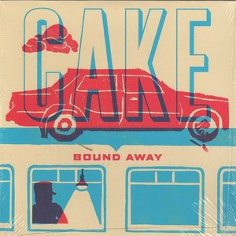

# Bound Away

By **CAKE**

## Album Data

- **Catalog:** Beets
- **Format:** Digital, Album
- **Album:** Bound Away
- **Artist:** Cake
- **Albumartist:** CAKE
- **Genre:** Indie Rock
- **MusicBrainz Album Artist ID:** [fa7b9055-3703-473a-8a09-adf2fe031a24](https://musicbrainz.org/artist/fa7b9055-3703-473a-8a09-adf2fe031a24)
- **MusicBrainz Album ID:** [5b85b15c-9d89-406c-9c7a-25c4c7c7115e](https://musicbrainz.org/release/5b85b15c-9d89-406c-9c7a-25c4c7c7115e)
- **MusicBrainz Release Group ID:** [22be76ad-b993-419a-925d-98c52e77bdaf](https://musicbrainz.org/release-group/22be76ad-b993-419a-925d-98c52e77bdaf)
- **Year:** 2014
- **Catalog #:** 
- **Label:** Columbia
- **Total Tracks:** 11

## Album Tracks

### Track 01 - Opera Singer

- **Artist:** CAKE
- **Format:** ALAC
- **Genre:** Indie Rock
- **Length:** 4:06
- **MusicBrainz Track ID:** [1e4a58e5-ab73-4156-91c9-868b0f0a3ce7](https://musicbrainz.org/recording/1e4a58e5-ab73-4156-91c9-868b0f0a3ce7)
- **Title:** Opera Singer
- **Track:** 01
- **Year:** 2001

### Track 02 - Meanwhile, Rick James…

- **Artist:** CAKE
- **Format:** ALAC
- **Genre:** Indie Rock
- **Length:** 3:57
- **MusicBrainz Track ID:** [44826b8c-2c84-4d3a-9452-e4ca6735afdd](https://musicbrainz.org/recording/44826b8c-2c84-4d3a-9452-e4ca6735afdd)
- **Title:** Meanwhile, Rick James…
- **Track:** 02
- **Year:** 2001

### Track 03 - Shadow Stabbing

- **Artist:** CAKE
- **Format:** ALAC
- **Genre:** Indie Rock
- **Length:** 3:07
- **MusicBrainz Track ID:** [b286b752-61b5-46de-83a2-ccc1bccce023](https://musicbrainz.org/recording/b286b752-61b5-46de-83a2-ccc1bccce023)
- **Title:** Shadow Stabbing
- **Track:** 03
- **Year:** 2001

### Track 04 - Short Skirt/Long Jacket

- **Artist:** CAKE
- **Format:** ALAC
- **Genre:** Indie Rock
- **Length:** 3:24
- **MusicBrainz Track ID:** [96d80e5a-9055-432e-b3c2-f9180adab3c9](https://musicbrainz.org/recording/96d80e5a-9055-432e-b3c2-f9180adab3c9)
- **Title:** Short Skirt/Long Jacket
- **Track:** 04
- **Year:** 2001

### Track 05 - Commissioning a Symphony in C

- **Artist:** CAKE
- **Format:** ALAC
- **Genre:** Indie Rock
- **Length:** 2:59
- **MusicBrainz Track ID:** [d5727e60-156a-4b62-9538-06f198e49d27](https://musicbrainz.org/recording/d5727e60-156a-4b62-9538-06f198e49d27)
- **Title:** Commissioning a Symphony in C
- **Track:** 05
- **Year:** 2001

### Track 06 - Arco Arena

- **Artist:** CAKE
- **Format:** ALAC
- **Genre:** Indie Rock
- **Length:** 1:31
- **MusicBrainz Track ID:** [472946f5-29c9-4ee8-a8f3-914972f67c40](https://musicbrainz.org/recording/472946f5-29c9-4ee8-a8f3-914972f67c40)
- **Title:** Arco Arena
- **Track:** 06
- **Year:** 2001

### Track 07 - Comfort Eagle

- **Artist:** CAKE
- **Format:** ALAC
- **Genre:** Indie Rock
- **Length:** 3:40
- **MusicBrainz Track ID:** [e9f29444-564b-46b8-a581-1ca86fcb2fa9](https://musicbrainz.org/recording/e9f29444-564b-46b8-a581-1ca86fcb2fa9)
- **Title:** Comfort Eagle
- **Track:** 07
- **Year:** 2001

### Track 08 - Long Line of Cars

- **Artist:** CAKE
- **Format:** ALAC
- **Genre:** Indie Rock
- **Length:** 3:23
- **MusicBrainz Track ID:** [b7d5e8ad-6256-461a-bac0-30684f0deed1](https://musicbrainz.org/recording/b7d5e8ad-6256-461a-bac0-30684f0deed1)
- **Title:** Long Line of Cars
- **Track:** 08
- **Year:** 2001

### Track 09 - Love You Madly

- **Artist:** CAKE
- **Format:** ALAC
- **Genre:** Indie Rock
- **Length:** 3:57
- **MusicBrainz Track ID:** [2ecc4d9c-a1d6-412f-a693-5850e6375cb1](https://musicbrainz.org/recording/2ecc4d9c-a1d6-412f-a693-5850e6375cb1)
- **Title:** Love You Madly
- **Track:** 09
- **Year:** 2001

### Track 10 - Pretty Pink Ribbon

- **Artist:** CAKE
- **Format:** ALAC
- **Genre:** Indie Rock
- **Length:** 3:08
- **MusicBrainz Track ID:** [0293c8c3-3a68-460a-b095-96c158dcb28a](https://musicbrainz.org/recording/0293c8c3-3a68-460a-b095-96c158dcb28a)
- **Title:** Pretty Pink Ribbon
- **Track:** 10
- **Year:** 2001

### Track 11 - World of Two

- **Artist:** CAKE
- **Format:** ALAC
- **Genre:** Ragga
- **Length:** 3:40
- **MusicBrainz Track ID:** [3b583932-ce6e-4859-8199-203d0d8c4805](https://musicbrainz.org/recording/3b583932-ce6e-4859-8199-203d0d8c4805)
- **Title:** World of Two
- **Track:** 11
- **Year:** 2001

## See also

- [B-Sides and Rarities](B-Sides_and_Rarities.md)
- [Comfort Eagle](Comfort_Eagle.md)
- [Fashion Nugget](Fashion_Nugget.md)
- [Long Time](Long_Time.md)
- [Motorcade of Generosity](Motorcade_of_Generosity.md)
- [Mustache Man (Wasted)](Mustache_Man_Wasted.md)
- [Pressure Chief](Pressure_Chief.md)
- [Prolonging the Magic](Prolonging_the_Magic.md)
- [Showroom of Compassion](Showroom_of_Compassion.md)
- [Sick of You](Sick_of_You.md)
- [The Winter](The_Winter.md)
- [What's Now Is Now](Whats_Now_Is_Now.md)
- [CD: ](../../CD/CAKE/CAKE.md)
- [CD: Fashion Nugget](../../CD/CAKE/Fashion_Nugget.md)
- [CD: Prolonging The Magic](../../CD/CAKE/Prolonging_The_Magic.md)
- [Roon: B-Sides and Rarities](../../Roon/CAKE/B-Sides_and_Rarities.md)
- [Roon: Comfort Eagle](../../Roon/CAKE/Comfort_Eagle.md)
- [Roon: Fashion Nugget (Deluxe Version)](../../Roon/CAKE/Fashion_Nugget_Deluxe_Version.md)
- [Roon: Motorcade of Generosity](../../Roon/CAKE/Motorcade_of_Generosity.md)
- [Roon: Pressure Chief](../../Roon/CAKE/Pressure_Chief.md)
- [Roon: Prolonging The Magic (Deluxe Version)](../../Roon/CAKE/Prolonging_The_Magic_Deluxe_Version.md)
- [Roon: Showroom Of Compassion](../../Roon/CAKE/Showroom_Of_Compassion.md)
- [Roon: Sick Of You](../../Roon/CAKE/Sick_Of_You.md)
- [Roon: Sinking Ship](../../Roon/CAKE/Sinking_Ship.md)
- [Roon: Up n Down](../../Roon/CAKE/Up_n_Down.md)
- [Roon: Wheels EP (Live)](../../Roon/CAKE/Wheels_EP_Live.md)
