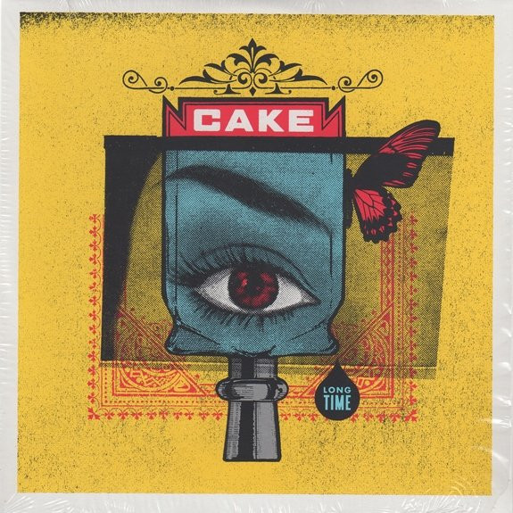

# Long Time

By **CAKE**

## Album Data

- **Catalog:** Beets
- **Format:** Digital, Album
- **Album:** Long Time
- **Artist:** Cake
- **Albumartist:** CAKE
- **Genre:** Indie Rock
- **MusicBrainz Album Artist ID:** [fa7b9055-3703-473a-8a09-adf2fe031a24](https://musicbrainz.org/artist/fa7b9055-3703-473a-8a09-adf2fe031a24)
- **MusicBrainz Album ID:** [070d98f7-68a1-475d-9534-52bc4f803179](https://musicbrainz.org/release/070d98f7-68a1-475d-9534-52bc4f803179)
- **MusicBrainz Release Group ID:** [47f8ea53-c46f-47b2-968e-6f7cf9d65613](https://musicbrainz.org/release-group/47f8ea53-c46f-47b2-968e-6f7cf9d65613)
- **Year:** 2014
- **Catalog #:** 893 942 035-2
- **Label:** Capricorn Records
- **Total Tracks:** 13

## Album Tracks

### Track 01 - Comanche

- **Artist:** CAKE
- **Format:** ALAC
- **Genre:** Indie Rock
- **Length:** 2:09
- **MusicBrainz Track ID:** [3239ded7-f649-400d-8d6c-1e0a851eca84](https://musicbrainz.org/recording/3239ded7-f649-400d-8d6c-1e0a851eca84)
- **Title:** Comanche
- **Track:** 01
- **Year:** 1994

### Track 02 - Ruby Sees All

- **Artist:** CAKE
- **Format:** ALAC
- **Genre:** Indie Rock
- **Length:** 3:00
- **MusicBrainz Track ID:** [2dbdf375-d6bd-4378-8b14-7914701c5bf6](https://musicbrainz.org/recording/2dbdf375-d6bd-4378-8b14-7914701c5bf6)
- **Title:** Ruby Sees All
- **Track:** 02
- **Year:** 1994

### Track 03 - Up So Close

- **Artist:** CAKE
- **Format:** ALAC
- **Genre:** Indie Rock
- **Length:** 3:13
- **MusicBrainz Track ID:** [9bf2553c-bbd2-4cba-a3d4-ff132ecbf1ca](https://musicbrainz.org/recording/9bf2553c-bbd2-4cba-a3d4-ff132ecbf1ca)
- **Title:** Up So Close
- **Track:** 03
- **Year:** 1994

### Track 04 - Pentagram

- **Artist:** CAKE
- **Format:** ALAC
- **Genre:** Post-Grunge
- **Length:** 2:19
- **MusicBrainz Track ID:** [24ca9a8b-0adb-4957-bd6a-067fe0af03a4](https://musicbrainz.org/recording/24ca9a8b-0adb-4957-bd6a-067fe0af03a4)
- **Title:** Pentagram
- **Track:** 04
- **Year:** 1994

### Track 05 - Jolene

- **Artist:** CAKE
- **Format:** ALAC
- **Genre:** Indie Rock
- **Length:** 5:19
- **MusicBrainz Track ID:** [60f0bfa4-8da9-4840-b5fe-23c1fc470f34](https://musicbrainz.org/recording/60f0bfa4-8da9-4840-b5fe-23c1fc470f34)
- **Title:** Jolene
- **Track:** 05
- **Year:** 1994

### Track 06 - Haze of Love

- **Artist:** CAKE
- **Format:** ALAC
- **Genre:** Indie Rock
- **Length:** 3:07
- **MusicBrainz Track ID:** [86428e00-8a2f-45fa-8121-31c6dc4db049](https://musicbrainz.org/recording/86428e00-8a2f-45fa-8121-31c6dc4db049)
- **Title:** Haze of Love
- **Track:** 06
- **Year:** 1994

### Track 07 - You Part the Waters

- **Artist:** CAKE
- **Format:** ALAC
- **Genre:** Indie Rock
- **Length:** 2:50
- **MusicBrainz Track ID:** [a0547165-0c0c-49f4-9034-f9631d9c4b3b](https://musicbrainz.org/recording/a0547165-0c0c-49f4-9034-f9631d9c4b3b)
- **Title:** You Part the Waters
- **Track:** 07
- **Year:** 1994

### Track 08 - Is This Love?

- **Artist:** CAKE
- **Format:** ALAC
- **Genre:** Indie Rock
- **Length:** 3:19
- **MusicBrainz Track ID:** [39b663be-3fd7-4df8-9e8f-41614d1a00a2](https://musicbrainz.org/recording/39b663be-3fd7-4df8-9e8f-41614d1a00a2)
- **Title:** Is This Love?
- **Track:** 08
- **Year:** 1994

### Track 09 - Jesus Wrote a Blank Check

- **Artist:** CAKE
- **Format:** ALAC
- **Genre:** Indie Rock
- **Length:** 3:10
- **MusicBrainz Track ID:** [c8a5f3b8-c812-44ff-9bd2-45e3f66ecfd8](https://musicbrainz.org/recording/c8a5f3b8-c812-44ff-9bd2-45e3f66ecfd8)
- **Title:** Jesus Wrote a Blank Check
- **Track:** 09
- **Year:** 1994

### Track 10 - Rock ’n’ Roll Lifestyle

- **Artist:** CAKE
- **Format:** ALAC
- **Genre:** Indie Rock
- **Length:** 4:14
- **MusicBrainz Track ID:** [275c9d4e-e5c4-4783-8672-bfc82953aeb8](https://musicbrainz.org/recording/275c9d4e-e5c4-4783-8672-bfc82953aeb8)
- **Title:** Rock ’n’ Roll Lifestyle
- **Track:** 10
- **Year:** 1994

### Track 11 - I Bombed Korea

- **Artist:** CAKE
- **Format:** ALAC
- **Genre:** Indie Rock
- **Length:** 2:19
- **MusicBrainz Track ID:** [7bfcf59b-452c-4008-a44f-14b7808976d1](https://musicbrainz.org/recording/7bfcf59b-452c-4008-a44f-14b7808976d1)
- **Title:** I Bombed Korea
- **Track:** 11
- **Year:** 1994

### Track 12 - Mr. Mastodon Farm

- **Artist:** CAKE
- **Format:** ALAC
- **Genre:** Indie Rock
- **Length:** 5:27
- **MusicBrainz Track ID:** [6bee681c-ddce-42ba-92f2-9772c59d1408](https://musicbrainz.org/recording/6bee681c-ddce-42ba-92f2-9772c59d1408)
- **Title:** Mr. Mastodon Farm
- **Track:** 12
- **Year:** 1994

### Track 13 - Ain’t No Good

- **Artist:** CAKE
- **Format:** ALAC
- **Genre:** Indie Rock
- **Length:** 2:40
- **MusicBrainz Track ID:** [aa4e66c9-e6a8-423b-b5e0-352817bfcbc2](https://musicbrainz.org/recording/aa4e66c9-e6a8-423b-b5e0-352817bfcbc2)
- **Title:** Ain’t No Good
- **Track:** 13
- **Year:** 1994

## See also

- [Bound Away](Bound_Away.md)
- [B-Sides and Rarities](B-Sides_and_Rarities.md)
- [Comfort Eagle](Comfort_Eagle.md)
- [Fashion Nugget](Fashion_Nugget.md)
- [Motorcade of Generosity](Motorcade_of_Generosity.md)
- [Mustache Man (Wasted)](Mustache_Man_Wasted.md)
- [Pressure Chief](Pressure_Chief.md)
- [Prolonging the Magic](Prolonging_the_Magic.md)
- [Showroom of Compassion](Showroom_of_Compassion.md)
- [Sick of You](Sick_of_You.md)
- [The Winter](The_Winter.md)
- [What's Now Is Now](Whats_Now_Is_Now.md)
- [CD: ](../../CD/CAKE/CAKE.md)
- [CD: Fashion Nugget](../../CD/CAKE/Fashion_Nugget.md)
- [CD: Prolonging The Magic](../../CD/CAKE/Prolonging_The_Magic.md)
- [Roon: B-Sides and Rarities](../../Roon/CAKE/B-Sides_and_Rarities.md)
- [Roon: Comfort Eagle](../../Roon/CAKE/Comfort_Eagle.md)
- [Roon: Fashion Nugget (Deluxe Version)](../../Roon/CAKE/Fashion_Nugget_Deluxe_Version.md)
- [Roon: Motorcade of Generosity](../../Roon/CAKE/Motorcade_of_Generosity.md)
- [Roon: Pressure Chief](../../Roon/CAKE/Pressure_Chief.md)
- [Roon: Prolonging The Magic (Deluxe Version)](../../Roon/CAKE/Prolonging_The_Magic_Deluxe_Version.md)
- [Roon: Showroom Of Compassion](../../Roon/CAKE/Showroom_Of_Compassion.md)
- [Roon: Sick Of You](../../Roon/CAKE/Sick_Of_You.md)
- [Roon: Sinking Ship](../../Roon/CAKE/Sinking_Ship.md)
- [Roon: Up n Down](../../Roon/CAKE/Up_n_Down.md)
- [Roon: Wheels EP (Live)](../../Roon/CAKE/Wheels_EP_Live.md)
