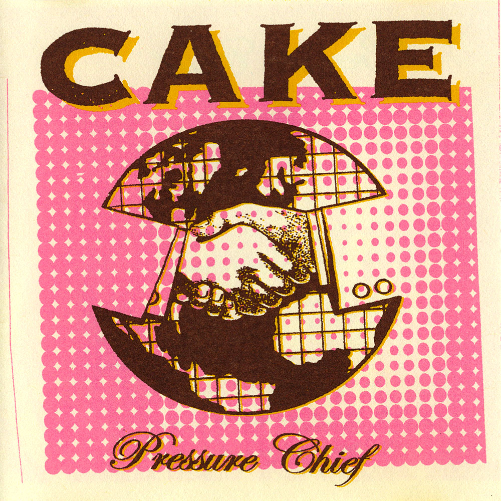

# Pressure Chief

By **CAKE**

## Album Data

- **Catalog:** Beets
- **Format:** Digital, Album
- **Album:** Pressure Chief
- **Artist:** Cake
- **Albumartist:** CAKE
- **Genre:** Indie Rock
- **MusicBrainz Album Artist ID:** [fa7b9055-3703-473a-8a09-adf2fe031a24](https://musicbrainz.org/artist/fa7b9055-3703-473a-8a09-adf2fe031a24)
- **MusicBrainz Album ID:** [404e17c6-3941-4f91-a409-810ec49f79e8](https://musicbrainz.org/release/404e17c6-3941-4f91-a409-810ec49f79e8)
- **MusicBrainz Release Group ID:** [84bf56d1-4f0d-35b2-9195-fc4b44ddd6b2](https://musicbrainz.org/release-group/84bf56d1-4f0d-35b2-9195-fc4b44ddd6b2)
- **Year:** 2004
- **Catalog #:** 
- **Label:** Volcano Records
- **Total Tracks:** 13

## Album Tracks

### Track 01 - Satan Is My Motor

- **Artist:** CAKE
- **Format:** ALAC
- **Genre:** Indie Rock
- **Length:** 3:12
- **MusicBrainz Track ID:** [0e7e78b3-3575-4f73-848d-931c764c3f19](https://musicbrainz.org/recording/0e7e78b3-3575-4f73-848d-931c764c3f19)
- **Title:** Satan Is My Motor
- **Track:** 01
- **Year:** 1998

### Track 02 - Mexico

- **Artist:** CAKE
- **Format:** ALAC
- **Genre:** Indie Rock
- **Length:** 3:26
- **MusicBrainz Track ID:** [8b1fa2c8-40c8-41d8-b50d-c2b4f6009d28](https://musicbrainz.org/recording/8b1fa2c8-40c8-41d8-b50d-c2b4f6009d28)
- **Title:** Mexico
- **Track:** 02
- **Year:** 1998

### Track 03 - Never There

- **Artist:** CAKE
- **Format:** ALAC
- **Genre:** Indie Rock
- **Length:** 2:44
- **MusicBrainz Track ID:** [5b65195a-d447-448e-a7ba-af5f5d4d9e79](https://musicbrainz.org/recording/5b65195a-d447-448e-a7ba-af5f5d4d9e79)
- **Title:** Never There
- **Track:** 03
- **Year:** 1998

### Track 04 - Guitar

- **Artist:** CAKE
- **Format:** ALAC
- **Genre:** Indie Rock
- **Length:** 3:40
- **MusicBrainz Track ID:** [2dabc0d9-00ef-4631-99b8-3dc23ac0c744](https://musicbrainz.org/recording/2dabc0d9-00ef-4631-99b8-3dc23ac0c744)
- **Title:** Guitar
- **Track:** 04
- **Year:** 1998

### Track 05 - You Turn the Screws

- **Artist:** CAKE
- **Format:** ALAC
- **Genre:** Indie Rock
- **Length:** 4:13
- **MusicBrainz Track ID:** [457121ac-9948-4ef8-950b-67bdf4e90eb9](https://musicbrainz.org/recording/457121ac-9948-4ef8-950b-67bdf4e90eb9)
- **Title:** You Turn the Screws
- **Track:** 05
- **Year:** 1998

### Track 06 - Walk On By

- **Artist:** CAKE
- **Format:** ALAC
- **Genre:** Indie Rock
- **Length:** 3:46
- **MusicBrainz Track ID:** [db15df4f-f4c4-480b-b7ac-59debb1c1830](https://musicbrainz.org/recording/db15df4f-f4c4-480b-b7ac-59debb1c1830)
- **Title:** Walk On By
- **Track:** 06
- **Year:** 1998

### Track 07 - Sheep Go to Heaven

- **Artist:** CAKE
- **Format:** ALAC
- **Genre:** Indie Rock
- **Length:** 4:44
- **MusicBrainz Track ID:** [d3921495-0b5f-4402-91a4-09e875e92da8](https://musicbrainz.org/recording/d3921495-0b5f-4402-91a4-09e875e92da8)
- **Title:** Sheep Go to Heaven
- **Track:** 07
- **Year:** 1998

### Track 08 - When You Sleep

- **Artist:** CAKE
- **Format:** ALAC
- **Genre:** Indie Rock
- **Length:** 3:58
- **MusicBrainz Track ID:** [8e71a5cc-6a46-45da-8a1f-592583e82553](https://musicbrainz.org/recording/8e71a5cc-6a46-45da-8a1f-592583e82553)
- **Title:** When You Sleep
- **Track:** 08
- **Year:** 1998

### Track 09 - Hem of Your Garment

- **Artist:** CAKE
- **Format:** ALAC
- **Genre:** Indie Rock
- **Length:** 3:43
- **MusicBrainz Track ID:** [151cd5b2-c5ee-4cc9-b35e-f9fb95ac4d4c](https://musicbrainz.org/recording/151cd5b2-c5ee-4cc9-b35e-f9fb95ac4d4c)
- **Title:** Hem of Your Garment
- **Track:** 09
- **Year:** 1998

### Track 10 - Alpha Beta Parking Lot

- **Artist:** CAKE
- **Format:** ALAC
- **Genre:** Indie Rock
- **Length:** 3:30
- **MusicBrainz Track ID:** [c562f51c-4dbd-4280-95be-7e232dd6e3b8](https://musicbrainz.org/recording/c562f51c-4dbd-4280-95be-7e232dd6e3b8)
- **Title:** Alpha Beta Parking Lot
- **Track:** 10
- **Year:** 1998

### Track 11 - Let Me Go

- **Artist:** CAKE
- **Format:** ALAC
- **Genre:** Indie Rock
- **Length:** 3:56
- **MusicBrainz Track ID:** [235efc48-16f8-4b48-8688-bf88010c1a32](https://musicbrainz.org/recording/235efc48-16f8-4b48-8688-bf88010c1a32)
- **Title:** Let Me Go
- **Track:** 11
- **Year:** 1998

### Track 12 - Cool Blue Reason

- **Artist:** CAKE
- **Format:** ALAC
- **Genre:** Indie Rock
- **Length:** 3:27
- **MusicBrainz Track ID:** [8e7901e5-9d52-4738-bb0c-395d6ca17d59](https://musicbrainz.org/recording/8e7901e5-9d52-4738-bb0c-395d6ca17d59)
- **Title:** Cool Blue Reason
- **Track:** 12
- **Year:** 1998

### Track 13 - Where Would I Be?

- **Artist:** CAKE
- **Format:** ALAC
- **Genre:** Indie Rock
- **Length:** 3:53
- **MusicBrainz Track ID:** [c93d771b-a673-451e-ba57-cb7a59d5933f](https://musicbrainz.org/recording/c93d771b-a673-451e-ba57-cb7a59d5933f)
- **Title:** Where Would I Be?
- **Track:** 13
- **Year:** 1998

## See also

- [Bound Away](Bound_Away.md)
- [B-Sides and Rarities](B-Sides_and_Rarities.md)
- [Comfort Eagle](Comfort_Eagle.md)
- [Fashion Nugget](Fashion_Nugget.md)
- [Long Time](Long_Time.md)
- [Motorcade of Generosity](Motorcade_of_Generosity.md)
- [Mustache Man (Wasted)](Mustache_Man_Wasted.md)
- [Prolonging the Magic](Prolonging_the_Magic.md)
- [Showroom of Compassion](Showroom_of_Compassion.md)
- [Sick of You](Sick_of_You.md)
- [The Winter](The_Winter.md)
- [What's Now Is Now](Whats_Now_Is_Now.md)
- [CD: ](../../CD/CAKE/CAKE.md)
- [CD: Fashion Nugget](../../CD/CAKE/Fashion_Nugget.md)
- [CD: Prolonging The Magic](../../CD/CAKE/Prolonging_The_Magic.md)
- [Roon: B-Sides and Rarities](../../Roon/CAKE/B-Sides_and_Rarities.md)
- [Roon: Comfort Eagle](../../Roon/CAKE/Comfort_Eagle.md)
- [Roon: Fashion Nugget (Deluxe Version)](../../Roon/CAKE/Fashion_Nugget_Deluxe_Version.md)
- [Roon: Motorcade of Generosity](../../Roon/CAKE/Motorcade_of_Generosity.md)
- [Roon: Pressure Chief](../../Roon/CAKE/Pressure_Chief.md)
- [Roon: Prolonging The Magic (Deluxe Version)](../../Roon/CAKE/Prolonging_The_Magic_Deluxe_Version.md)
- [Roon: Showroom Of Compassion](../../Roon/CAKE/Showroom_Of_Compassion.md)
- [Roon: Sick Of You](../../Roon/CAKE/Sick_Of_You.md)
- [Roon: Sinking Ship](../../Roon/CAKE/Sinking_Ship.md)
- [Roon: Up n Down](../../Roon/CAKE/Up_n_Down.md)
- [Roon: Wheels EP (Live)](../../Roon/CAKE/Wheels_EP_Live.md)
