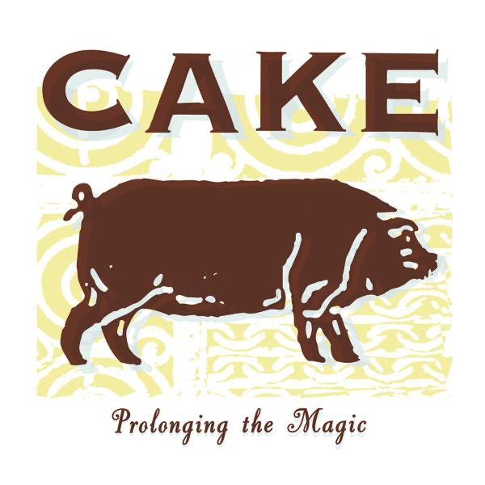

# Prolonging the Magic

By **CAKE**

## Album Data

- **Catalog:** Beets
- **Format:** Digital, Album
- **Album:** Prolonging the Magic
- **Artist:** Cake
- **Albumartist:** CAKE
- **Genre:** Indie Rock
- **MusicBrainz Album Artist ID:** [fa7b9055-3703-473a-8a09-adf2fe031a24](https://musicbrainz.org/artist/fa7b9055-3703-473a-8a09-adf2fe031a24)
- **MusicBrainz Album ID:** [4c04837e-f3eb-49b4-8644-96fb629bb90c](https://musicbrainz.org/release/4c04837e-f3eb-49b4-8644-96fb629bb90c)
- **MusicBrainz Release Group ID:** [34cc7616-0e7e-34aa-a42d-bc9c17755f18](https://musicbrainz.org/release-group/34cc7616-0e7e-34aa-a42d-bc9c17755f18)
- **Year:** 1998
- **Catalog #:** 
- **Label:** Upbeat Records
- **Total Tracks:** 11

## Album Tracks

### Track 01 - Federal Funding

- **Artist:** CAKE
- **Format:** MP3
- **Genre:** Alternative Rock
- **Length:** 3:49
- **MusicBrainz Track ID:** [40beaf43-43ec-4122-8b9f-4b01b074e5f5](https://musicbrainz.org/recording/40beaf43-43ec-4122-8b9f-4b01b074e5f5)
- **Title:** Federal Funding
- **Track:** 01
- **Year:** 2011

### Track 02 - Long Time

- **Artist:** CAKE
- **Format:** MP3
- **Genre:** Indietronica
- **Length:** 4:35
- **MusicBrainz Track ID:** [9d7e2d13-ec35-4569-b855-e3a9fc3cfab0](https://musicbrainz.org/recording/9d7e2d13-ec35-4569-b855-e3a9fc3cfab0)
- **Title:** Long Time
- **Track:** 02
- **Year:** 2011

### Track 03 - Got to Move

- **Artist:** CAKE
- **Format:** MP3
- **Genre:** Indie Pop
- **Length:** 3:40
- **MusicBrainz Track ID:** [39c3b799-45c6-4117-8289-09203dc3a7e9](https://musicbrainz.org/recording/39c3b799-45c6-4117-8289-09203dc3a7e9)
- **Title:** Got to Move
- **Track:** 03
- **Year:** 2011

### Track 04 - What's Now Is Now

- **Artist:** CAKE
- **Format:** MP3
- **Genre:** Alternative Rock
- **Length:** 3:37
- **MusicBrainz Track ID:** [501620e7-957b-47e0-b3d6-258c12ce0999](https://musicbrainz.org/recording/501620e7-957b-47e0-b3d6-258c12ce0999)
- **Title:** What's Now Is Now
- **Track:** 04
- **Year:** 2011

### Track 05 - Mustache Man (Wasted)

- **Artist:** CAKE
- **Format:** MP3
- **Genre:** Uk Garage
- **Length:** 4:04
- **MusicBrainz Track ID:** [aa8026f9-9ec7-4731-b766-f7404e9e030d](https://musicbrainz.org/recording/aa8026f9-9ec7-4731-b766-f7404e9e030d)
- **Title:** Mustache Man (Wasted)
- **Track:** 05
- **Year:** 2011

### Track 06 - Teenage Pregnancy

- **Artist:** CAKE
- **Format:** MP3
- **Genre:** Alternative Rock
- **Length:** 2:40
- **MusicBrainz Track ID:** [34c465b0-f52d-4918-b0b2-c3689f8b981b](https://musicbrainz.org/recording/34c465b0-f52d-4918-b0b2-c3689f8b981b)
- **Title:** Teenage Pregnancy
- **Track:** 06
- **Year:** 2011

### Track 07 - Sick of You

- **Artist:** CAKE
- **Format:** MP3
- **Genre:** Indie Rock
- **Length:** 3:13
- **MusicBrainz Track ID:** [dfdfd2a3-8f36-4a01-a69a-fc7fa01df16c](https://musicbrainz.org/recording/dfdfd2a3-8f36-4a01-a69a-fc7fa01df16c)
- **Title:** Sick of You
- **Track:** 07
- **Year:** 2011

### Track 08 - Easy to Crash

- **Artist:** CAKE
- **Format:** MP3
- **Genre:** Alternative Rock
- **Length:** 4:07
- **MusicBrainz Track ID:** [237b744a-8dd9-426d-91dd-e952a19321bf](https://musicbrainz.org/recording/237b744a-8dd9-426d-91dd-e952a19321bf)
- **Title:** Easy to Crash
- **Track:** 08
- **Year:** 2011

### Track 09 - Bound Away

- **Artist:** CAKE
- **Format:** MP3
- **Genre:** Alternative Rock
- **Length:** 3:24
- **MusicBrainz Track ID:** [609e7568-2487-4537-ba46-c55d6e42f871](https://musicbrainz.org/recording/609e7568-2487-4537-ba46-c55d6e42f871)
- **Title:** Bound Away
- **Track:** 09
- **Year:** 2011

### Track 10 - The Winter

- **Artist:** CAKE
- **Format:** MP3
- **Genre:** Stoner Rock
- **Length:** 4:05
- **MusicBrainz Track ID:** [7fc70de5-da98-47f6-a39e-6df3c04253eb](https://musicbrainz.org/recording/7fc70de5-da98-47f6-a39e-6df3c04253eb)
- **Title:** The Winter
- **Track:** 10
- **Year:** 2011

### Track 11 - Italian Guy

- **Artist:** CAKE
- **Format:** MP3
- **Genre:** Alternative Rock
- **Length:** 3:10
- **MusicBrainz Track ID:** [8e353175-cea9-4cbc-9608-981586342dee](https://musicbrainz.org/recording/8e353175-cea9-4cbc-9608-981586342dee)
- **Title:** Italian Guy
- **Track:** 11
- **Year:** 2011

## See also

- [Bound Away](Bound_Away.md)
- [B-Sides and Rarities](B-Sides_and_Rarities.md)
- [Comfort Eagle](Comfort_Eagle.md)
- [Fashion Nugget](Fashion_Nugget.md)
- [Long Time](Long_Time.md)
- [Motorcade of Generosity](Motorcade_of_Generosity.md)
- [Mustache Man (Wasted)](Mustache_Man_Wasted.md)
- [Pressure Chief](Pressure_Chief.md)
- [Showroom of Compassion](Showroom_of_Compassion.md)
- [Sick of You](Sick_of_You.md)
- [The Winter](The_Winter.md)
- [What's Now Is Now](Whats_Now_Is_Now.md)
- [CD: ](../../CD/CAKE/CAKE.md)
- [CD: Fashion Nugget](../../CD/CAKE/Fashion_Nugget.md)
- [CD: Prolonging The Magic](../../CD/CAKE/Prolonging_The_Magic.md)
- [Roon: B-Sides and Rarities](../../Roon/CAKE/B-Sides_and_Rarities.md)
- [Roon: Comfort Eagle](../../Roon/CAKE/Comfort_Eagle.md)
- [Roon: Fashion Nugget (Deluxe Version)](../../Roon/CAKE/Fashion_Nugget_Deluxe_Version.md)
- [Roon: Motorcade of Generosity](../../Roon/CAKE/Motorcade_of_Generosity.md)
- [Roon: Pressure Chief](../../Roon/CAKE/Pressure_Chief.md)
- [Roon: Prolonging The Magic (Deluxe Version)](../../Roon/CAKE/Prolonging_The_Magic_Deluxe_Version.md)
- [Roon: Showroom Of Compassion](../../Roon/CAKE/Showroom_Of_Compassion.md)
- [Roon: Sick Of You](../../Roon/CAKE/Sick_Of_You.md)
- [Roon: Sinking Ship](../../Roon/CAKE/Sinking_Ship.md)
- [Roon: Up n Down](../../Roon/CAKE/Up_n_Down.md)
- [Roon: Wheels EP (Live)](../../Roon/CAKE/Wheels_EP_Live.md)
