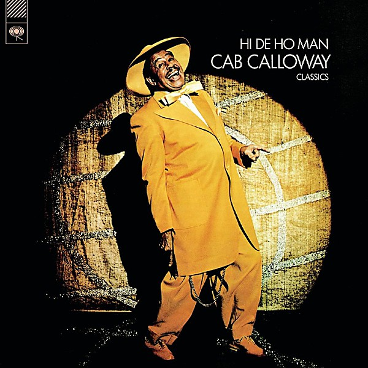

# Hi De Ho Man

By **Cab Calloway**

## Album Data

- **Catalog:** Beets
- **Format:** Digital, Album
- **Album:** Hi De Ho Man
- **Artist:** Cab Calloway
- **Albumartist:** Cab Calloway
- **Genre:** Swing
- **MusicBrainz Album Artist ID:** [315bd083-892b-4e76-a9f0-91a7408168fc](https://musicbrainz.org/artist/315bd083-892b-4e76-a9f0-91a7408168fc)
- **MusicBrainz Album ID:** [0154e4ca-81ba-4b04-be36-49a41f180e81](https://musicbrainz.org/release/0154e4ca-81ba-4b04-be36-49a41f180e81)
- **MusicBrainz Release Group ID:** [ee15cddc-2488-3f6c-ba84-b58d58b9a633](https://musicbrainz.org/release-group/ee15cddc-2488-3f6c-ba84-b58d58b9a633)
- **Year:** 2008
- **Catalog #:** WOU 2593
- **Label:** Wounded Bird Records
- **Total Tracks:** 20

## Album Tracks

### Track 01 - Nagasaki

- **Artist:** Cab Calloway
- **Format:** MP3
- **Genre:** Swing
- **Length:** 2:53
- **MusicBrainz Track ID:** [b0da08a6-319f-44be-9433-9ad1d4f92a98](https://musicbrainz.org/recording/b0da08a6-319f-44be-9433-9ad1d4f92a98)
- **Title:** Nagasaki
- **Track:** 01
- **Year:** 2008

### Track 02 - Hoy Hoy

- **Artist:** Cab Calloway
- **Format:** MP3
- **Genre:** Swing
- **Length:** 2:47
- **MusicBrainz Track ID:** [b8d4accd-6439-49cd-b353-22ded928f0cd](https://musicbrainz.org/recording/b8d4accd-6439-49cd-b353-22ded928f0cd)
- **Title:** Hoy Hoy
- **Track:** 02
- **Year:** 2008

### Track 03 - Jumpin Jive

- **Artist:** Cab Calloway
- **Format:** MP3
- **Genre:** Swing
- **Length:** 2:47
- **MusicBrainz Track ID:** [9e6d4ed7-35b7-4738-8852-e3667585269e](https://musicbrainz.org/recording/9e6d4ed7-35b7-4738-8852-e3667585269e)
- **Title:** Jumpin Jive
- **Track:** 03
- **Year:** 2008

### Track 04 - Abi Gezunt

- **Artist:** Cab Calloway
- **Format:** MP3
- **Genre:** Swing
- **Length:** 2:48
- **MusicBrainz Track ID:** [13afca1b-ccb1-452c-bba8-903490939d9f](https://musicbrainz.org/recording/13afca1b-ccb1-452c-bba8-903490939d9f)
- **Title:** Abi Gezunt
- **Track:** 04
- **Year:** 2008

### Track 05 - Fifteen Minutes Itermission

- **Artist:** Cab Calloway
- **Format:** MP3
- **Genre:** Swing
- **Length:** 2:47
- **MusicBrainz Track ID:** [ffc17fb9-37b4-4de8-944d-a9669ff6a736](https://musicbrainz.org/recording/ffc17fb9-37b4-4de8-944d-a9669ff6a736)
- **Title:** Fifteen Minutes Itermission
- **Track:** 05
- **Year:** 2008

### Track 06 - A Chicken Ain't Nothing but a Bird

- **Artist:** Cab Calloway
- **Format:** MP3
- **Genre:** Swing
- **Length:** 2:50
- **MusicBrainz Track ID:** [612673e8-2565-4b9a-a1dd-e1de4a101566](https://musicbrainz.org/recording/612673e8-2565-4b9a-a1dd-e1de4a101566)
- **Title:** A Chicken Ain't Nothing but a Bird
- **Track:** 06
- **Year:** 2008

### Track 07 - My Gal

- **Artist:** Cab Calloway
- **Format:** MP3
- **Genre:** Jazz
- **Length:** 2:42
- **MusicBrainz Track ID:** [12c2d036-a64a-4bd9-97de-ca9a719045c0](https://musicbrainz.org/recording/12c2d036-a64a-4bd9-97de-ca9a719045c0)
- **Title:** My Gal
- **Track:** 07
- **Year:** 2008

### Track 08 - St. James Infirmary

- **Artist:** Cab Calloway
- **Format:** MP3
- **Genre:** Swing
- **Length:** 3:17
- **MusicBrainz Track ID:** [902f221c-b348-45e5-bbb5-c7bf14cc3a2f](https://musicbrainz.org/recording/902f221c-b348-45e5-bbb5-c7bf14cc3a2f)
- **Title:** St. James Infirmary
- **Track:** 08
- **Year:** 2008

### Track 09 - I Want to Rock

- **Artist:** Cab Calloway
- **Format:** MP3
- **Genre:** Swing
- **Length:** 2:47
- **MusicBrainz Track ID:** [89c6a742-62c2-4600-b20f-4cfa5995276c](https://musicbrainz.org/recording/89c6a742-62c2-4600-b20f-4cfa5995276c)
- **Title:** I Want to Rock
- **Track:** 09
- **Year:** 2008

### Track 10 - I'll Be Around

- **Artist:** Cab Calloway
- **Format:** MP3
- **Genre:** Swing
- **Length:** 3:03
- **MusicBrainz Track ID:** [8aa3d0aa-7a08-46b8-829e-a198fc7e2f89](https://musicbrainz.org/recording/8aa3d0aa-7a08-46b8-829e-a198fc7e2f89)
- **Title:** I'll Be Around
- **Track:** 10
- **Year:** 2008

### Track 11 - Minnie the Moocher

- **Artist:** Cab Calloway
- **Format:** MP3
- **Genre:** Swing
- **Length:** 3:13
- **MusicBrainz Track ID:** [5362e234-1948-4c85-815e-1af3e2f574db](https://musicbrainz.org/recording/5362e234-1948-4c85-815e-1af3e2f574db)
- **Title:** Minnie the Moocher
- **Track:** 11
- **Year:** 2008

### Track 12 - Honey Dripper

- **Artist:** Cab Calloway
- **Format:** MP3
- **Genre:** Jazz
- **Length:** 2:55
- **MusicBrainz Track ID:** [b7f69fab-d7e6-4390-b15c-a89d27f6a9e0](https://musicbrainz.org/recording/b7f69fab-d7e6-4390-b15c-a89d27f6a9e0)
- **Title:** Honey Dripper
- **Track:** 12
- **Year:** 2008

### Track 13 - Hey Now - Hey Now

- **Artist:** Cab Calloway
- **Format:** MP3
- **Genre:** Swing
- **Length:** 2:54
- **MusicBrainz Track ID:** [08611c61-1845-4654-a06d-aa2f3b5f2e71](https://musicbrainz.org/recording/08611c61-1845-4654-a06d-aa2f3b5f2e71)
- **Title:** Hey Now - Hey Now
- **Track:** 13
- **Year:** 2008

### Track 14 - Hi De Ho Man

- **Artist:** Cab Calloway
- **Format:** MP3
- **Genre:** Boogie
- **Length:** 3:00
- **MusicBrainz Track ID:** [6724eb2d-b752-4aa5-a120-644630d1d4e1](https://musicbrainz.org/recording/6724eb2d-b752-4aa5-a120-644630d1d4e1)
- **Title:** Hi De Ho Man
- **Track:** 14
- **Year:** 2008

### Track 15 - Oh Grandpa

- **Artist:** Cab Calloway
- **Format:** MP3
- **Genre:** Swing
- **Length:** 3:01
- **MusicBrainz Track ID:** [f47a1943-96c5-4c45-810d-7b4770975085](https://musicbrainz.org/recording/f47a1943-96c5-4c45-810d-7b4770975085)
- **Title:** Oh Grandpa
- **Track:** 15
- **Year:** 2008

### Track 16 - Jungle King

- **Artist:** Cab Calloway
- **Format:** MP3
- **Genre:** Swing
- **Length:** 3:14
- **MusicBrainz Track ID:** [ab5ec517-917a-48d3-a8d1-7772631717d0](https://musicbrainz.org/recording/ab5ec517-917a-48d3-a8d1-7772631717d0)
- **Title:** Jungle King
- **Track:** 16
- **Year:** 2008

### Track 17 - Two Blocks Down, Turn to the Left

- **Artist:** Cab Calloway
- **Format:** MP3
- **Genre:** Swing
- **Length:** 3:12
- **MusicBrainz Track ID:** [dbf6cd44-13ef-4de8-8b7f-149ad0212af1](https://musicbrainz.org/recording/dbf6cd44-13ef-4de8-8b7f-149ad0212af1)
- **Title:** Two Blocks Down, Turn to the Left
- **Track:** 17
- **Year:** 2008

### Track 18 - San Francisco Fan

- **Artist:** Cab Calloway
- **Format:** MP3
- **Genre:** Swing
- **Length:** 3:20
- **MusicBrainz Track ID:** [c6f07969-f4f4-4833-b5a9-db4d26346475](https://musicbrainz.org/recording/c6f07969-f4f4-4833-b5a9-db4d26346475)
- **Title:** San Francisco Fan
- **Track:** 18
- **Year:** 2008

### Track 19 - The Calloway Boogie

- **Artist:** Cab Calloway
- **Format:** MP3
- **Genre:** Boogie
- **Length:** 3:02
- **MusicBrainz Track ID:** [2e1b4ac7-994c-404b-84a5-15040ff4debc](https://musicbrainz.org/recording/2e1b4ac7-994c-404b-84a5-15040ff4debc)
- **Title:** The Calloway Boogie
- **Track:** 19
- **Year:** 2008

### Track 20 - Everybody Eats When They Come to My House

- **Artist:** Cab Calloway
- **Format:** MP3
- **Genre:** Swing
- **Length:** 2:46
- **MusicBrainz Track ID:** [9f77b8ea-52a9-4944-9717-80eb80da6923](https://musicbrainz.org/recording/9f77b8ea-52a9-4944-9717-80eb80da6923)
- **Title:** Everybody Eats When They Come to My House
- **Track:** 20
- **Year:** 2008

