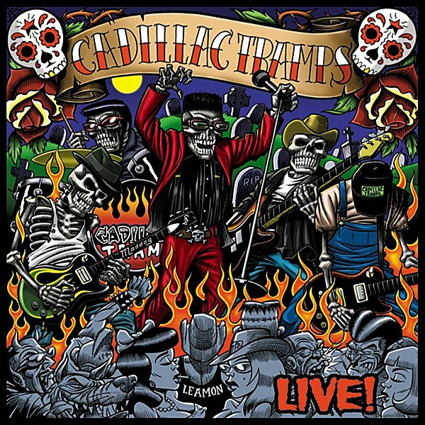

# Live

By **Cadillac Tramps**

## Album Data

- **Catalog:** Beets
- **Format:** Digital, Album
- **Album:** Live
- **Artist:** Cadillac Tramps
- **Albumartist:** Cadillac Tramps
- **Genre:** Psychobilly
- **MusicBrainz Album Artist ID:** [a23eae24-1921-4505-9ac9-a639f24c2846](https://musicbrainz.org/artist/a23eae24-1921-4505-9ac9-a639f24c2846)
- **MusicBrainz Album ID:** [ed550947-9f63-4da4-9e67-ec391bc870a7](https://musicbrainz.org/release/ed550947-9f63-4da4-9e67-ec391bc870a7)
- **MusicBrainz Release Group ID:** [5b64adec-de3f-3c6d-b1b6-2b3e877ff61e](https://musicbrainz.org/release-group/5b64adec-de3f-3c6d-b1b6-2b3e877ff61e)
- **Year:** 2000
- **Catalog #:** BYO 067
- **Label:** BYO Records
- **Total Tracks:** 16

## Album Tracks

### Track 01 - Intro

- **Artist:** Cadillac Tramps
- **Format:** AAC
- **Genre:** Psychobilly
- **Length:** 1:21
- **MusicBrainz Track ID:** [3dea0dc4-6e1f-4d67-b640-bbf03985c002](https://musicbrainz.org/recording/3dea0dc4-6e1f-4d67-b640-bbf03985c002)
- **Title:** Intro
- **Track:** 01
- **Year:** 2000

### Track 02 - Hoodoo Guru

- **Artist:** Cadillac Tramps
- **Format:** AAC
- **Genre:** Psychobilly
- **Length:** 4:08
- **MusicBrainz Track ID:** [db09919b-08ff-42a0-bb64-02e9fceda8ca](https://musicbrainz.org/recording/db09919b-08ff-42a0-bb64-02e9fceda8ca)
- **Title:** Hoodoo Guru
- **Track:** 02
- **Year:** 2000

### Track 03 - Don't Ya Know

- **Artist:** Cadillac Tramps
- **Format:** AAC
- **Genre:** Psychobilly
- **Length:** 3:24
- **MusicBrainz Track ID:** [fa016646-e01b-4383-9bf5-ad6758d84a35](https://musicbrainz.org/recording/fa016646-e01b-4383-9bf5-ad6758d84a35)
- **Title:** Don't Ya Know
- **Track:** 03
- **Year:** 2000

### Track 04 - Should I

- **Artist:** Cadillac Tramps
- **Format:** AAC
- **Genre:** Psychobilly
- **Length:** 2:52
- **MusicBrainz Track ID:** [32f0f3ae-94d0-451a-be59-f677932bc93b](https://musicbrainz.org/recording/32f0f3ae-94d0-451a-be59-f677932bc93b)
- **Title:** Should I
- **Track:** 04
- **Year:** 2000

### Track 05 - Life on the Edge

- **Artist:** Cadillac Tramps
- **Format:** AAC
- **Genre:** Psychobilly
- **Length:** 3:03
- **MusicBrainz Track ID:** [2b9c4c2e-b6cd-4b7d-9b7c-126d8536a828](https://musicbrainz.org/recording/2b9c4c2e-b6cd-4b7d-9b7c-126d8536a828)
- **Title:** Life on the Edge
- **Track:** 05
- **Year:** 2000

### Track 06 - Bridges

- **Artist:** Cadillac Tramps
- **Format:** AAC
- **Genre:** Psychobilly
- **Length:** 2:45
- **MusicBrainz Track ID:** [36e0e2aa-8ef8-4390-bd98-404a3b5dc507](https://musicbrainz.org/recording/36e0e2aa-8ef8-4390-bd98-404a3b5dc507)
- **Title:** Bridges
- **Track:** 06
- **Year:** 2000

### Track 07 - Barbed Wire

- **Artist:** Cadillac Tramps
- **Format:** AAC
- **Genre:** Psychobilly
- **Length:** 2:55
- **MusicBrainz Track ID:** [7f376c30-d347-4de4-a7dc-bc30599bcb39](https://musicbrainz.org/recording/7f376c30-d347-4de4-a7dc-bc30599bcb39)
- **Title:** Barbed Wire
- **Track:** 07
- **Year:** 2000

### Track 08 - Medicine Man

- **Artist:** Cadillac Tramps
- **Format:** AAC
- **Genre:** Psychobilly
- **Length:** 3:25
- **MusicBrainz Track ID:** [1e978ce5-d8b0-4743-9253-b19c10bcf118](https://musicbrainz.org/recording/1e978ce5-d8b0-4743-9253-b19c10bcf118)
- **Title:** Medicine Man
- **Track:** 08
- **Year:** 2000

### Track 09 - Cadillac Hearse

- **Artist:** Cadillac Tramps
- **Format:** AAC
- **Genre:** Psychobilly
- **Length:** 3:45
- **MusicBrainz Track ID:** [e28464df-4419-4fdc-9d97-33f3464869e2](https://musicbrainz.org/recording/e28464df-4419-4fdc-9d97-33f3464869e2)
- **Title:** Cadillac Hearse
- **Track:** 09
- **Year:** 2000

### Track 10 - Move to the Hills

- **Artist:** Cadillac Tramps
- **Format:** AAC
- **Genre:** Psychobilly
- **Length:** 3:38
- **MusicBrainz Track ID:** [2f7f866b-b249-4662-accc-9be2d5be33b4](https://musicbrainz.org/recording/2f7f866b-b249-4662-accc-9be2d5be33b4)
- **Title:** Move to the Hills
- **Track:** 10
- **Year:** 2000

### Track 11 - Shake

- **Artist:** Cadillac Tramps
- **Format:** AAC
- **Genre:** Psychobilly
- **Length:** 3:18
- **MusicBrainz Track ID:** [6cc5839d-0d98-49d7-8fa5-3ef311b5ad8d](https://musicbrainz.org/recording/6cc5839d-0d98-49d7-8fa5-3ef311b5ad8d)
- **Title:** Shake
- **Track:** 11
- **Year:** 2000

### Track 12 - Drivin' (intro)

- **Artist:** Cadillac Tramps
- **Format:** AAC
- **Genre:** Psychobilly
- **Length:** 0:41
- **MusicBrainz Track ID:** [f19232c6-b8f9-46ab-a6b3-52184174ade3](https://musicbrainz.org/recording/f19232c6-b8f9-46ab-a6b3-52184174ade3)
- **Title:** Drivin' (intro)
- **Track:** 12
- **Year:** 2000

### Track 13 - Drivin'

- **Artist:** Cadillac Tramps
- **Format:** AAC
- **Genre:** Psychobilly
- **Length:** 2:02
- **MusicBrainz Track ID:** [163373b4-2de7-4204-b58e-d2b465562f67](https://musicbrainz.org/recording/163373b4-2de7-4204-b58e-d2b465562f67)
- **Title:** Drivin'
- **Track:** 13
- **Year:** 2000

### Track 14 - Alright

- **Artist:** Cadillac Tramps
- **Format:** AAC
- **Genre:** Psychobilly
- **Length:** 2:59
- **MusicBrainz Track ID:** [ff1bec2d-1f70-493d-ba3c-5fec2386516d](https://musicbrainz.org/recording/ff1bec2d-1f70-493d-ba3c-5fec2386516d)
- **Title:** Alright
- **Track:** 14
- **Year:** 2000

### Track 15 - Hate

- **Artist:** Cadillac Tramps
- **Format:** AAC
- **Genre:** Psychobilly
- **Length:** 2:55
- **MusicBrainz Track ID:** [8597a0e1-8b2b-492f-b286-e0be0538c230](https://musicbrainz.org/recording/8597a0e1-8b2b-492f-b286-e0be0538c230)
- **Title:** Hate
- **Track:** 15
- **Year:** 2000

### Track 16 - Train to Fame

- **Artist:** Cadillac Tramps
- **Format:** AAC
- **Genre:** Psychobilly
- **Length:** 4:04
- **MusicBrainz Track ID:** [ffc4857c-3d6b-4fc9-a802-2a30e3f72ab9](https://musicbrainz.org/recording/ffc4857c-3d6b-4fc9-a802-2a30e3f72ab9)
- **Title:** Train to Fame
- **Track:** 16
- **Year:** 2000

## See also

- [Don't Go (Special Edition)](Dont_Go_Special_Edition.md)
- [Roon: Don't Go (Special Edition)](../../Roon/Cadillac_Tramps/Dont_Go_Special_Edition.md)
- [Roon: Live!](../../Roon/Cadillac_Tramps/Live!.md)
