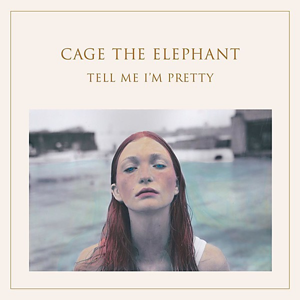

# Tell Me I’m Pretty

By **Cage the Elephant**

## Album Data

- **Catalog:** Beets
- **Format:** Digital, Album
- **Album:** Tell Me I’m Pretty
- **Artist:** Cage The Elephant
- **Albumartist:** Cage the Elephant
- **Genre:** Indie Rock
- **MusicBrainz Album Artist ID:** [b41b38d4-ef3e-4f37-8c75-cfe9af999696](https://musicbrainz.org/artist/b41b38d4-ef3e-4f37-8c75-cfe9af999696)
- **MusicBrainz Album ID:** [4896e0a1-57eb-49bd-8ae7-24f12600bb53](https://musicbrainz.org/release/4896e0a1-57eb-49bd-8ae7-24f12600bb53)
- **MusicBrainz Release Group ID:** [865ca6c7-64f2-4b88-a79f-33ca42d49811](https://musicbrainz.org/release-group/865ca6c7-64f2-4b88-a79f-33ca42d49811)
- **Year:** 2015
- **Catalog #:** 
- **Label:** RCA
- **Total Tracks:** 10

## Album Tracks

### Track 01 - Cry Baby

- **Artist:** Cage the Elephant
- **Format:** MP3
- **Genre:** Indie Rock
- **Length:** 4:07
- **MusicBrainz Track ID:** [32ab08d1-49c4-4071-bb94-0646ebf8d7b8](https://musicbrainz.org/recording/32ab08d1-49c4-4071-bb94-0646ebf8d7b8)
- **Title:** Cry Baby
- **Track:** 01
- **Year:** 2015

### Track 02 - Mess Around

- **Artist:** Cage the Elephant
- **Format:** MP3
- **Genre:** Indie Rock
- **Length:** 2:53
- **MusicBrainz Track ID:** [f3b0b2e5-44e6-4b78-876e-361165eb0eaa](https://musicbrainz.org/recording/f3b0b2e5-44e6-4b78-876e-361165eb0eaa)
- **Title:** Mess Around
- **Track:** 02
- **Year:** 2015

### Track 03 - Sweetie Little Jean

- **Artist:** Cage the Elephant
- **Format:** MP3
- **Genre:** Indie Rock
- **Length:** 3:44
- **MusicBrainz Track ID:** [be47bdd1-32fd-497b-9b04-c64edc6c26e1](https://musicbrainz.org/recording/be47bdd1-32fd-497b-9b04-c64edc6c26e1)
- **Title:** Sweetie Little Jean
- **Track:** 03
- **Year:** 2015

### Track 04 - Too Late to Say Goodbye

- **Artist:** Cage the Elephant
- **Format:** MP3
- **Genre:** Indie Rock
- **Length:** 4:12
- **MusicBrainz Track ID:** [72bea84d-a433-497d-9a64-445403f9dbbe](https://musicbrainz.org/recording/72bea84d-a433-497d-9a64-445403f9dbbe)
- **Title:** Too Late to Say Goodbye
- **Track:** 04
- **Year:** 2015

### Track 05 - Cold Cold Cold

- **Artist:** Cage the Elephant
- **Format:** MP3
- **Genre:** Indie Rock
- **Length:** 3:34
- **MusicBrainz Track ID:** [20b18145-caaf-4dda-8b7e-1e58ca563c68](https://musicbrainz.org/recording/20b18145-caaf-4dda-8b7e-1e58ca563c68)
- **Title:** Cold Cold Cold
- **Track:** 05
- **Year:** 2015

### Track 06 - Trouble

- **Artist:** Cage the Elephant
- **Format:** MP3
- **Genre:** Neo-Psychedelia
- **Length:** 3:45
- **MusicBrainz Track ID:** [1435da5b-a01f-458d-a3e0-5ed7d33ec3d1](https://musicbrainz.org/recording/1435da5b-a01f-458d-a3e0-5ed7d33ec3d1)
- **Title:** Trouble
- **Track:** 06
- **Year:** 2015

### Track 07 - How Are You True

- **Artist:** Cage the Elephant
- **Format:** MP3
- **Genre:** Indie Rock
- **Length:** 4:40
- **MusicBrainz Track ID:** [cfccaabc-f553-4cdc-8b3f-1528d4ef752b](https://musicbrainz.org/recording/cfccaabc-f553-4cdc-8b3f-1528d4ef752b)
- **Title:** How Are You True
- **Track:** 07
- **Year:** 2015

### Track 08 - That’s Right

- **Artist:** Cage the Elephant
- **Format:** MP3
- **Genre:** Indie Rock
- **Length:** 3:52
- **MusicBrainz Track ID:** [4fb92c81-72a3-4e3b-bdcd-3fd1a7797aa1](https://musicbrainz.org/recording/4fb92c81-72a3-4e3b-bdcd-3fd1a7797aa1)
- **Title:** That’s Right
- **Track:** 08
- **Year:** 2015

### Track 09 - Punchin’ Bag

- **Artist:** Cage the Elephant
- **Format:** MP3
- **Genre:** Indie Rock
- **Length:** 3:47
- **MusicBrainz Track ID:** [a703b76e-4d8d-496d-b7e7-da096c251696](https://musicbrainz.org/recording/a703b76e-4d8d-496d-b7e7-da096c251696)
- **Title:** Punchin’ Bag
- **Track:** 09
- **Year:** 2015

### Track 10 - Portuguese Knife Fight

- **Artist:** Cage the Elephant
- **Format:** MP3
- **Genre:** Indie Rock
- **Length:** 3:37
- **MusicBrainz Track ID:** [27b97ff5-3d18-4992-ac25-abc54c958099](https://musicbrainz.org/recording/27b97ff5-3d18-4992-ac25-abc54c958099)
- **Title:** Portuguese Knife Fight
- **Track:** 10
- **Year:** 2015

## See also

- [Vinyl: ](../../Vinyl/Cage_The_Elephant/Cage_The_Elephant.md)
- [Vinyl: Tell Me I'm Pretty](../../Vinyl/Cage_The_Elephant/Tell_Me_Im_Pretty.md)
