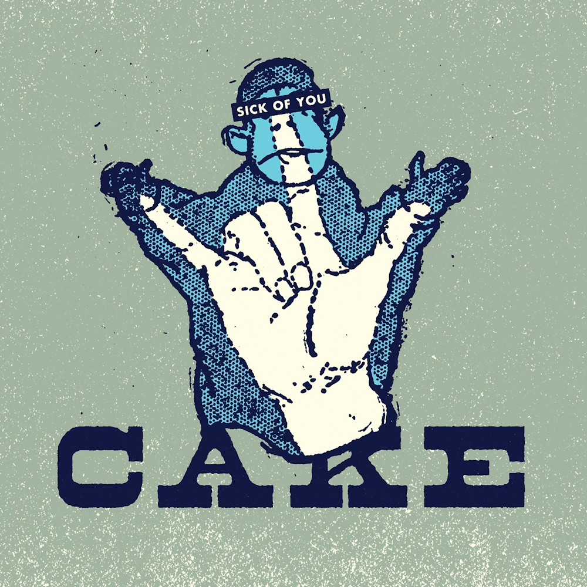

# Sick of You

By **CAKE**

## Album Data

- **Catalog:** Beets
- **Format:** Digital, Album
- **Album:** Sick of You
- **Artist:** Cake
- **Albumartist:** CAKE
- **Genre:** Pop Rock
- **MusicBrainz Album Artist ID:** [fa7b9055-3703-473a-8a09-adf2fe031a24](https://musicbrainz.org/artist/fa7b9055-3703-473a-8a09-adf2fe031a24)
- **MusicBrainz Album ID:** [c9735e72-4b15-4287-8747-d30a5fb0e5d1](https://musicbrainz.org/release/c9735e72-4b15-4287-8747-d30a5fb0e5d1)
- **MusicBrainz Release Group ID:** [1ff0e9a5-0a0b-46fc-b6b8-9290fb48f2ee](https://musicbrainz.org/release-group/1ff0e9a5-0a0b-46fc-b6b8-9290fb48f2ee)
- **Year:** 2011
- **Catalog #:** CKE7-69927
- **Label:** Independent Label Group
- **Total Tracks:** 02

## Album Tracks

### Track 01 - The Winter

- **Artist:** CAKE
- **Format:** MP3
- **Genre:** Stoner Rock
- **Length:** 4:05
- **MusicBrainz Track ID:** [7fc70de5-da98-47f6-a39e-6df3c04253eb](https://musicbrainz.org/recording/7fc70de5-da98-47f6-a39e-6df3c04253eb)
- **Title:** The Winter
- **Track:** 01
- **Year:** 2014

### Track 02 - Easy to Crash

- **Artist:** CAKE
- **Format:** MP3
- **Genre:** Alternative Rock
- **Length:** 4:11
- **MusicBrainz Track ID:** [237b744a-8dd9-426d-91dd-e952a19321bf](https://musicbrainz.org/recording/237b744a-8dd9-426d-91dd-e952a19321bf)
- **Title:** Easy to Crash
- **Track:** 02
- **Year:** 2014

