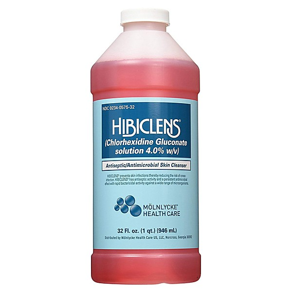

# 2013-08-11 San Francisco - Outside Lands ~ Sutro Stage

By **Camper Van Beethoven**

## Album Data

- **Catalog:** Beets
- **Format:** Digital, Album
- **Album:** 2013-08-11 San Francisco - Outside Lands ~ Sutro Stage
- **Artist:** Camper Van Beethoven
- **Albumartist:** Camper Van Beethoven
- **Genre:** Indie Rock
- **MusicBrainz Album Artist ID:** 
- **MusicBrainz Album ID:** 
- **MusicBrainz Release Group ID:** 
- **Year:** 2013
- **Catalog #:** 0777 7 13210 23
- **Label:** I.R.S. Records
- **Total Tracks:** 16

## Album Tracks

### Track 01 - Good Guys & Bad Guys

- **Artist:** Camper Van Beethoven
- **Format:** AAC
- **Genre:** Rock
- **Length:** 3:56
- **MusicBrainz Track ID:** [4ad622b0-c183-4f36-84cb-df8f7b16db4f](https://musicbrainz.org/recording/4ad622b0-c183-4f36-84cb-df8f7b16db4f)
- **Title:** Good Guys & Bad Guys
- **Track:** 01
- **Year:** 1993

### Track 02 - Joe Stalin’s Cadillac

- **Artist:** Camper Van Beethoven
- **Format:** AAC
- **Genre:** Indie Rock
- **Length:** 2:31
- **MusicBrainz Track ID:** [39661f97-42c8-422c-982b-82b72d68fc75](https://musicbrainz.org/recording/39661f97-42c8-422c-982b-82b72d68fc75)
- **Title:** Joe Stalin’s Cadillac
- **Track:** 02
- **Year:** 1993

### Track 03 - Five Sticks

- **Artist:** Camper Van Beethoven
- **Format:** AAC
- **Genre:** Indie Rock
- **Length:** 1:38
- **MusicBrainz Track ID:** [611ceafa-24b7-4032-8e4f-90d6ae14dc09](https://musicbrainz.org/recording/611ceafa-24b7-4032-8e4f-90d6ae14dc09)
- **Title:** Five Sticks
- **Track:** 03
- **Year:** 1993

### Track 04 - Lulu Land

- **Artist:** Camper Van Beethoven
- **Format:** AAC
- **Genre:** Indie Rock
- **Length:** 2:40
- **MusicBrainz Track ID:** [26bb843f-9749-4582-8d47-0ffd78036c7b](https://musicbrainz.org/recording/26bb843f-9749-4582-8d47-0ffd78036c7b)
- **Title:** Lulu Land
- **Track:** 04
- **Year:** 1993

### Track 05 - Une Fois

- **Artist:** Camper Van Beethoven
- **Format:** AAC
- **Genre:** Indie Rock
- **Length:** 1:29
- **MusicBrainz Track ID:** [908f3917-5a25-47a7-a0bc-cb7aa8d6d184](https://musicbrainz.org/recording/908f3917-5a25-47a7-a0bc-cb7aa8d6d184)
- **Title:** Une Fois
- **Track:** 05
- **Year:** 1993

### Track 06 - We Saw Jerry’s Daughter

- **Artist:** Camper Van Beethoven
- **Format:** AAC
- **Genre:** Indie Rock
- **Length:** 2:09
- **MusicBrainz Track ID:** [150aa134-6f4c-4df3-8c47-879352f4d7ea](https://musicbrainz.org/recording/150aa134-6f4c-4df3-8c47-879352f4d7ea)
- **Title:** We Saw Jerry’s Daughter
- **Track:** 06
- **Year:** 1993

### Track 07 - Surprise Truck

- **Artist:** Camper Van Beethoven
- **Format:** AAC
- **Genre:** Rock
- **Length:** 3:27
- **MusicBrainz Track ID:** [acf389da-a158-413f-a777-43ddc61ba568](https://musicbrainz.org/recording/acf389da-a158-413f-a777-43ddc61ba568)
- **Title:** Surprise Truck
- **Track:** 07
- **Year:** 1993

### Track 08 - Stairway to Heavan (sic)

- **Artist:** Camper Van Beethoven
- **Format:** AAC
- **Genre:** Indie Rock
- **Length:** 2:32
- **MusicBrainz Track ID:** [f885d5e4-6ff9-4d6a-b7a6-a60fbac6aa39](https://musicbrainz.org/recording/f885d5e4-6ff9-4d6a-b7a6-a60fbac6aa39)
- **Title:** Stairway to Heavan (sic)
- **Track:** 08
- **Year:** 1993

### Track 09 - The History of Utah

- **Artist:** Camper Van Beethoven
- **Format:** AAC
- **Genre:** Indie Rock
- **Length:** 2:52
- **MusicBrainz Track ID:** [56264722-fa3f-4277-af20-1d69313bf245](https://musicbrainz.org/recording/56264722-fa3f-4277-af20-1d69313bf245)
- **Title:** The History of Utah
- **Track:** 09
- **Year:** 1993

### Track 10 - Still Wishing to Course

- **Artist:** Camper Van Beethoven
- **Format:** AAC
- **Genre:** Alternative Rock
- **Length:** 3:51
- **MusicBrainz Track ID:** [9f17fb84-55c5-4366-9ef1-91bc4a050deb](https://musicbrainz.org/recording/9f17fb84-55c5-4366-9ef1-91bc4a050deb)
- **Title:** Still Wishing to Course
- **Track:** 10
- **Year:** 1993

### Track 11 - We Love You

- **Artist:** Camper Van Beethoven
- **Format:** AAC
- **Genre:** Indie Rock
- **Length:** 2:03
- **MusicBrainz Track ID:** [8212df6b-f0d4-49fd-9191-9e3882d04537](https://musicbrainz.org/recording/8212df6b-f0d4-49fd-9191-9e3882d04537)
- **Title:** We Love You
- **Track:** 11
- **Year:** 1993

### Track 12 - Hoe Yourself Down

- **Artist:** Camper Van Beethoven
- **Format:** AAC
- **Genre:** Indie Rock
- **Length:** 1:50
- **MusicBrainz Track ID:** [ef87201d-faa7-4bd9-9398-30491ac23a8f](https://musicbrainz.org/recording/ef87201d-faa7-4bd9-9398-30491ac23a8f)
- **Title:** Hoe Yourself Down
- **Track:** 12
- **Year:** 1993

### Track 13 - Peace & Love

- **Artist:** Camper Van Beethoven
- **Format:** AAC
- **Genre:** Indie Rock
- **Length:** 2:39
- **MusicBrainz Track ID:** [7a296db9-a3c7-4361-991d-56ec548e4c4c](https://musicbrainz.org/recording/7a296db9-a3c7-4361-991d-56ec548e4c4c)
- **Title:** Peace & Love
- **Track:** 13
- **Year:** 1993

### Track 14 - Folly

- **Artist:** Camper Van Beethoven
- **Format:** AAC
- **Genre:** Indie Rock
- **Length:** 1:57
- **MusicBrainz Track ID:** [8b6406ec-bf5e-4c0a-a8df-072b69522b40](https://musicbrainz.org/recording/8b6406ec-bf5e-4c0a-a8df-072b69522b40)
- **Title:** Folly
- **Track:** 14
- **Year:** 1993

### Track 15 - Interstellar Overdrive

- **Artist:** Camper Van Beethoven
- **Format:** AAC
- **Genre:** Cowpunk
- **Length:** 7:45
- **MusicBrainz Track ID:** [6a2e693c-c081-4d71-b46c-6cf9b0f420fd](https://musicbrainz.org/recording/6a2e693c-c081-4d71-b46c-6cf9b0f420fd)
- **Title:** Interstellar Overdrive
- **Track:** 15
- **Year:** 1993

### Track 16 - Shut Us Down

- **Artist:** Camper Van Beethoven
- **Format:** AAC
- **Genre:** Alternative Rock
- **Length:** 1:26
- **MusicBrainz Track ID:** [9655017c-1a40-438e-80d3-459646dfee02](https://musicbrainz.org/recording/9655017c-1a40-438e-80d3-459646dfee02)
- **Title:** Shut Us Down
- **Track:** 16
- **Year:** 1993

## See also

- [Camper Van Beethoven](Camper_Van_Beethoven.md)
- [Camper Vantiquities](Camper_Vantiquities.md)
- [El Camino Real](El_Camino_Real.md)
- [Greatest Hits Played Faster](Greatest_Hits_Played_Faster.md)
- [II & III](II_and_III.md)
- [In the Mouth of the Crocodile](In_the_Mouth_of_the_Crocodile.md)
- [Key Lime Pie](Key_Lime_Pie.md)
- [La Costa Perdida](La_Costa_Perdida.md)
- [New Roman Times (2015 Vinyl MP3 Download)](New_Roman_Times_2015_Vinyl_MP3_Download.md)
- [New Roman Times](New_Roman_Times.md)
- [Take The Skinheads Bowling](Take_The_Skinheads_Bowling.md)
- [Telephone Free Landslide Victory](Telephone_Free_Landslide_Victory.md)
- [Tusk](Tusk.md)
- [Vampire Can Mating Oven](Vampire_Can_Mating_Oven.md)
- [Roon: 2013-08-11 San Francisco - Outside Lands ~ Sutro Stage](../../Roon/Camper_Van_Beethoven/2013-08-11_San_Francisco_-_Outside_Lands_~_Sutro_Stage.md)
- [Roon: Camper Van Beethoven](../../Roon/Camper_Van_Beethoven/Camper_Van_Beethoven.md)
- [Roon: Camper Vantiquities](../../Roon/Camper_Van_Beethoven/Camper_Vantiquities.md)
- [Roon: Cigarettes & Carrot Juice](../../Roon/Camper_Van_Beethoven/Cigarettes_and_Carrot_Juice-_The_Santa_Cruz_Years.md)
- [Roon: El Camino Real](../../Roon/Camper_Van_Beethoven/El_Camino_Real.md)
- [Roon: II & III](../../Roon/Camper_Van_Beethoven/II_and_III.md)
- [Roon: In the Mouth of the Crocodile](../../Roon/Camper_Van_Beethoven/In_the_Mouth_of_the_Crocodile-_Live_in_Seattle.md)
- [Roon: Key Lime Pie](../../Roon/Camper_Van_Beethoven/Key_Lime_Pie.md)
- [Roon: La Costa Perdida (Bonus Version)](../../Roon/Camper_Van_Beethoven/La_Costa_Perdida_Bonus_Version.md)
- [Roon: Live at CBGB's on 1986-03-21](../../Roon/Camper_Van_Beethoven/Live_at_CBGBs_on_1986-03-21.md)
- [Roon: New Roman Times](../../Roon/Camper_Van_Beethoven/New_Roman_Times.md)
- [Roon: Our Beloved Revolutionary Sweetheart](../../Roon/Camper_Van_Beethoven/Our_Beloved_Revolutionary_Sweetheart.md)
- [Roon: Take The Skinheads Bowling](../../Roon/Camper_Van_Beethoven/Take_The_Skinheads_Bowling.md)
- [Roon: Telephone Free Landslide Victory](../../Roon/Camper_Van_Beethoven/Telephone_Free_Landslide_Victory.md)
- [Roon: Tusk](../../Roon/Camper_Van_Beethoven/Tusk.md)
- [Roon: Vampire Can Mating Oven](../../Roon/Camper_Van_Beethoven/Vampire_Can_Mating_Oven.md)
- [Vinyl: ](../../Vinyl/Camper_Van_Beethoven/Camper_Van_Beethoven_index.md)
- [Vinyl: Camper Van Beethoven](../../Vinyl/Camper_Van_Beethoven/Camper_Van_Beethoven.md)
- [Vinyl: New Roman Times](../../Vinyl/Camper_Van_Beethoven/New_Roman_Times.md)
