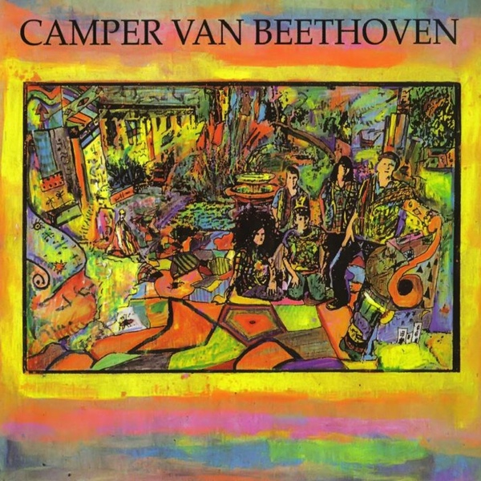

# Camper Van Beethoven

By **Camper Van Beethoven**

## Album Data

- **Catalog:** Beets
- **Format:** Digital, Album
- **Album:** Camper Van Beethoven
- **Artist:** Camper Van Beethoven
- **Albumartist:** Camper Van Beethoven
- **Genre:** Indie Rock
- **MusicBrainz Album Artist ID:** [0ee7e64d-90ca-406b-b59a-3e551c556dbe](https://musicbrainz.org/artist/0ee7e64d-90ca-406b-b59a-3e551c556dbe)
- **MusicBrainz Album ID:** [3d7a90df-a0c8-479d-8dd3-8ea9c01fab74](https://musicbrainz.org/release/3d7a90df-a0c8-479d-8dd3-8ea9c01fab74)
- **MusicBrainz Release Group ID:** [1fc7f777-87eb-3a00-8ada-c2d313e5af69](https://musicbrainz.org/release-group/1fc7f777-87eb-3a00-8ada-c2d313e5af69)
- **Year:** 1993
- **Catalog #:** 
- **Label:** 
- **Total Tracks:** 16

## Album Tracks

### Track 01 - Heart

- **Artist:** Camper Van Beethoven
- **Format:** AAC
- **Genre:** Post-Punk
- **Length:** 3:08
- **MusicBrainz Track ID:** 
- **Title:** Heart
- **Track:** 01
- **Year:** 1987

### Track 02 - Never Go Back

- **Artist:** Camper Van Beethoven
- **Format:** AAC
- **Genre:** Acid Rock
- **Length:** 3:24
- **MusicBrainz Track ID:** 
- **Title:** Never Go Back
- **Track:** 02
- **Year:** 1987

### Track 03 - Seven Languages

- **Artist:** Camper Van Beethoven
- **Format:** AAC
- **Genre:** Post-Punk
- **Length:** 4:12
- **MusicBrainz Track ID:** 
- **Title:** Seven Languages
- **Track:** 03
- **Year:** 1987

### Track 04 - Axe Murderer Song

- **Artist:** Camper Van Beethoven
- **Format:** AAC
- **Genre:** Indie Rock
- **Length:** 2:28
- **MusicBrainz Track ID:** 
- **Title:** Axe Murderer Song
- **Track:** 04
- **Year:** 1985

### Track 05 - SP37957

- **Artist:** Camper Van Beethoven
- **Format:** AAC
- **Genre:** Post-Punk
- **Length:** 3:04
- **MusicBrainz Track ID:** 
- **Title:** SP37957
- **Track:** 05
- **Year:** 1985

### Track 06 - Crossing Over

- **Artist:** Camper Van Beethoven
- **Format:** AAC
- **Genre:** Cowpunk
- **Length:** 3:24
- **MusicBrainz Track ID:** 
- **Title:** Crossing Over
- **Track:** 06
- **Year:** 1985

### Track 07 - Guardian Angles

- **Artist:** Camper Van Beethoven
- **Format:** AAC
- **Genre:** Post-Punk
- **Length:** 2:06
- **MusicBrainz Track ID:** 
- **Title:** Guardian Angles
- **Track:** 07
- **Year:** 1986

### Track 08 - I'm Not Like Everybody Else

- **Artist:** Camper Van Beethoven
- **Format:** AAC
- **Genre:** Post-Punk
- **Length:** 3:24
- **MusicBrainz Track ID:** 
- **Title:** I'm Not Like Everybody Else
- **Track:** 08
- **Year:** 1986

### Track 09 - A.C. Cover

- **Artist:** Camper Van Beethoven
- **Format:** AAC
- **Genre:** Post-Punk
- **Length:** 3:02
- **MusicBrainz Track ID:** 
- **Title:** A.C. Cover
- **Track:** 09
- **Year:** 1986

### Track 10 - Porpoise Mouth

- **Artist:** Camper Van Beethoven
- **Format:** AAC
- **Genre:** Post-Punk
- **Length:** 2:38
- **MusicBrainz Track ID:** 
- **Title:** Porpoise Mouth
- **Track:** 10
- **Year:** 1986

### Track 11 - We Workers Do Not Understand Modern Art

- **Artist:** Camper Van Beethoven
- **Format:** AAC
- **Genre:** Post-Punk
- **Length:** 2:58
- **MusicBrainz Track ID:** 
- **Title:** We Workers Do Not Understand Modern Art
- **Track:** 11
- **Year:** 1986

### Track 12 - We Eat Your Children

- **Artist:** Camper Van Beethoven
- **Format:** AAC
- **Genre:** Post-Punk
- **Length:** 3:49
- **MusicBrainz Track ID:** 
- **Title:** We Eat Your Children
- **Track:** 12
- **Year:** 1986

### Track 13 - Six More Miles To The Graveyard

- **Artist:** Camper Van Beethoven
- **Format:** AAC
- **Genre:** Indie Pop
- **Length:** 2:57
- **MusicBrainz Track ID:** 
- **Title:** Six More Miles To The Graveyard
- **Track:** 13
- **Year:** 1986

### Track 14 - Ice Cream Everyday

- **Artist:** Camper Van Beethoven
- **Format:** AAC
- **Genre:** Post-Punk
- **Length:** 4:04
- **MusicBrainz Track ID:** 
- **Title:** Ice Cream Everyday
- **Track:** 14
- **Year:** 1986

### Track 15 - Processional

- **Artist:** Camper Van Beethoven
- **Format:** AAC
- **Genre:** Post-Punk
- **Length:** 3:48
- **MusicBrainz Track ID:** 
- **Title:** Processional
- **Track:** 15
- **Year:** 1986

### Track 16 - Photograph/Om Eye (Sweet Isthmus)

- **Artist:** Camper Van Beethoven
- **Format:** AAC
- **Genre:** Post-Punk
- **Length:** 19:39
- **MusicBrainz Track ID:** 
- **Title:** Photograph/Om Eye (Sweet Isthmus)
- **Track:** 16
- **Year:** 1985

## See also

- [2013-08-11 San Francisco - Outside Lands ~ Sutro Stage](2013-08-11_San_Francisco_-_Outside_Lands_~_Sutro_Stage.md)
- [Camper Vantiquities](Camper_Vantiquities.md)
- [El Camino Real](El_Camino_Real.md)
- [Greatest Hits Played Faster](Greatest_Hits_Played_Faster.md)
- [II & III](II_and_III.md)
- [In the Mouth of the Crocodile](In_the_Mouth_of_the_Crocodile.md)
- [Key Lime Pie](Key_Lime_Pie.md)
- [La Costa Perdida](La_Costa_Perdida.md)
- [New Roman Times (2015 Vinyl MP3 Download)](New_Roman_Times_2015_Vinyl_MP3_Download.md)
- [New Roman Times](New_Roman_Times.md)
- [Take The Skinheads Bowling](Take_The_Skinheads_Bowling.md)
- [Telephone Free Landslide Victory](Telephone_Free_Landslide_Victory.md)
- [Tusk](Tusk.md)
- [Vampire Can Mating Oven](Vampire_Can_Mating_Oven.md)
- [Roon: 2013-08-11 San Francisco - Outside Lands ~ Sutro Stage](../../Roon/Camper_Van_Beethoven/2013-08-11_San_Francisco_-_Outside_Lands_~_Sutro_Stage.md)
- [Roon: Camper Van Beethoven](../../Roon/Camper_Van_Beethoven/Camper_Van_Beethoven.md)
- [Roon: Camper Vantiquities](../../Roon/Camper_Van_Beethoven/Camper_Vantiquities.md)
- [Roon: Cigarettes & Carrot Juice](../../Roon/Camper_Van_Beethoven/Cigarettes_and_Carrot_Juice-_The_Santa_Cruz_Years.md)
- [Roon: El Camino Real](../../Roon/Camper_Van_Beethoven/El_Camino_Real.md)
- [Roon: II & III](../../Roon/Camper_Van_Beethoven/II_and_III.md)
- [Roon: In the Mouth of the Crocodile](../../Roon/Camper_Van_Beethoven/In_the_Mouth_of_the_Crocodile-_Live_in_Seattle.md)
- [Roon: Key Lime Pie](../../Roon/Camper_Van_Beethoven/Key_Lime_Pie.md)
- [Roon: La Costa Perdida (Bonus Version)](../../Roon/Camper_Van_Beethoven/La_Costa_Perdida_Bonus_Version.md)
- [Roon: Live at CBGB's on 1986-03-21](../../Roon/Camper_Van_Beethoven/Live_at_CBGBs_on_1986-03-21.md)
- [Roon: New Roman Times](../../Roon/Camper_Van_Beethoven/New_Roman_Times.md)
- [Roon: Our Beloved Revolutionary Sweetheart](../../Roon/Camper_Van_Beethoven/Our_Beloved_Revolutionary_Sweetheart.md)
- [Roon: Take The Skinheads Bowling](../../Roon/Camper_Van_Beethoven/Take_The_Skinheads_Bowling.md)
- [Roon: Telephone Free Landslide Victory](../../Roon/Camper_Van_Beethoven/Telephone_Free_Landslide_Victory.md)
- [Roon: Tusk](../../Roon/Camper_Van_Beethoven/Tusk.md)
- [Roon: Vampire Can Mating Oven](../../Roon/Camper_Van_Beethoven/Vampire_Can_Mating_Oven.md)
- [Vinyl: ](../../Vinyl/Camper_Van_Beethoven/Camper_Van_Beethoven_index.md)
- [Vinyl: Camper Van Beethoven](../../Vinyl/Camper_Van_Beethoven/Camper_Van_Beethoven.md)
- [Vinyl: New Roman Times](../../Vinyl/Camper_Van_Beethoven/New_Roman_Times.md)
