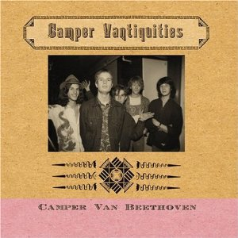

# Camper Vantiquities

By **Camper Van Beethoven**

## Album Data

- **Catalog:** Beets
- **Format:** Digital, Album
- **Album:** Camper Vantiquities
- **Artist:** Camper Van Beethoven
- **Albumartist:** Camper Van Beethoven
- **Genre:** Post-Punk
- **MusicBrainz Album Artist ID:** 
- **MusicBrainz Album ID:** 
- **MusicBrainz Release Group ID:** 
- **Year:** 1987
- **Catalog #:** 
- **Label:** SLG
- **Total Tracks:** 14

## Album Tracks

### Track 01 - The Ultimate Solution

- **Artist:** Camper Van Beethoven
- **Format:** AAC
- **Genre:** Indie Rock
- **Length:** 2:56
- **MusicBrainz Track ID:** [6d57c064-c314-45cc-8bfe-32d86b2ee233](https://musicbrainz.org/recording/6d57c064-c314-45cc-8bfe-32d86b2ee233)
- **Title:** The Ultimate Solution
- **Track:** 01
- **Year:** 2014

### Track 02 - It Was Like That When We Got Here

- **Artist:** Camper Van Beethoven
- **Format:** AAC
- **Genre:** Rock
- **Length:** 4:28
- **MusicBrainz Track ID:** [1e4d67b5-0337-4ce5-85c5-e7511b2be126](https://musicbrainz.org/recording/1e4d67b5-0337-4ce5-85c5-e7511b2be126)
- **Title:** It Was Like That When We Got Here
- **Track:** 02
- **Year:** 2014

### Track 03 - Classy Dames and Able Gents

- **Artist:** Camper Van Beethoven
- **Format:** AAC
- **Genre:** Indie Rock
- **Length:** 2:15
- **MusicBrainz Track ID:** [ab808278-6b4c-456d-a254-570894b7999e](https://musicbrainz.org/recording/ab808278-6b4c-456d-a254-570894b7999e)
- **Title:** Classy Dames and Able Gents
- **Track:** 03
- **Year:** 2014

### Track 04 - Camp Pendleton

- **Artist:** Camper Van Beethoven
- **Format:** AAC
- **Genre:** Indie Rock
- **Length:** 4:56
- **MusicBrainz Track ID:** [49db71ab-d0c1-425c-8818-24a350851abf](https://musicbrainz.org/recording/49db71ab-d0c1-425c-8818-24a350851abf)
- **Title:** Camp Pendleton
- **Track:** 04
- **Year:** 2014

### Track 05 - Dockweiler Beach

- **Artist:** Camper Van Beethoven
- **Format:** AAC
- **Genre:** Indie Rock
- **Length:** 2:50
- **MusicBrainz Track ID:** [c612fe93-b327-4789-b0bf-364ed20111ff](https://musicbrainz.org/recording/c612fe93-b327-4789-b0bf-364ed20111ff)
- **Title:** Dockweiler Beach
- **Track:** 05
- **Year:** 2014

### Track 06 - Sugartown

- **Artist:** Camper Van Beethoven
- **Format:** AAC
- **Genre:** Indie Rock
- **Length:** 2:26
- **MusicBrainz Track ID:** [26309e73-2abe-430a-a596-43e5d2d0e97c](https://musicbrainz.org/recording/26309e73-2abe-430a-a596-43e5d2d0e97c)
- **Title:** Sugartown
- **Track:** 06
- **Year:** 2014

### Track 07 - I Live in LA

- **Artist:** Camper Van Beethoven
- **Format:** AAC
- **Genre:** Indie Rock
- **Length:** 4:23
- **MusicBrainz Track ID:** [cb41cd76-4291-42d3-9bf8-ffa80494038d](https://musicbrainz.org/recording/cb41cd76-4291-42d3-9bf8-ffa80494038d)
- **Title:** I Live in LA
- **Track:** 07
- **Year:** 2014

### Track 08 - Out Like a Lion

- **Artist:** Camper Van Beethoven
- **Format:** AAC
- **Genre:** Indie Rock
- **Length:** 4:00
- **MusicBrainz Track ID:** [397dd164-c01c-4e38-8927-3cd2fbce71f5](https://musicbrainz.org/recording/397dd164-c01c-4e38-8927-3cd2fbce71f5)
- **Title:** Out Like a Lion
- **Track:** 08
- **Year:** 2014

### Track 09 - Goldbase

- **Artist:** Camper Van Beethoven
- **Format:** AAC
- **Genre:** Indie Rock
- **Length:** 3:50
- **MusicBrainz Track ID:** [cb2ddc83-4c77-4318-84ca-b67ef242a424](https://musicbrainz.org/recording/cb2ddc83-4c77-4318-84ca-b67ef242a424)
- **Title:** Goldbase
- **Track:** 09
- **Year:** 2014

### Track 10 - Darken Your Door

- **Artist:** Camper Van Beethoven
- **Format:** AAC
- **Genre:** Indie Rock
- **Length:** 4:38
- **MusicBrainz Track ID:** [2e869fa0-2528-4e3b-805a-d79b3798dee9](https://musicbrainz.org/recording/2e869fa0-2528-4e3b-805a-d79b3798dee9)
- **Title:** Darken Your Door
- **Track:** 10
- **Year:** 2014

### Track 11 - Grasshopper

- **Artist:** Camper Van Beethoven
- **Format:** AAC
- **Genre:** Indie Rock
- **Length:** 3:06
- **MusicBrainz Track ID:** [ce6a6f6f-41f9-4527-ac9a-63bd6161d245](https://musicbrainz.org/recording/ce6a6f6f-41f9-4527-ac9a-63bd6161d245)
- **Title:** Grasshopper
- **Track:** 11
- **Year:** 2014

### Track 12 - City of Industry (outtake)

- **Artist:** Camper Van Beethoven
- **Format:** AAC
- **Genre:** Indie Rock
- **Length:** 4:33
- **MusicBrainz Track ID:** [4b8f777a-c6e7-4d38-86ae-c787fcbff3d5](https://musicbrainz.org/recording/4b8f777a-c6e7-4d38-86ae-c787fcbff3d5)
- **Title:** City of Industry (outtake)
- **Track:** 12
- **Year:** 2014

### Track 13 - Camp Pendleton (demo)

- **Artist:** Camper Van Beethoven
- **Format:** AAC
- **Genre:** Indie Rock
- **Length:** 4:59
- **MusicBrainz Track ID:** [9c1eb0bc-739d-4881-866b-153e299fa3c3](https://musicbrainz.org/recording/9c1eb0bc-739d-4881-866b-153e299fa3c3)
- **Title:** Camp Pendleton (demo)
- **Track:** 13
- **Year:** 2014

### Track 14 - Summer Days

- **Artist:** Camper Van Beethoven
- **Format:** AAC
- **Genre:** Indie Rock
- **Length:** 5:40
- **MusicBrainz Track ID:** [285ba319-ad4a-4115-9da3-67b70a5e62b6](https://musicbrainz.org/recording/285ba319-ad4a-4115-9da3-67b70a5e62b6)
- **Title:** Summer Days
- **Track:** 14
- **Year:** 2014

## See also

- [2013-08-11 San Francisco - Outside Lands ~ Sutro Stage](2013-08-11_San_Francisco_-_Outside_Lands_~_Sutro_Stage.md)
- [Camper Van Beethoven](Camper_Van_Beethoven.md)
- [El Camino Real](El_Camino_Real.md)
- [Greatest Hits Played Faster](Greatest_Hits_Played_Faster.md)
- [II & III](II_and_III.md)
- [In the Mouth of the Crocodile](In_the_Mouth_of_the_Crocodile.md)
- [Key Lime Pie](Key_Lime_Pie.md)
- [La Costa Perdida](La_Costa_Perdida.md)
- [New Roman Times (2015 Vinyl MP3 Download)](New_Roman_Times_2015_Vinyl_MP3_Download.md)
- [New Roman Times](New_Roman_Times.md)
- [Take The Skinheads Bowling](Take_The_Skinheads_Bowling.md)
- [Telephone Free Landslide Victory](Telephone_Free_Landslide_Victory.md)
- [Tusk](Tusk.md)
- [Vampire Can Mating Oven](Vampire_Can_Mating_Oven.md)
- [Roon: 2013-08-11 San Francisco - Outside Lands ~ Sutro Stage](../../Roon/Camper_Van_Beethoven/2013-08-11_San_Francisco_-_Outside_Lands_~_Sutro_Stage.md)
- [Roon: Camper Van Beethoven](../../Roon/Camper_Van_Beethoven/Camper_Van_Beethoven.md)
- [Roon: Camper Vantiquities](../../Roon/Camper_Van_Beethoven/Camper_Vantiquities.md)
- [Roon: Cigarettes & Carrot Juice](../../Roon/Camper_Van_Beethoven/Cigarettes_and_Carrot_Juice-_The_Santa_Cruz_Years.md)
- [Roon: El Camino Real](../../Roon/Camper_Van_Beethoven/El_Camino_Real.md)
- [Roon: II & III](../../Roon/Camper_Van_Beethoven/II_and_III.md)
- [Roon: In the Mouth of the Crocodile](../../Roon/Camper_Van_Beethoven/In_the_Mouth_of_the_Crocodile-_Live_in_Seattle.md)
- [Roon: Key Lime Pie](../../Roon/Camper_Van_Beethoven/Key_Lime_Pie.md)
- [Roon: La Costa Perdida (Bonus Version)](../../Roon/Camper_Van_Beethoven/La_Costa_Perdida_Bonus_Version.md)
- [Roon: Live at CBGB's on 1986-03-21](../../Roon/Camper_Van_Beethoven/Live_at_CBGBs_on_1986-03-21.md)
- [Roon: New Roman Times](../../Roon/Camper_Van_Beethoven/New_Roman_Times.md)
- [Roon: Our Beloved Revolutionary Sweetheart](../../Roon/Camper_Van_Beethoven/Our_Beloved_Revolutionary_Sweetheart.md)
- [Roon: Take The Skinheads Bowling](../../Roon/Camper_Van_Beethoven/Take_The_Skinheads_Bowling.md)
- [Roon: Telephone Free Landslide Victory](../../Roon/Camper_Van_Beethoven/Telephone_Free_Landslide_Victory.md)
- [Roon: Tusk](../../Roon/Camper_Van_Beethoven/Tusk.md)
- [Roon: Vampire Can Mating Oven](../../Roon/Camper_Van_Beethoven/Vampire_Can_Mating_Oven.md)
- [Vinyl: ](../../Vinyl/Camper_Van_Beethoven/Camper_Van_Beethoven_index.md)
- [Vinyl: Camper Van Beethoven](../../Vinyl/Camper_Van_Beethoven/Camper_Van_Beethoven.md)
- [Vinyl: New Roman Times](../../Vinyl/Camper_Van_Beethoven/New_Roman_Times.md)
