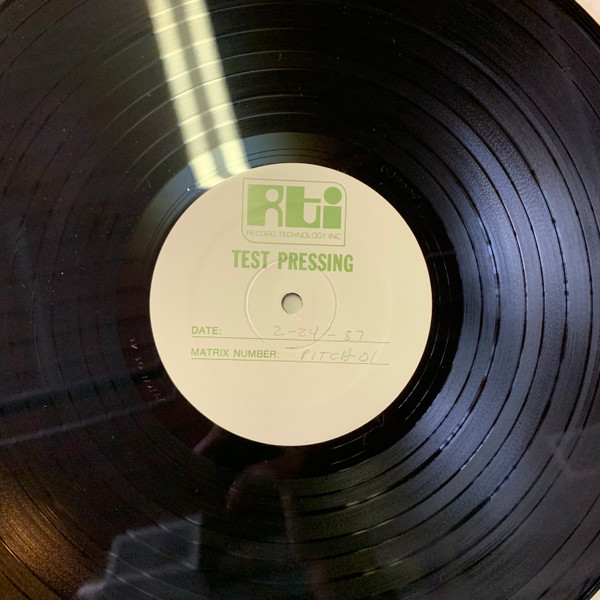

# II & III

By **Camper Van Beethoven**

## Album Data

- **Catalog:** Beets
- **Format:** Digital, Album
- **Album:** II & III
- **Artist:** Camper Van Beethoven
- **Albumartist:** Camper Van Beethoven
- **Genre:** Indie Rock
- **MusicBrainz Album Artist ID:** [0ee7e64d-90ca-406b-b59a-3e551c556dbe](https://musicbrainz.org/artist/0ee7e64d-90ca-406b-b59a-3e551c556dbe)
- **MusicBrainz Album ID:** [7aa032e0-f40b-480f-82ed-4570a0166411](https://musicbrainz.org/release/7aa032e0-f40b-480f-82ed-4570a0166411)
- **MusicBrainz Release Group ID:** [3fe006ff-af5d-380f-898f-d05adb791167](https://musicbrainz.org/release-group/3fe006ff-af5d-380f-898f-d05adb791167)
- **Year:** 2004
- **Catalog #:** [none]
- **Label:** Pitch-A-Tent
- **Total Tracks:** 28

## Album Tracks

### Track 01 - When I Win the Lottery

- **Artist:** Camper Van Beethoven
- **Format:** ALAC
- **Genre:** Indie Rock
- **Length:** 4:09
- **MusicBrainz Track ID:** [26d130b4-3bfb-4fd8-b365-658a896c8ad0](https://musicbrainz.org/recording/26d130b4-3bfb-4fd8-b365-658a896c8ad0)
- **Title:** When I Win the Lottery
- **Track:** 01
- **Year:** 2004

### Track 02 - Balalaika Gap

- **Artist:** Camper Van Beethoven
- **Format:** ALAC
- **Genre:** Ska Punk
- **Length:** 2:07
- **MusicBrainz Track ID:** [86e75b62-1f24-4de0-ab47-7431f2286d57](https://musicbrainz.org/recording/86e75b62-1f24-4de0-ab47-7431f2286d57)
- **Title:** Balalaika Gap
- **Track:** 02
- **Year:** 2004

### Track 03 - Tania

- **Artist:** Camper Van Beethoven
- **Format:** ALAC
- **Genre:** Indie Pop
- **Length:** 3:48
- **MusicBrainz Track ID:** [08930618-994a-4776-adde-9a19c16d0e48](https://musicbrainz.org/recording/08930618-994a-4776-adde-9a19c16d0e48)
- **Title:** Tania
- **Track:** 03
- **Year:** 2004

### Track 04 - Tina

- **Artist:** Camper Van Beethoven
- **Format:** ALAC
- **Genre:** Indie Pop
- **Length:** 1:48
- **MusicBrainz Track ID:** [1cf3ecd9-3449-4beb-90a0-c5c734cc820e](https://musicbrainz.org/recording/1cf3ecd9-3449-4beb-90a0-c5c734cc820e)
- **Title:** Tina
- **Track:** 04
- **Year:** 2004

### Track 05 - Waka

- **Artist:** Camper Van Beethoven
- **Format:** ALAC
- **Genre:** Indie Rock
- **Length:** 2:52
- **MusicBrainz Track ID:** [47806869-4658-48e9-9f32-43991764c5c7](https://musicbrainz.org/recording/47806869-4658-48e9-9f32-43991764c5c7)
- **Title:** Waka
- **Track:** 05
- **Year:** 2004

### Track 06 - Eye of Fatima 1

- **Artist:** Camper Van Beethoven
- **Format:** ALAC
- **Genre:** Indie Rock
- **Length:** 3:13
- **MusicBrainz Track ID:** [da05691f-944b-4569-9ed9-47c37a2ae4b5](https://musicbrainz.org/recording/da05691f-944b-4569-9ed9-47c37a2ae4b5)
- **Title:** Eye of Fatima 1
- **Track:** 06
- **Year:** 2004

### Track 07 - Eye of Fatima 2

- **Artist:** Camper Van Beethoven
- **Format:** ALAC
- **Genre:** Indie Rock
- **Length:** 2:24
- **MusicBrainz Track ID:** [a661987b-737a-4556-9fa7-b9cc4b869e46](https://musicbrainz.org/recording/a661987b-737a-4556-9fa7-b9cc4b869e46)
- **Title:** Eye of Fatima 2
- **Track:** 07
- **Year:** 2004

### Track 08 - Flowers

- **Artist:** Camper Van Beethoven
- **Format:** ALAC
- **Genre:** Indie Rock
- **Length:** 3:14
- **MusicBrainz Track ID:** [be6eff1a-db95-4cd0-b83c-a88f239a1604](https://musicbrainz.org/recording/be6eff1a-db95-4cd0-b83c-a88f239a1604)
- **Title:** Flowers
- **Track:** 08
- **Year:** 2004

### Track 09 - Bad Birthday Dedications

- **Artist:** Camper Van Beethoven
- **Format:** ALAC
- **Genre:** Indie Rock
- **Length:** 0:33
- **MusicBrainz Track ID:** [817edbc2-69a5-4e2d-9b08-91aa495bffa1](https://musicbrainz.org/recording/817edbc2-69a5-4e2d-9b08-91aa495bffa1)
- **Title:** Bad Birthday Dedications
- **Track:** 09
- **Year:** 2004

### Track 10 - Oh Death

- **Artist:** Camper Van Beethoven
- **Format:** ALAC
- **Genre:** Indie Rock
- **Length:** 3:07
- **MusicBrainz Track ID:** [5d8c3c79-1cfd-44bb-9d5c-70ccf3e72b6a](https://musicbrainz.org/recording/5d8c3c79-1cfd-44bb-9d5c-70ccf3e72b6a)
- **Title:** Oh Death
- **Track:** 10
- **Year:** 2004

### Track 11 - Embarassing Stage Comments

- **Artist:** Camper Van Beethoven
- **Format:** ALAC
- **Genre:** Indie Rock
- **Length:** 0:49
- **MusicBrainz Track ID:** [313b3425-f2fe-42ce-b453-c94e826275e0](https://musicbrainz.org/recording/313b3425-f2fe-42ce-b453-c94e826275e0)
- **Title:** Embarassing Stage Comments
- **Track:** 11
- **Year:** 2004

### Track 12 - Circles

- **Artist:** Camper Van Beethoven
- **Format:** ALAC
- **Genre:** Progressive Rock
- **Length:** 3:03
- **MusicBrainz Track ID:** [99e22d70-dfc1-4fa2-b3eb-12318631b488](https://musicbrainz.org/recording/99e22d70-dfc1-4fa2-b3eb-12318631b488)
- **Title:** Circles
- **Track:** 12
- **Year:** 2004

### Track 13 - Unabomber Song

- **Artist:** Camper Van Beethoven
- **Format:** ALAC
- **Genre:** Indie Rock
- **Length:** 2:14
- **MusicBrainz Track ID:** [54dab17a-0150-4ce3-b903-330d8ec30280](https://musicbrainz.org/recording/54dab17a-0150-4ce3-b903-330d8ec30280)
- **Title:** Unabomber Song
- **Track:** 13
- **Year:** 2004

### Track 14 - White Riot

- **Artist:** Camper Van Beethoven
- **Format:** ALAC
- **Genre:** Indie Rock
- **Length:** 2:04
- **MusicBrainz Track ID:** [8d8e13e1-8dd7-46bd-b715-eac3299f00e8](https://musicbrainz.org/recording/8d8e13e1-8dd7-46bd-b715-eac3299f00e8)
- **Title:** White Riot
- **Track:** 14
- **Year:** 2004

### Track 15 - (I Was So) Wasted

- **Artist:** Camper Van Beethoven
- **Format:** ALAC
- **Genre:** Indie Rock
- **Length:** 1:48
- **MusicBrainz Track ID:** [00e57490-64ab-4584-86d4-3bdc9d9ddd73](https://musicbrainz.org/recording/00e57490-64ab-4584-86d4-3bdc9d9ddd73)
- **Title:** (I Was So) Wasted
- **Track:** 15
- **Year:** 2004

### Track 16 - Shut Us Down

- **Artist:** Camper Van Beethoven
- **Format:** ALAC
- **Genre:** Alternative Rock
- **Length:** 1:16
- **MusicBrainz Track ID:** [b0a7acb1-f6bf-479f-9172-852af48a791b](https://musicbrainz.org/recording/b0a7acb1-f6bf-479f-9172-852af48a791b)
- **Title:** Shut Us Down
- **Track:** 16
- **Year:** 2004

### Track 17 - History of Utah

- **Artist:** Camper Van Beethoven
- **Format:** ALAC
- **Genre:** Indie Rock
- **Length:** 3:03
- **MusicBrainz Track ID:** [36193c0c-6a46-43a9-9b80-db8fac252f15](https://musicbrainz.org/recording/36193c0c-6a46-43a9-9b80-db8fac252f15)
- **Title:** History of Utah
- **Track:** 17
- **Year:** 2004

### Track 18 - How to Win Friends and Influence People

- **Artist:** Camper Van Beethoven
- **Format:** ALAC
- **Genre:** Indie Rock
- **Length:** 0:44
- **MusicBrainz Track ID:** [41b201c0-3180-495d-adfb-bf12e9b4a202](https://musicbrainz.org/recording/41b201c0-3180-495d-adfb-bf12e9b4a202)
- **Title:** How to Win Friends and Influence People
- **Track:** 18
- **Year:** 2004

### Track 19 - All Her Favorite Fruit

- **Artist:** Camper Van Beethoven
- **Format:** ALAC
- **Genre:** Rock
- **Length:** 5:20
- **MusicBrainz Track ID:** [b4cab138-8330-47e5-a8a9-37bfc6bf8d59](https://musicbrainz.org/recording/b4cab138-8330-47e5-a8a9-37bfc6bf8d59)
- **Title:** All Her Favorite Fruit
- **Track:** 19
- **Year:** 2004

### Track 20 - Sweethearts

- **Artist:** Camper Van Beethoven
- **Format:** ALAC
- **Genre:** Indie Rock
- **Length:** 4:48
- **MusicBrainz Track ID:** [4e1eb4b4-b47f-4a7f-b91f-cab4ff67d4e6](https://musicbrainz.org/recording/4e1eb4b4-b47f-4a7f-b91f-cab4ff67d4e6)
- **Title:** Sweethearts
- **Track:** 20
- **Year:** 2004

### Track 21 - Life Is Grand

- **Artist:** Camper Van Beethoven
- **Format:** ALAC
- **Genre:** Indie Rock
- **Length:** 3:39
- **MusicBrainz Track ID:** [33de36b4-2eb4-4e4b-9cfc-572bb90c1c3b](https://musicbrainz.org/recording/33de36b4-2eb4-4e4b-9cfc-572bb90c1c3b)
- **Title:** Life Is Grand
- **Track:** 21
- **Year:** 2004

### Track 22 - Oh...Uh Canada?

- **Artist:** Camper Van Beethoven
- **Format:** ALAC
- **Genre:** Indie Rock
- **Length:** 0:42
- **MusicBrainz Track ID:** [818ef634-e886-44d2-a663-fe93ed73305b](https://musicbrainz.org/recording/818ef634-e886-44d2-a663-fe93ed73305b)
- **Title:** Oh...Uh Canada?
- **Track:** 22
- **Year:** 2004

### Track 23 - Cattle (Reversed)

- **Artist:** Camper Van Beethoven
- **Format:** ALAC
- **Genre:** Indie Rock
- **Length:** 2:39
- **MusicBrainz Track ID:** [e3749777-595f-4db0-9d79-d11a19511812](https://musicbrainz.org/recording/e3749777-595f-4db0-9d79-d11a19511812)
- **Title:** Cattle (Reversed)
- **Track:** 23
- **Year:** 2004

### Track 24 - Good Guys and Bad Guys

- **Artist:** Camper Van Beethoven
- **Format:** ALAC
- **Genre:** Gothic Rock
- **Length:** 4:48
- **MusicBrainz Track ID:** [a867af49-6dc5-4b8a-b007-62c5de644f52](https://musicbrainz.org/recording/a867af49-6dc5-4b8a-b007-62c5de644f52)
- **Title:** Good Guys and Bad Guys
- **Track:** 24
- **Year:** 2004

### Track 25 - Take the Skinheads Bowling

- **Artist:** Camper Van Beethoven
- **Format:** ALAC
- **Genre:** Indie Rock
- **Length:** 2:48
- **MusicBrainz Track ID:** [d28bc877-3d90-426e-9b24-492f0a855dd0](https://musicbrainz.org/recording/d28bc877-3d90-426e-9b24-492f0a855dd0)
- **Title:** Take the Skinheads Bowling
- **Track:** 25
- **Year:** 2004

### Track 26 - Abundance

- **Artist:** Camper Van Beethoven
- **Format:** ALAC
- **Genre:** Indie Rock
- **Length:** 2:41
- **MusicBrainz Track ID:** [cd19c215-8e67-496c-bf77-f1d04db98aaf](https://musicbrainz.org/recording/cd19c215-8e67-496c-bf77-f1d04db98aaf)
- **Title:** Abundance
- **Track:** 26
- **Year:** 2004

### Track 27 - Thank You We'll Be Here All Week

- **Artist:** Camper Van Beethoven
- **Format:** ALAC
- **Genre:** Indie Rock
- **Length:** 0:50
- **MusicBrainz Track ID:** [f74f6833-8ae7-483d-bf29-9624309d2bcd](https://musicbrainz.org/recording/f74f6833-8ae7-483d-bf29-9624309d2bcd)
- **Title:** Thank You We'll Be Here All Week
- **Track:** 27
- **Year:** 2004

### Track 28 - Sad Lovers Waltz

- **Artist:** Camper Van Beethoven
- **Format:** ALAC
- **Genre:** Indie Rock
- **Length:** 4:40
- **MusicBrainz Track ID:** [60992ede-4b76-40ac-8928-efb49d2b4574](https://musicbrainz.org/recording/60992ede-4b76-40ac-8928-efb49d2b4574)
- **Title:** Sad Lovers Waltz
- **Track:** 28
- **Year:** 2004

## See also

- [2013-08-11 San Francisco - Outside Lands ~ Sutro Stage](2013-08-11_San_Francisco_-_Outside_Lands_~_Sutro_Stage.md)
- [Camper Van Beethoven](Camper_Van_Beethoven.md)
- [Camper Vantiquities](Camper_Vantiquities.md)
- [El Camino Real](El_Camino_Real.md)
- [Greatest Hits Played Faster](Greatest_Hits_Played_Faster.md)
- [In the Mouth of the Crocodile](In_the_Mouth_of_the_Crocodile.md)
- [Key Lime Pie](Key_Lime_Pie.md)
- [La Costa Perdida](La_Costa_Perdida.md)
- [New Roman Times (2015 Vinyl MP3 Download)](New_Roman_Times_2015_Vinyl_MP3_Download.md)
- [New Roman Times](New_Roman_Times.md)
- [Take The Skinheads Bowling](Take_The_Skinheads_Bowling.md)
- [Telephone Free Landslide Victory](Telephone_Free_Landslide_Victory.md)
- [Tusk](Tusk.md)
- [Vampire Can Mating Oven](Vampire_Can_Mating_Oven.md)
- [Roon: 2013-08-11 San Francisco - Outside Lands ~ Sutro Stage](../../Roon/Camper_Van_Beethoven/2013-08-11_San_Francisco_-_Outside_Lands_~_Sutro_Stage.md)
- [Roon: Camper Van Beethoven](../../Roon/Camper_Van_Beethoven/Camper_Van_Beethoven.md)
- [Roon: Camper Vantiquities](../../Roon/Camper_Van_Beethoven/Camper_Vantiquities.md)
- [Roon: Cigarettes & Carrot Juice](../../Roon/Camper_Van_Beethoven/Cigarettes_and_Carrot_Juice-_The_Santa_Cruz_Years.md)
- [Roon: El Camino Real](../../Roon/Camper_Van_Beethoven/El_Camino_Real.md)
- [Roon: II & III](../../Roon/Camper_Van_Beethoven/II_and_III.md)
- [Roon: In the Mouth of the Crocodile](../../Roon/Camper_Van_Beethoven/In_the_Mouth_of_the_Crocodile-_Live_in_Seattle.md)
- [Roon: Key Lime Pie](../../Roon/Camper_Van_Beethoven/Key_Lime_Pie.md)
- [Roon: La Costa Perdida (Bonus Version)](../../Roon/Camper_Van_Beethoven/La_Costa_Perdida_Bonus_Version.md)
- [Roon: Live at CBGB's on 1986-03-21](../../Roon/Camper_Van_Beethoven/Live_at_CBGBs_on_1986-03-21.md)
- [Roon: New Roman Times](../../Roon/Camper_Van_Beethoven/New_Roman_Times.md)
- [Roon: Our Beloved Revolutionary Sweetheart](../../Roon/Camper_Van_Beethoven/Our_Beloved_Revolutionary_Sweetheart.md)
- [Roon: Take The Skinheads Bowling](../../Roon/Camper_Van_Beethoven/Take_The_Skinheads_Bowling.md)
- [Roon: Telephone Free Landslide Victory](../../Roon/Camper_Van_Beethoven/Telephone_Free_Landslide_Victory.md)
- [Roon: Tusk](../../Roon/Camper_Van_Beethoven/Tusk.md)
- [Roon: Vampire Can Mating Oven](../../Roon/Camper_Van_Beethoven/Vampire_Can_Mating_Oven.md)
- [Vinyl: ](../../Vinyl/Camper_Van_Beethoven/Camper_Van_Beethoven_index.md)
- [Vinyl: Camper Van Beethoven](../../Vinyl/Camper_Van_Beethoven/Camper_Van_Beethoven.md)
- [Vinyl: New Roman Times](../../Vinyl/Camper_Van_Beethoven/New_Roman_Times.md)
