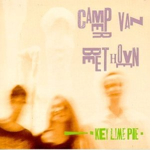

# Key Lime Pie

By **Camper Van Beethoven**

## Album Data

- **Catalog:** Beets
- **Format:** Digital, Album
- **Album:** Key Lime Pie
- **Artist:** Camper Van Beethoven
- **Albumartist:** Camper Van Beethoven
- **Genre:** Indie Rock
- **MusicBrainz Album Artist ID:** [0ee7e64d-90ca-406b-b59a-3e551c556dbe](https://musicbrainz.org/artist/0ee7e64d-90ca-406b-b59a-3e551c556dbe)
- **MusicBrainz Album ID:** [52babdda-2b11-41d9-ad35-4f5e27a1fe51](https://musicbrainz.org/release/52babdda-2b11-41d9-ad35-4f5e27a1fe51)
- **MusicBrainz Release Group ID:** [e94f1a6c-260f-3d68-a211-dd3197c0ba1f](https://musicbrainz.org/release-group/e94f1a6c-260f-3d68-a211-dd3197c0ba1f)
- **Year:** 1989
- **Catalog #:** FTN17920
- **Label:** 429 Records
- **Total Tracks:** 10

## Album Tracks

### Track 01 - Come Down the Coast

- **Artist:** Camper Van Beethoven
- **Format:** AAC
- **Genre:** Rock
- **Length:** 4:07
- **MusicBrainz Track ID:** [22b3847a-0c01-4f12-97ab-0c870fe4428b](https://musicbrainz.org/recording/22b3847a-0c01-4f12-97ab-0c870fe4428b)
- **Title:** Come Down the Coast
- **Track:** 01
- **Year:** 2013

### Track 02 - Too High for the Love-In

- **Artist:** Camper Van Beethoven
- **Format:** AAC
- **Genre:** Indie Rock
- **Length:** 5:39
- **MusicBrainz Track ID:** [398b1b2b-0896-44df-bbda-6fc208a0a87d](https://musicbrainz.org/recording/398b1b2b-0896-44df-bbda-6fc208a0a87d)
- **Title:** Too High for the Love-In
- **Track:** 02
- **Year:** 2013

### Track 03 - You Got to Roll

- **Artist:** Camper Van Beethoven
- **Format:** AAC
- **Genre:** Rock
- **Length:** 4:07
- **MusicBrainz Track ID:** [f3f1c6a9-0631-4415-8dff-9a0352e74871](https://musicbrainz.org/recording/f3f1c6a9-0631-4415-8dff-9a0352e74871)
- **Title:** You Got to Roll
- **Track:** 03
- **Year:** 2013

### Track 04 - Someday Our Love Will Sell Us Out

- **Artist:** Camper Van Beethoven
- **Format:** AAC
- **Genre:** Indie Rock
- **Length:** 5:16
- **MusicBrainz Track ID:** [47f4578e-6caa-4512-b881-1e0ab1c6e5ad](https://musicbrainz.org/recording/47f4578e-6caa-4512-b881-1e0ab1c6e5ad)
- **Title:** Someday Our Love Will Sell Us Out
- **Track:** 04
- **Year:** 2013

### Track 05 - Peaches in the Summertime

- **Artist:** Camper Van Beethoven
- **Format:** AAC
- **Genre:** Indie Rock
- **Length:** 2:10
- **MusicBrainz Track ID:** [7a3876d4-f268-406c-afe4-098647ce6400](https://musicbrainz.org/recording/7a3876d4-f268-406c-afe4-098647ce6400)
- **Title:** Peaches in the Summertime
- **Track:** 05
- **Year:** 2013

### Track 06 - Northern California Girls

- **Artist:** Camper Van Beethoven
- **Format:** AAC
- **Genre:** Indie Rock
- **Length:** 7:17
- **MusicBrainz Track ID:** [d3ac9cec-3fed-4869-ad68-03ee108d32b3](https://musicbrainz.org/recording/d3ac9cec-3fed-4869-ad68-03ee108d32b3)
- **Title:** Northern California Girls
- **Track:** 06
- **Year:** 2013

### Track 07 - Summer Days

- **Artist:** Camper Van Beethoven
- **Format:** AAC
- **Genre:** Indie Rock
- **Length:** 5:37
- **MusicBrainz Track ID:** [285ba319-ad4a-4115-9da3-67b70a5e62b6](https://musicbrainz.org/recording/285ba319-ad4a-4115-9da3-67b70a5e62b6)
- **Title:** Summer Days
- **Track:** 07
- **Year:** 2013

### Track 08 - La Costa Perdida

- **Artist:** Camper Van Beethoven
- **Format:** AAC
- **Genre:** Rock
- **Length:** 4:18
- **MusicBrainz Track ID:** [1355fcaa-f04f-47dc-8ab5-cb08e13bbb6b](https://musicbrainz.org/recording/1355fcaa-f04f-47dc-8ab5-cb08e13bbb6b)
- **Title:** La Costa Perdida
- **Track:** 08
- **Year:** 2013

### Track 09 - Aged in Wood

- **Artist:** Camper Van Beethoven
- **Format:** AAC
- **Genre:** Indie Rock
- **Length:** 1:03
- **MusicBrainz Track ID:** [682c6b39-e043-401c-a809-b88a6bfcb835](https://musicbrainz.org/recording/682c6b39-e043-401c-a809-b88a6bfcb835)
- **Title:** Aged in Wood
- **Track:** 09
- **Year:** 2013

### Track 10 - A Love for All Time

- **Artist:** Camper Van Beethoven
- **Format:** AAC
- **Genre:** Indie Rock
- **Length:** 3:30
- **MusicBrainz Track ID:** [d7a45f52-ad7b-47cb-b387-dc045e495f26](https://musicbrainz.org/recording/d7a45f52-ad7b-47cb-b387-dc045e495f26)
- **Title:** A Love for All Time
- **Track:** 10
- **Year:** 2013

## See also

- [2013-08-11 San Francisco - Outside Lands ~ Sutro Stage](2013-08-11_San_Francisco_-_Outside_Lands_~_Sutro_Stage.md)
- [Camper Van Beethoven](Camper_Van_Beethoven.md)
- [Camper Vantiquities](Camper_Vantiquities.md)
- [El Camino Real](El_Camino_Real.md)
- [Greatest Hits Played Faster](Greatest_Hits_Played_Faster.md)
- [II & III](II_and_III.md)
- [In the Mouth of the Crocodile](In_the_Mouth_of_the_Crocodile.md)
- [La Costa Perdida](La_Costa_Perdida.md)
- [New Roman Times (2015 Vinyl MP3 Download)](New_Roman_Times_2015_Vinyl_MP3_Download.md)
- [New Roman Times](New_Roman_Times.md)
- [Take The Skinheads Bowling](Take_The_Skinheads_Bowling.md)
- [Telephone Free Landslide Victory](Telephone_Free_Landslide_Victory.md)
- [Tusk](Tusk.md)
- [Vampire Can Mating Oven](Vampire_Can_Mating_Oven.md)
- [Roon: 2013-08-11 San Francisco - Outside Lands ~ Sutro Stage](../../Roon/Camper_Van_Beethoven/2013-08-11_San_Francisco_-_Outside_Lands_~_Sutro_Stage.md)
- [Roon: Camper Van Beethoven](../../Roon/Camper_Van_Beethoven/Camper_Van_Beethoven.md)
- [Roon: Camper Vantiquities](../../Roon/Camper_Van_Beethoven/Camper_Vantiquities.md)
- [Roon: Cigarettes & Carrot Juice](../../Roon/Camper_Van_Beethoven/Cigarettes_and_Carrot_Juice-_The_Santa_Cruz_Years.md)
- [Roon: El Camino Real](../../Roon/Camper_Van_Beethoven/El_Camino_Real.md)
- [Roon: II & III](../../Roon/Camper_Van_Beethoven/II_and_III.md)
- [Roon: In the Mouth of the Crocodile](../../Roon/Camper_Van_Beethoven/In_the_Mouth_of_the_Crocodile-_Live_in_Seattle.md)
- [Roon: Key Lime Pie](../../Roon/Camper_Van_Beethoven/Key_Lime_Pie.md)
- [Roon: La Costa Perdida (Bonus Version)](../../Roon/Camper_Van_Beethoven/La_Costa_Perdida_Bonus_Version.md)
- [Roon: Live at CBGB's on 1986-03-21](../../Roon/Camper_Van_Beethoven/Live_at_CBGBs_on_1986-03-21.md)
- [Roon: New Roman Times](../../Roon/Camper_Van_Beethoven/New_Roman_Times.md)
- [Roon: Our Beloved Revolutionary Sweetheart](../../Roon/Camper_Van_Beethoven/Our_Beloved_Revolutionary_Sweetheart.md)
- [Roon: Take The Skinheads Bowling](../../Roon/Camper_Van_Beethoven/Take_The_Skinheads_Bowling.md)
- [Roon: Telephone Free Landslide Victory](../../Roon/Camper_Van_Beethoven/Telephone_Free_Landslide_Victory.md)
- [Roon: Tusk](../../Roon/Camper_Van_Beethoven/Tusk.md)
- [Roon: Vampire Can Mating Oven](../../Roon/Camper_Van_Beethoven/Vampire_Can_Mating_Oven.md)
- [Vinyl: ](../../Vinyl/Camper_Van_Beethoven/Camper_Van_Beethoven_index.md)
- [Vinyl: Camper Van Beethoven](../../Vinyl/Camper_Van_Beethoven/Camper_Van_Beethoven.md)
- [Vinyl: New Roman Times](../../Vinyl/Camper_Van_Beethoven/New_Roman_Times.md)
