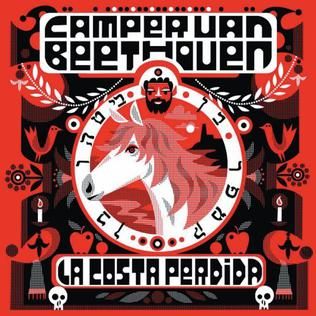

# La Costa Perdida

By **Camper Van Beethoven**

## Album Data

- **Catalog:** Beets
- **Format:** Digital, Album
- **Album:** La Costa Perdida
- **Artist:** Camper Van Beethoven
- **Albumartist:** Camper Van Beethoven
- **Genre:** Indie Rock
- **MusicBrainz Album Artist ID:** [0ee7e64d-90ca-406b-b59a-3e551c556dbe](https://musicbrainz.org/artist/0ee7e64d-90ca-406b-b59a-3e551c556dbe)
- **MusicBrainz Album ID:** [028577fe-23d7-4f7b-8c12-4cd93963d831](https://musicbrainz.org/release/028577fe-23d7-4f7b-8c12-4cd93963d831)
- **MusicBrainz Release Group ID:** [fa0be28b-4892-44a8-86d0-371d82a1d530](https://musicbrainz.org/release-group/fa0be28b-4892-44a8-86d0-371d82a1d530)
- **Year:** 2013
- **Catalog #:** 
- **Label:** 
- **Total Tracks:** 00

## Album Tracks

### Track 21 - Might Makes Right Dub

- **Artist:** Camper Van Beethoven
- **Format:** MP3
- **Genre:** Psychedelic Rock
- **Length:** 4:13
- **MusicBrainz Track ID:** 
- **Title:** Might Makes Right Dub
- **Track:** 21
- **Year:** 2004

### Track 01 - Prelude

- **Artist:** Camper Van Beethoven
- **Format:** ALAC
- **Genre:** Psychedelic Rock
- **Length:** 0:55
- **MusicBrainz Track ID:** 
- **Title:** Prelude
- **Track:** 01
- **Year:** 2004

### Track 02 - Sons Of The New Golden West

- **Artist:** Camper Van Beethoven
- **Format:** ALAC
- **Genre:** Psychedelic Rock
- **Length:** 2:55
- **MusicBrainz Track ID:** 
- **Title:** Sons Of The New Golden West
- **Track:** 02
- **Year:** 2004

### Track 03 - 51-7

- **Artist:** Camper Van Beethoven
- **Format:** ALAC
- **Genre:** Psychedelic Rock
- **Length:** 4:43
- **MusicBrainz Track ID:** 
- **Title:** 51-7
- **Track:** 03
- **Year:** 2004

### Track 04 - White Fluffy Clouds

- **Artist:** Camper Van Beethoven
- **Format:** ALAC
- **Genre:** Psychedelic Rock
- **Length:** 5:00
- **MusicBrainz Track ID:** 
- **Title:** White Fluffy Clouds
- **Track:** 04
- **Year:** 2004

### Track 05 - That Gum You Like Is Back In Style

- **Artist:** Camper Van Beethoven
- **Format:** ALAC
- **Genre:** Psychedelic Rock
- **Length:** 4:56
- **MusicBrainz Track ID:** 
- **Title:** That Gum You Like Is Back In Style
- **Track:** 05
- **Year:** 2004

### Track 06 - Might Makes Right

- **Artist:** Camper Van Beethoven
- **Format:** ALAC
- **Genre:** Indie Rock
- **Length:** 2:46
- **MusicBrainz Track ID:** 
- **Title:** Might Makes Right
- **Track:** 06
- **Year:** 2004

### Track 07 - Militia Song

- **Artist:** Camper Van Beethoven
- **Format:** ALAC
- **Genre:** Indie Rock
- **Length:** 2:10
- **MusicBrainz Track ID:** 
- **Title:** Militia Song
- **Track:** 07
- **Year:** 2004

### Track 08 - R 'n R Uzbekistan

- **Artist:** Camper Van Beethoven
- **Format:** ALAC
- **Genre:** Psychedelic Rock
- **Length:** 1:13
- **MusicBrainz Track ID:** 
- **Title:** R 'n R Uzbekistan
- **Track:** 08
- **Year:** 2004

### Track 09 - Sons Of The New Golden West Reprise

- **Artist:** Camper Van Beethoven
- **Format:** ALAC
- **Genre:** Psychedelic Rock
- **Length:** 0:21
- **MusicBrainz Track ID:** 
- **Title:** Sons Of The New Golden West Reprise
- **Track:** 09
- **Year:** 2004

### Track 10 - New Roman Times

- **Artist:** Camper Van Beethoven
- **Format:** ALAC
- **Genre:** Psychedelic Rock
- **Length:** 4:47
- **MusicBrainz Track ID:** 
- **Title:** New Roman Times
- **Track:** 10
- **Year:** 2004

### Track 11 - The Poppies Of Balmorhea

- **Artist:** Camper Van Beethoven
- **Format:** ALAC
- **Genre:** Psychedelic Rock
- **Length:** 3:23
- **MusicBrainz Track ID:** 
- **Title:** The Poppies Of Balmorhea
- **Track:** 11
- **Year:** 2004

### Track 12 - The Long Plastic Hallway

- **Artist:** Camper Van Beethoven
- **Format:** ALAC
- **Genre:** Psychedelic Rock
- **Length:** 5:09
- **MusicBrainz Track ID:** 
- **Title:** The Long Plastic Hallway
- **Track:** 12
- **Year:** 2004

### Track 13 - I Am Talking To This Flower

- **Artist:** Camper Van Beethoven
- **Format:** ALAC
- **Genre:** Psychedelic Rock
- **Length:** 2:30
- **MusicBrainz Track ID:** 
- **Title:** I Am Talking To This Flower
- **Track:** 13
- **Year:** 2004

### Track 14 - Come Out

- **Artist:** Camper Van Beethoven
- **Format:** ALAC
- **Genre:** Psychedelic Rock
- **Length:** 1:44
- **MusicBrainz Track ID:** 
- **Title:** Come Out
- **Track:** 14
- **Year:** 2004

### Track 15 - Los Tigres Traficantes

- **Artist:** Camper Van Beethoven
- **Format:** ALAC
- **Genre:** Psychedelic Rock
- **Length:** 2:30
- **MusicBrainz Track ID:** 
- **Title:** Los Tigres Traficantes
- **Track:** 15
- **Year:** 2004

### Track 16 - I Hate This Part Of Texas

- **Artist:** Camper Van Beethoven
- **Format:** ALAC
- **Genre:** Psychedelic Rock
- **Length:** 2:45
- **MusicBrainz Track ID:** 
- **Title:** I Hate This Part Of Texas
- **Track:** 16
- **Year:** 2004

### Track 17 - Hippy Chix

- **Artist:** Camper Van Beethoven
- **Format:** ALAC
- **Genre:** Cowpunk
- **Length:** 4:28
- **MusicBrainz Track ID:** 
- **Title:** Hippy Chix
- **Track:** 17
- **Year:** 2004

### Track 18 - Civil Disobedience

- **Artist:** Camper Van Beethoven
- **Format:** ALAC
- **Genre:** Psychedelic Rock
- **Length:** 6:14
- **MusicBrainz Track ID:** 
- **Title:** Civil Disobedience
- **Track:** 18
- **Year:** 2004

### Track 19 - Discotheque CVB

- **Artist:** Camper Van Beethoven
- **Format:** ALAC
- **Genre:** Uk Garage
- **Length:** 5:58
- **MusicBrainz Track ID:** 
- **Title:** Discotheque CVB
- **Track:** 19
- **Year:** 2004

### Track 20 - Hey Brother

- **Artist:** Camper Van Beethoven
- **Format:** ALAC
- **Genre:** Psychedelic Rock
- **Length:** 2:44
- **MusicBrainz Track ID:** 
- **Title:** Hey Brother
- **Track:** 20
- **Year:** 2004

### Track 08 - R ’n’ R Uzbekistan

- **Artist:** Camper Van Beethoven
- **Format:** AAC
- **Genre:** Psychedelic Rock
- **Length:** 1:13
- **MusicBrainz Track ID:** 
- **Title:** R ’n’ R Uzbekistan
- **Track:** 08
- **Year:** 2004

### Track 24 - Might Makes Right Dub [Bonus Track]

- **Artist:** Camper Van Beethoven
- **Format:** AAC
- **Genre:** Psychedelic Rock
- **Length:** 2:51
- **MusicBrainz Track ID:** 
- **Title:** Might Makes Right Dub [Bonus Track]
- **Track:** 24
- **Year:** 2004

### Track 21 - Los Tigres Dub [Bonus Track]

- **Artist:** Camper Van Beethoven
- **Format:** AAC
- **Genre:** Indie Rock
- **Length:** 2:27
- **MusicBrainz Track ID:** 
- **Title:** Los Tigres Dub [Bonus Track]
- **Track:** 21
- **Year:** 2004

### Track 23 - It’s Gonna Rain [Bonus Track]

- **Artist:** Camper Van Beethoven
- **Format:** AAC
- **Genre:** Indie Rock
- **Length:** 4:02
- **MusicBrainz Track ID:** 
- **Title:** It’s Gonna Rain [Bonus Track]
- **Track:** 23
- **Year:** 2004

## See also

- [2013-08-11 San Francisco - Outside Lands ~ Sutro Stage](2013-08-11_San_Francisco_-_Outside_Lands_~_Sutro_Stage.md)
- [Camper Van Beethoven](Camper_Van_Beethoven.md)
- [Camper Vantiquities](Camper_Vantiquities.md)
- [El Camino Real](El_Camino_Real.md)
- [Greatest Hits Played Faster](Greatest_Hits_Played_Faster.md)
- [II & III](II_and_III.md)
- [In the Mouth of the Crocodile](In_the_Mouth_of_the_Crocodile.md)
- [Key Lime Pie](Key_Lime_Pie.md)
- [New Roman Times (2015 Vinyl MP3 Download)](New_Roman_Times_2015_Vinyl_MP3_Download.md)
- [New Roman Times](New_Roman_Times.md)
- [Take The Skinheads Bowling](Take_The_Skinheads_Bowling.md)
- [Telephone Free Landslide Victory](Telephone_Free_Landslide_Victory.md)
- [Tusk](Tusk.md)
- [Vampire Can Mating Oven](Vampire_Can_Mating_Oven.md)
- [Roon: 2013-08-11 San Francisco - Outside Lands ~ Sutro Stage](../../Roon/Camper_Van_Beethoven/2013-08-11_San_Francisco_-_Outside_Lands_~_Sutro_Stage.md)
- [Roon: Camper Van Beethoven](../../Roon/Camper_Van_Beethoven/Camper_Van_Beethoven.md)
- [Roon: Camper Vantiquities](../../Roon/Camper_Van_Beethoven/Camper_Vantiquities.md)
- [Roon: Cigarettes & Carrot Juice](../../Roon/Camper_Van_Beethoven/Cigarettes_and_Carrot_Juice-_The_Santa_Cruz_Years.md)
- [Roon: El Camino Real](../../Roon/Camper_Van_Beethoven/El_Camino_Real.md)
- [Roon: II & III](../../Roon/Camper_Van_Beethoven/II_and_III.md)
- [Roon: In the Mouth of the Crocodile](../../Roon/Camper_Van_Beethoven/In_the_Mouth_of_the_Crocodile-_Live_in_Seattle.md)
- [Roon: Key Lime Pie](../../Roon/Camper_Van_Beethoven/Key_Lime_Pie.md)
- [Roon: La Costa Perdida (Bonus Version)](../../Roon/Camper_Van_Beethoven/La_Costa_Perdida_Bonus_Version.md)
- [Roon: Live at CBGB's on 1986-03-21](../../Roon/Camper_Van_Beethoven/Live_at_CBGBs_on_1986-03-21.md)
- [Roon: New Roman Times](../../Roon/Camper_Van_Beethoven/New_Roman_Times.md)
- [Roon: Our Beloved Revolutionary Sweetheart](../../Roon/Camper_Van_Beethoven/Our_Beloved_Revolutionary_Sweetheart.md)
- [Roon: Take The Skinheads Bowling](../../Roon/Camper_Van_Beethoven/Take_The_Skinheads_Bowling.md)
- [Roon: Telephone Free Landslide Victory](../../Roon/Camper_Van_Beethoven/Telephone_Free_Landslide_Victory.md)
- [Roon: Tusk](../../Roon/Camper_Van_Beethoven/Tusk.md)
- [Roon: Vampire Can Mating Oven](../../Roon/Camper_Van_Beethoven/Vampire_Can_Mating_Oven.md)
- [Vinyl: ](../../Vinyl/Camper_Van_Beethoven/Camper_Van_Beethoven_index.md)
- [Vinyl: Camper Van Beethoven](../../Vinyl/Camper_Van_Beethoven/Camper_Van_Beethoven.md)
- [Vinyl: New Roman Times](../../Vinyl/Camper_Van_Beethoven/New_Roman_Times.md)
