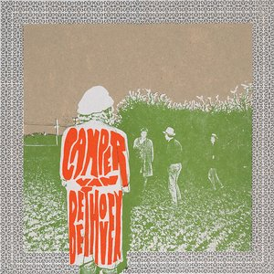

# Telephone Free Landslide Victory

By **Camper Van Beethoven**

## Album Data

- **Catalog:** Beets
- **Format:** Digital, Album
- **Album:** Telephone Free Landslide Victory
- **Artist:** Camper Van Beethoven
- **Albumartist:** Camper Van Beethoven
- **Genre:** Indie Rock
- **MusicBrainz Album Artist ID:** [0ee7e64d-90ca-406b-b59a-3e551c556dbe](https://musicbrainz.org/artist/0ee7e64d-90ca-406b-b59a-3e551c556dbe)
- **MusicBrainz Album ID:** [278cf805-812d-3de8-bfc5-f5d5ef5e00fe](https://musicbrainz.org/release/278cf805-812d-3de8-bfc5-f5d5ef5e00fe)
- **MusicBrainz Release Group ID:** [0e98fddd-81b9-3bb7-b030-8a18e3f05fae](https://musicbrainz.org/release-group/0e98fddd-81b9-3bb7-b030-8a18e3f05fae)
- **Year:** 1985
- **Catalog #:** Pitch 12
- **Label:** Pitch-A-Tent
- **Total Tracks:** 20

## Album Tracks

### Track 01 - Over and Over

- **Artist:** Camper Van Beethoven
- **Format:** MP3
- **Genre:** Indie Rock
- **Length:** 4:48
- **MusicBrainz Track ID:** [d3456a7d-7f29-4d2e-aa8c-9ee4582ba4ab](https://musicbrainz.org/recording/d3456a7d-7f29-4d2e-aa8c-9ee4582ba4ab)
- **Title:** Over and Over
- **Track:** 01
- **Year:** 2002

### Track 02 - The Ledge

- **Artist:** Camper Van Beethoven
- **Format:** MP3
- **Genre:** Alternative Rock
- **Length:** 2:06
- **MusicBrainz Track ID:** [6b78e7d3-f307-4205-930a-64c59247bca2](https://musicbrainz.org/recording/6b78e7d3-f307-4205-930a-64c59247bca2)
- **Title:** The Ledge
- **Track:** 02
- **Year:** 2002

### Track 03 - Think About Me

- **Artist:** Camper Van Beethoven
- **Format:** MP3
- **Genre:** Indie Rock
- **Length:** 2:48
- **MusicBrainz Track ID:** [b3c5b468-f8f9-4eeb-bc52-3aea2216101c](https://musicbrainz.org/recording/b3c5b468-f8f9-4eeb-bc52-3aea2216101c)
- **Title:** Think About Me
- **Track:** 03
- **Year:** 2002

### Track 04 - Save Me a Place

- **Artist:** Camper Van Beethoven
- **Format:** MP3
- **Genre:** Indie Rock
- **Length:** 3:23
- **MusicBrainz Track ID:** [e156a331-82bf-4d2e-8f0f-60ab7c12c83a](https://musicbrainz.org/recording/e156a331-82bf-4d2e-8f0f-60ab7c12c83a)
- **Title:** Save Me a Place
- **Track:** 04
- **Year:** 2002

### Track 05 - Sara

- **Artist:** Camper Van Beethoven
- **Format:** MP3
- **Genre:** Indie Rock
- **Length:** 4:56
- **MusicBrainz Track ID:** [da6b2217-4f5e-44ea-aa9d-4a59b6ee45a4](https://musicbrainz.org/recording/da6b2217-4f5e-44ea-aa9d-4a59b6ee45a4)
- **Title:** Sara
- **Track:** 05
- **Year:** 2002

### Track 06 - What Makes You Think You're the One

- **Artist:** Camper Van Beethoven
- **Format:** MP3
- **Genre:** Indie Rock
- **Length:** 3:30
- **MusicBrainz Track ID:** [4ac51438-6a29-437a-a525-73950f9c1119](https://musicbrainz.org/recording/4ac51438-6a29-437a-a525-73950f9c1119)
- **Title:** What Makes You Think You're the One
- **Track:** 06
- **Year:** 2002

### Track 07 - Storms

- **Artist:** Camper Van Beethoven
- **Format:** MP3
- **Genre:** Shoegaze
- **Length:** 6:01
- **MusicBrainz Track ID:** [66d3a360-7692-4904-9cb9-beae629ec1b9](https://musicbrainz.org/recording/66d3a360-7692-4904-9cb9-beae629ec1b9)
- **Title:** Storms
- **Track:** 07
- **Year:** 2002

### Track 08 - That's All for Everyone

- **Artist:** Camper Van Beethoven
- **Format:** MP3
- **Genre:** Indie Rock
- **Length:** 3:13
- **MusicBrainz Track ID:** [c7d7291c-00ad-45d2-8970-d1f617cb5157](https://musicbrainz.org/recording/c7d7291c-00ad-45d2-8970-d1f617cb5157)
- **Title:** That's All for Everyone
- **Track:** 08
- **Year:** 2002

### Track 09 - Not That Funny

- **Artist:** Camper Van Beethoven
- **Format:** MP3
- **Genre:** Indie Rock
- **Length:** 1:55
- **MusicBrainz Track ID:** [4b42537b-d379-4e80-94f6-468de0269c59](https://musicbrainz.org/recording/4b42537b-d379-4e80-94f6-468de0269c59)
- **Title:** Not That Funny
- **Track:** 09
- **Year:** 2002

### Track 10 - Sisters of the Moon

- **Artist:** Camper Van Beethoven
- **Format:** MP3
- **Genre:** Indie Rock
- **Length:** 4:00
- **MusicBrainz Track ID:** [ccc0e187-2d61-450d-9f8a-f15e3d03f991](https://musicbrainz.org/recording/ccc0e187-2d61-450d-9f8a-f15e3d03f991)
- **Title:** Sisters of the Moon
- **Track:** 10
- **Year:** 2002

### Track 11 - Angel

- **Artist:** Camper Van Beethoven
- **Format:** MP3
- **Genre:** Ska
- **Length:** 5:27
- **MusicBrainz Track ID:** [fb830501-1a22-4392-b024-95383dfa8a35](https://musicbrainz.org/recording/fb830501-1a22-4392-b024-95383dfa8a35)
- **Title:** Angel
- **Track:** 11
- **Year:** 2002

### Track 12 - That's Enough for Me

- **Artist:** Camper Van Beethoven
- **Format:** MP3
- **Genre:** Country
- **Length:** 1:54
- **MusicBrainz Track ID:** [f40057e9-5886-45e1-8fcb-a047a01eef5d](https://musicbrainz.org/recording/f40057e9-5886-45e1-8fcb-a047a01eef5d)
- **Title:** That's Enough for Me
- **Track:** 12
- **Year:** 2002

### Track 13 - Brown Eyes

- **Artist:** Camper Van Beethoven
- **Format:** MP3
- **Genre:** Indie Rock
- **Length:** 3:38
- **MusicBrainz Track ID:** [6daade11-8c08-47ed-97dd-d81fa6277b66](https://musicbrainz.org/recording/6daade11-8c08-47ed-97dd-d81fa6277b66)
- **Title:** Brown Eyes
- **Track:** 13
- **Year:** 2002

### Track 14 - Never Make Me Cry

- **Artist:** Camper Van Beethoven
- **Format:** MP3
- **Genre:** Indie Rock
- **Length:** 2:16
- **MusicBrainz Track ID:** [ed73d721-3012-4767-b265-31e2b3b45455](https://musicbrainz.org/recording/ed73d721-3012-4767-b265-31e2b3b45455)
- **Title:** Never Make Me Cry
- **Track:** 14
- **Year:** 2002

### Track 15 - I Know I'm Not Wrong

- **Artist:** Camper Van Beethoven
- **Format:** MP3
- **Genre:** Indie Rock
- **Length:** 3:12
- **MusicBrainz Track ID:** [a20b1a08-a62b-47f8-affe-78736f22bb66](https://musicbrainz.org/recording/a20b1a08-a62b-47f8-affe-78736f22bb66)
- **Title:** I Know I'm Not Wrong
- **Track:** 15
- **Year:** 2002

### Track 16 - Honey Hi

- **Artist:** Camper Van Beethoven
- **Format:** MP3
- **Genre:** Indie Rock
- **Length:** 2:38
- **MusicBrainz Track ID:** [833ca948-851d-48ea-91a5-2aaac086d62c](https://musicbrainz.org/recording/833ca948-851d-48ea-91a5-2aaac086d62c)
- **Title:** Honey Hi
- **Track:** 16
- **Year:** 2002

### Track 17 - Beautiful Child

- **Artist:** Camper Van Beethoven
- **Format:** MP3
- **Genre:** Indie Rock
- **Length:** 5:34
- **MusicBrainz Track ID:** [1f4f55ce-a950-4c2f-9e86-379ff51c7dcb](https://musicbrainz.org/recording/1f4f55ce-a950-4c2f-9e86-379ff51c7dcb)
- **Title:** Beautiful Child
- **Track:** 17
- **Year:** 2002

### Track 18 - Walk a Thin Line

- **Artist:** Camper Van Beethoven
- **Format:** MP3
- **Genre:** Indie Rock
- **Length:** 3:59
- **MusicBrainz Track ID:** [97c12d91-606e-49a1-8872-f4107958c425](https://musicbrainz.org/recording/97c12d91-606e-49a1-8872-f4107958c425)
- **Title:** Walk a Thin Line
- **Track:** 18
- **Year:** 2002

### Track 19 - Tusk

- **Artist:** Camper Van Beethoven
- **Format:** MP3
- **Genre:** Rock
- **Length:** 10:14
- **MusicBrainz Track ID:** [b5f900d6-f845-4ca2-b5b0-cb5c76b0b15e](https://musicbrainz.org/recording/b5f900d6-f845-4ca2-b5b0-cb5c76b0b15e)
- **Title:** Tusk
- **Track:** 19
- **Year:** 2002

### Track 20 - Never Forget

- **Artist:** Camper Van Beethoven
- **Format:** MP3
- **Genre:** Indie Rock
- **Length:** 3:39
- **MusicBrainz Track ID:** [bb3c67b2-9b57-4d47-a90a-dd0fb0223368](https://musicbrainz.org/recording/bb3c67b2-9b57-4d47-a90a-dd0fb0223368)
- **Title:** Never Forget
- **Track:** 20
- **Year:** 2002

## See also

- [2013-08-11 San Francisco - Outside Lands ~ Sutro Stage](2013-08-11_San_Francisco_-_Outside_Lands_~_Sutro_Stage.md)
- [Camper Van Beethoven](Camper_Van_Beethoven.md)
- [Camper Vantiquities](Camper_Vantiquities.md)
- [El Camino Real](El_Camino_Real.md)
- [Greatest Hits Played Faster](Greatest_Hits_Played_Faster.md)
- [II & III](II_and_III.md)
- [In the Mouth of the Crocodile](In_the_Mouth_of_the_Crocodile.md)
- [Key Lime Pie](Key_Lime_Pie.md)
- [La Costa Perdida](La_Costa_Perdida.md)
- [New Roman Times (2015 Vinyl MP3 Download)](New_Roman_Times_2015_Vinyl_MP3_Download.md)
- [New Roman Times](New_Roman_Times.md)
- [Take The Skinheads Bowling](Take_The_Skinheads_Bowling.md)
- [Tusk](Tusk.md)
- [Vampire Can Mating Oven](Vampire_Can_Mating_Oven.md)
- [Roon: 2013-08-11 San Francisco - Outside Lands ~ Sutro Stage](../../Roon/Camper_Van_Beethoven/2013-08-11_San_Francisco_-_Outside_Lands_~_Sutro_Stage.md)
- [Roon: Camper Van Beethoven](../../Roon/Camper_Van_Beethoven/Camper_Van_Beethoven.md)
- [Roon: Camper Vantiquities](../../Roon/Camper_Van_Beethoven/Camper_Vantiquities.md)
- [Roon: Cigarettes & Carrot Juice](../../Roon/Camper_Van_Beethoven/Cigarettes_and_Carrot_Juice-_The_Santa_Cruz_Years.md)
- [Roon: El Camino Real](../../Roon/Camper_Van_Beethoven/El_Camino_Real.md)
- [Roon: II & III](../../Roon/Camper_Van_Beethoven/II_and_III.md)
- [Roon: In the Mouth of the Crocodile](../../Roon/Camper_Van_Beethoven/In_the_Mouth_of_the_Crocodile-_Live_in_Seattle.md)
- [Roon: Key Lime Pie](../../Roon/Camper_Van_Beethoven/Key_Lime_Pie.md)
- [Roon: La Costa Perdida (Bonus Version)](../../Roon/Camper_Van_Beethoven/La_Costa_Perdida_Bonus_Version.md)
- [Roon: Live at CBGB's on 1986-03-21](../../Roon/Camper_Van_Beethoven/Live_at_CBGBs_on_1986-03-21.md)
- [Roon: New Roman Times](../../Roon/Camper_Van_Beethoven/New_Roman_Times.md)
- [Roon: Our Beloved Revolutionary Sweetheart](../../Roon/Camper_Van_Beethoven/Our_Beloved_Revolutionary_Sweetheart.md)
- [Roon: Take The Skinheads Bowling](../../Roon/Camper_Van_Beethoven/Take_The_Skinheads_Bowling.md)
- [Roon: Telephone Free Landslide Victory](../../Roon/Camper_Van_Beethoven/Telephone_Free_Landslide_Victory.md)
- [Roon: Tusk](../../Roon/Camper_Van_Beethoven/Tusk.md)
- [Roon: Vampire Can Mating Oven](../../Roon/Camper_Van_Beethoven/Vampire_Can_Mating_Oven.md)
- [Vinyl: ](../../Vinyl/Camper_Van_Beethoven/Camper_Van_Beethoven_index.md)
- [Vinyl: Camper Van Beethoven](../../Vinyl/Camper_Van_Beethoven/Camper_Van_Beethoven.md)
- [Vinyl: New Roman Times](../../Vinyl/Camper_Van_Beethoven/New_Roman_Times.md)
