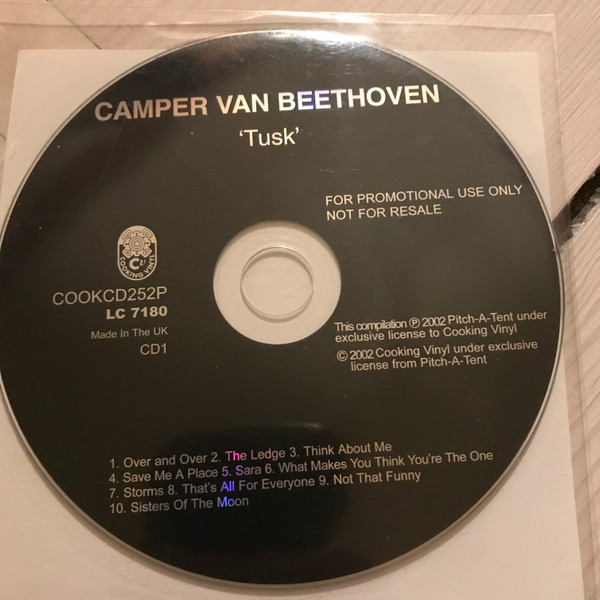

# Tusk

By **Camper Van Beethoven**

## Album Data

- **Catalog:** Beets
- **Format:** Digital, Album
- **Album:** Tusk
- **Artist:** Camper Van Beethoven
- **Albumartist:** Camper Van Beethoven
- **Genre:** Indie Rock
- **MusicBrainz Album Artist ID:** [0ee7e64d-90ca-406b-b59a-3e551c556dbe](https://musicbrainz.org/artist/0ee7e64d-90ca-406b-b59a-3e551c556dbe)
- **MusicBrainz Album ID:** [4eb272d9-99cb-462d-a2d9-a6a4fd9bdce0](https://musicbrainz.org/release/4eb272d9-99cb-462d-a2d9-a6a4fd9bdce0)
- **MusicBrainz Release Group ID:** [880ce6c1-71cb-326a-bb2f-73bcff6e0840](https://musicbrainz.org/release-group/880ce6c1-71cb-326a-bb2f-73bcff6e0840)
- **Year:** 2002
- **Catalog #:** PITCH 05
- **Label:** Pitch-A-Tent
- **Total Tracks:** 06

## Album Tracks

### Track 01 - Heart

- **Artist:** Camper Van Beethoven
- **Format:** MP3
- **Genre:** Indie Rock
- **Length:** 3:06
- **MusicBrainz Track ID:** [168989ba-49c1-4edd-b9ca-e43912d264f4](https://musicbrainz.org/recording/168989ba-49c1-4edd-b9ca-e43912d264f4)
- **Title:** Heart
- **Track:** 01
- **Year:** 1987

### Track 02 - Never Go Back

- **Artist:** Camper Van Beethoven
- **Format:** MP3
- **Genre:** Acid Rock
- **Length:** 3:22
- **MusicBrainz Track ID:** [c1d1984d-5634-4367-b6ee-20d2910cffec](https://musicbrainz.org/recording/c1d1984d-5634-4367-b6ee-20d2910cffec)
- **Title:** Never Go Back
- **Track:** 02
- **Year:** 1987

### Track 03 - Seven Languages

- **Artist:** Camper Van Beethoven
- **Format:** MP3
- **Genre:** Indie Rock
- **Length:** 4:12
- **MusicBrainz Track ID:** [3a7a319c-ed53-4769-a7a1-bdcd34056a18](https://musicbrainz.org/recording/3a7a319c-ed53-4769-a7a1-bdcd34056a18)
- **Title:** Seven Languages
- **Track:** 03
- **Year:** 1987

### Track 04 - Ice Cream Everyday

- **Artist:** Camper Van Beethoven
- **Format:** MP3
- **Genre:** Indie Rock
- **Length:** 4:02
- **MusicBrainz Track ID:** [341c831f-84fc-48a7-a40a-76717125b472](https://musicbrainz.org/recording/341c831f-84fc-48a7-a40a-76717125b472)
- **Title:** Ice Cream Everyday
- **Track:** 04
- **Year:** 1987

### Track 05 - Processional

- **Artist:** Camper Van Beethoven
- **Format:** MP3
- **Genre:** Indie Rock
- **Length:** 3:46
- **MusicBrainz Track ID:** [e0be34ff-461d-4b9f-aae5-45bc6688c998](https://musicbrainz.org/recording/e0be34ff-461d-4b9f-aae5-45bc6688c998)
- **Title:** Processional
- **Track:** 05
- **Year:** 1987

### Track 06 - Photograph

- **Artist:** Camper Van Beethoven
- **Format:** MP3
- **Genre:** Emo
- **Length:** 3:12
- **MusicBrainz Track ID:** [9002c468-4eed-44fe-a314-06690b29f031](https://musicbrainz.org/recording/9002c468-4eed-44fe-a314-06690b29f031)
- **Title:** Photograph
- **Track:** 06
- **Year:** 1987

