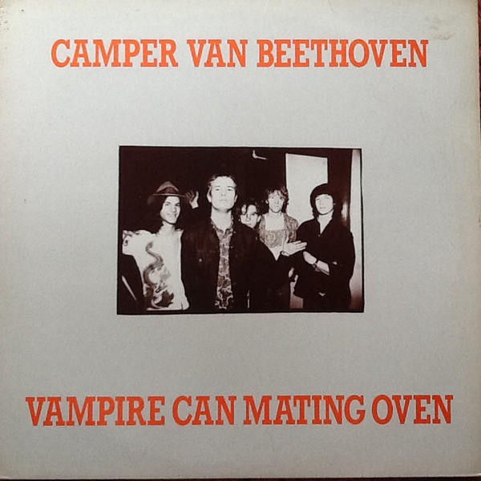

# Vampire Can Mating Oven

By **Camper Van Beethoven**

## Album Data

- **Catalog:** Beets
- **Format:** Digital, Album
- **Album:** Vampire Can Mating Oven
- **Artist:** Camper Van Beethoven
- **Albumartist:** Camper Van Beethoven
- **Genre:** Indie Rock
- **MusicBrainz Album Artist ID:** [0ee7e64d-90ca-406b-b59a-3e551c556dbe](https://musicbrainz.org/artist/0ee7e64d-90ca-406b-b59a-3e551c556dbe)
- **MusicBrainz Album ID:** [2366150d-2bcc-4e2f-b96c-fbef3f1127ef](https://musicbrainz.org/release/2366150d-2bcc-4e2f-b96c-fbef3f1127ef)
- **MusicBrainz Release Group ID:** [cb84d742-ba9a-360d-a521-0315a2d3a963](https://musicbrainz.org/release-group/cb84d742-ba9a-360d-a521-0315a2d3a963)
- **Year:** 1987
- **Catalog #:** PITCH 05
- **Label:** Pitch-A-Tent
- **Total Tracks:** 06

## Album Tracks

### Track 01 - Heart

- **Artist:** Camper Van Beethoven
- **Format:** MP3
- **Genre:** Indie Rock
- **Length:** 3:06
- **MusicBrainz Track ID:** [168989ba-49c1-4edd-b9ca-e43912d264f4](https://musicbrainz.org/recording/168989ba-49c1-4edd-b9ca-e43912d264f4)
- **Title:** Heart
- **Track:** 01
- **Year:** 1987

### Track 02 - Never Go Back

- **Artist:** Camper Van Beethoven
- **Format:** MP3
- **Genre:** Acid Rock
- **Length:** 3:22
- **MusicBrainz Track ID:** [c1d1984d-5634-4367-b6ee-20d2910cffec](https://musicbrainz.org/recording/c1d1984d-5634-4367-b6ee-20d2910cffec)
- **Title:** Never Go Back
- **Track:** 02
- **Year:** 1987

### Track 03 - Seven Languages

- **Artist:** Camper Van Beethoven
- **Format:** MP3
- **Genre:** Indie Rock
- **Length:** 4:12
- **MusicBrainz Track ID:** [3a7a319c-ed53-4769-a7a1-bdcd34056a18](https://musicbrainz.org/recording/3a7a319c-ed53-4769-a7a1-bdcd34056a18)
- **Title:** Seven Languages
- **Track:** 03
- **Year:** 1987

### Track 04 - Ice Cream Everyday

- **Artist:** Camper Van Beethoven
- **Format:** MP3
- **Genre:** Indie Rock
- **Length:** 4:02
- **MusicBrainz Track ID:** [341c831f-84fc-48a7-a40a-76717125b472](https://musicbrainz.org/recording/341c831f-84fc-48a7-a40a-76717125b472)
- **Title:** Ice Cream Everyday
- **Track:** 04
- **Year:** 1987

### Track 05 - Processional

- **Artist:** Camper Van Beethoven
- **Format:** MP3
- **Genre:** Indie Rock
- **Length:** 3:46
- **MusicBrainz Track ID:** [e0be34ff-461d-4b9f-aae5-45bc6688c998](https://musicbrainz.org/recording/e0be34ff-461d-4b9f-aae5-45bc6688c998)
- **Title:** Processional
- **Track:** 05
- **Year:** 1987

### Track 06 - Photograph

- **Artist:** Camper Van Beethoven
- **Format:** MP3
- **Genre:** Emo
- **Length:** 3:12
- **MusicBrainz Track ID:** [9002c468-4eed-44fe-a314-06690b29f031](https://musicbrainz.org/recording/9002c468-4eed-44fe-a314-06690b29f031)
- **Title:** Photograph
- **Track:** 06
- **Year:** 1987

## See also

- [2013-08-11 San Francisco - Outside Lands ~ Sutro Stage](2013-08-11_San_Francisco_-_Outside_Lands_~_Sutro_Stage.md)
- [Camper Van Beethoven](Camper_Van_Beethoven.md)
- [Camper Vantiquities](Camper_Vantiquities.md)
- [El Camino Real](El_Camino_Real.md)
- [Greatest Hits Played Faster](Greatest_Hits_Played_Faster.md)
- [II & III](II_and_III.md)
- [In the Mouth of the Crocodile](In_the_Mouth_of_the_Crocodile.md)
- [Key Lime Pie](Key_Lime_Pie.md)
- [La Costa Perdida](La_Costa_Perdida.md)
- [New Roman Times (2015 Vinyl MP3 Download)](New_Roman_Times_2015_Vinyl_MP3_Download.md)
- [New Roman Times](New_Roman_Times.md)
- [Take The Skinheads Bowling](Take_The_Skinheads_Bowling.md)
- [Telephone Free Landslide Victory](Telephone_Free_Landslide_Victory.md)
- [Tusk](Tusk.md)
- [Roon: 2013-08-11 San Francisco - Outside Lands ~ Sutro Stage](../../Roon/Camper_Van_Beethoven/2013-08-11_San_Francisco_-_Outside_Lands_~_Sutro_Stage.md)
- [Roon: Camper Van Beethoven](../../Roon/Camper_Van_Beethoven/Camper_Van_Beethoven.md)
- [Roon: Camper Vantiquities](../../Roon/Camper_Van_Beethoven/Camper_Vantiquities.md)
- [Roon: Cigarettes & Carrot Juice](../../Roon/Camper_Van_Beethoven/Cigarettes_and_Carrot_Juice-_The_Santa_Cruz_Years.md)
- [Roon: El Camino Real](../../Roon/Camper_Van_Beethoven/El_Camino_Real.md)
- [Roon: II & III](../../Roon/Camper_Van_Beethoven/II_and_III.md)
- [Roon: In the Mouth of the Crocodile](../../Roon/Camper_Van_Beethoven/In_the_Mouth_of_the_Crocodile-_Live_in_Seattle.md)
- [Roon: Key Lime Pie](../../Roon/Camper_Van_Beethoven/Key_Lime_Pie.md)
- [Roon: La Costa Perdida (Bonus Version)](../../Roon/Camper_Van_Beethoven/La_Costa_Perdida_Bonus_Version.md)
- [Roon: Live at CBGB's on 1986-03-21](../../Roon/Camper_Van_Beethoven/Live_at_CBGBs_on_1986-03-21.md)
- [Roon: New Roman Times](../../Roon/Camper_Van_Beethoven/New_Roman_Times.md)
- [Roon: Our Beloved Revolutionary Sweetheart](../../Roon/Camper_Van_Beethoven/Our_Beloved_Revolutionary_Sweetheart.md)
- [Roon: Take The Skinheads Bowling](../../Roon/Camper_Van_Beethoven/Take_The_Skinheads_Bowling.md)
- [Roon: Telephone Free Landslide Victory](../../Roon/Camper_Van_Beethoven/Telephone_Free_Landslide_Victory.md)
- [Roon: Tusk](../../Roon/Camper_Van_Beethoven/Tusk.md)
- [Roon: Vampire Can Mating Oven](../../Roon/Camper_Van_Beethoven/Vampire_Can_Mating_Oven.md)
- [Vinyl: ](../../Vinyl/Camper_Van_Beethoven/Camper_Van_Beethoven_index.md)
- [Vinyl: Camper Van Beethoven](../../Vinyl/Camper_Van_Beethoven/Camper_Van_Beethoven.md)
- [Vinyl: New Roman Times](../../Vinyl/Camper_Van_Beethoven/New_Roman_Times.md)
