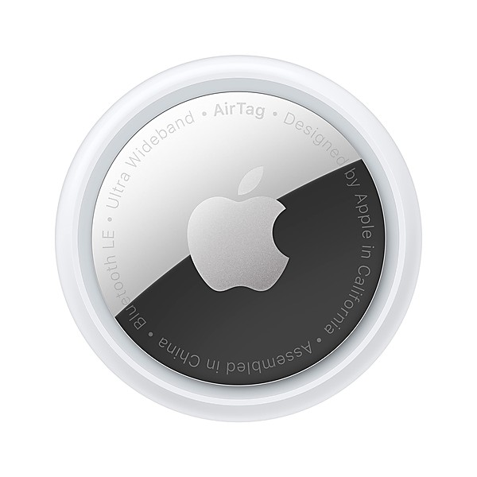

# The Spotlight Kid / Clear Spot

By **Captain Beefheart & His Magic Band**

## Album Data

- **Catalog:** Beets
- **Format:** Digital, Album
- **Album:** The Spotlight Kid / Clear Spot
- **Artist:** Captain Beefheart & His Magic Band
- **Albumartist:** Captain Beefheart & His Magic Band
- **Genre:** Psychedelic Rock
- **MusicBrainz Album Artist ID:** [8dcd04e4-7695-4d80-bae9-1d7d680a38ef](https://musicbrainz.org/artist/8dcd04e4-7695-4d80-bae9-1d7d680a38ef)
- **MusicBrainz Album ID:** [5d3accc0-4767-446c-b4de-9d61d89e240a](https://musicbrainz.org/release/5d3accc0-4767-446c-b4de-9d61d89e240a)
- **MusicBrainz Release Group ID:** [c75eafec-3e53-3ef9-8edb-a1d349078a12](https://musicbrainz.org/release-group/c75eafec-3e53-3ef9-8edb-a1d349078a12)
- **Year:** 1990
- **Catalog #:** 9 26249-2
- **Label:** Reprise Records
- **Total Tracks:** 22

## Album Tracks

### Track 01 - I'm Gonna Booglarize You Baby

- **Artist:** Captain Beefheart
- **Format:** ALAC
- **Genre:** Psychedelic Rock
- **Length:** 4:33
- **MusicBrainz Track ID:** [2ca13a9e-40b4-4c76-accf-ef3eda393d31](https://musicbrainz.org/recording/2ca13a9e-40b4-4c76-accf-ef3eda393d31)
- **Title:** I'm Gonna Booglarize You Baby
- **Track:** 01
- **Year:** 1990

### Track 02 - White Jam

- **Artist:** Captain Beefheart
- **Format:** ALAC
- **Genre:** Rock
- **Length:** 2:55
- **MusicBrainz Track ID:** [bff8f366-b558-4915-bf52-49977649b1b7](https://musicbrainz.org/recording/bff8f366-b558-4915-bf52-49977649b1b7)
- **Title:** White Jam
- **Track:** 02
- **Year:** 1990

### Track 03 - Blabber 'n Smoke

- **Artist:** Captain Beefheart
- **Format:** ALAC
- **Genre:** Rock
- **Length:** 2:46
- **MusicBrainz Track ID:** [dd4dd86f-e208-4046-a404-5cc60b9aa995](https://musicbrainz.org/recording/dd4dd86f-e208-4046-a404-5cc60b9aa995)
- **Title:** Blabber 'n Smoke
- **Track:** 03
- **Year:** 1990

### Track 04 - When It Blows Its Stacks

- **Artist:** Captain Beefheart
- **Format:** ALAC
- **Genre:** Psychedelic Rock
- **Length:** 3:40
- **MusicBrainz Track ID:** [ed77328a-413f-4ae9-ac6f-1cb73d96749f](https://musicbrainz.org/recording/ed77328a-413f-4ae9-ac6f-1cb73d96749f)
- **Title:** When It Blows Its Stacks
- **Track:** 04
- **Year:** 1990

### Track 05 - Alice in Blunderland

- **Artist:** Captain Beefheart
- **Format:** ALAC
- **Genre:** Psychedelic Rock
- **Length:** 3:54
- **MusicBrainz Track ID:** [ba02af84-bfc6-4162-9644-22dd3382f7da](https://musicbrainz.org/recording/ba02af84-bfc6-4162-9644-22dd3382f7da)
- **Title:** Alice in Blunderland
- **Track:** 05
- **Year:** 1990

### Track 06 - The Spotlight Kid

- **Artist:** Captain Beefheart
- **Format:** ALAC
- **Genre:** Art Rock
- **Length:** 3:21
- **MusicBrainz Track ID:** [aeee908d-e827-4510-a47c-bf193c5de49d](https://musicbrainz.org/recording/aeee908d-e827-4510-a47c-bf193c5de49d)
- **Title:** The Spotlight Kid
- **Track:** 06
- **Year:** 1990

### Track 07 - Click Clack

- **Artist:** Captain Beefheart
- **Format:** ALAC
- **Genre:** Psychedelic Rock
- **Length:** 3:30
- **MusicBrainz Track ID:** [93ac5c30-d4a8-40c6-b088-27a79f5bb6d0](https://musicbrainz.org/recording/93ac5c30-d4a8-40c6-b088-27a79f5bb6d0)
- **Title:** Click Clack
- **Track:** 07
- **Year:** 1990

### Track 08 - Grow Fins

- **Artist:** Captain Beefheart
- **Format:** ALAC
- **Genre:** Psychedelic Rock
- **Length:** 3:30
- **MusicBrainz Track ID:** [e3f4c360-2ec8-41c1-8db9-290d9b48fe4d](https://musicbrainz.org/recording/e3f4c360-2ec8-41c1-8db9-290d9b48fe4d)
- **Title:** Grow Fins
- **Track:** 08
- **Year:** 1990

### Track 09 - There Ain't No Santa Claus on the Evenin' Stage

- **Artist:** Captain Beefheart
- **Format:** ALAC
- **Genre:** Rock
- **Length:** 3:11
- **MusicBrainz Track ID:** [f74f2d6f-c2d1-4bb6-b22a-f5e7c2efe1af](https://musicbrainz.org/recording/f74f2d6f-c2d1-4bb6-b22a-f5e7c2efe1af)
- **Title:** There Ain't No Santa Claus on the Evenin' Stage
- **Track:** 09
- **Year:** 1990

### Track 10 - Glider

- **Artist:** Captain Beefheart
- **Format:** ALAC
- **Genre:** Art Rock
- **Length:** 4:34
- **MusicBrainz Track ID:** [c9b90b70-37dc-4570-bc8c-8035293d2f90](https://musicbrainz.org/recording/c9b90b70-37dc-4570-bc8c-8035293d2f90)
- **Title:** Glider
- **Track:** 10
- **Year:** 1990

### Track 11 - Low Yo Yo Stuff

- **Artist:** Captain Beefheart & His Magic Band
- **Format:** ALAC
- **Genre:** Rock
- **Length:** 3:41
- **MusicBrainz Track ID:** [9702c545-48d7-4f82-9d89-64394f84f158](https://musicbrainz.org/recording/9702c545-48d7-4f82-9d89-64394f84f158)
- **Title:** Low Yo Yo Stuff
- **Track:** 11
- **Year:** 1990

### Track 12 - Nowadays a Woman's Gotta Hit a Man

- **Artist:** Captain Beefheart & His Magic Band
- **Format:** ALAC
- **Genre:** Psychedelic Rock
- **Length:** 3:46
- **MusicBrainz Track ID:** [8b73eaaf-1557-4681-b6a7-6e0cf6d0219f](https://musicbrainz.org/recording/8b73eaaf-1557-4681-b6a7-6e0cf6d0219f)
- **Title:** Nowadays a Woman's Gotta Hit a Man
- **Track:** 12
- **Year:** 1990

### Track 13 - Too Much Time

- **Artist:** Captain Beefheart & His Magic Band
- **Format:** ALAC
- **Genre:** Soul
- **Length:** 2:50
- **MusicBrainz Track ID:** [9b56ea99-66e9-4ea5-b9fa-87784d103154](https://musicbrainz.org/recording/9b56ea99-66e9-4ea5-b9fa-87784d103154)
- **Title:** Too Much Time
- **Track:** 13
- **Year:** 1990

### Track 14 - Circumstances

- **Artist:** Captain Beefheart & His Magic Band
- **Format:** ALAC
- **Genre:** Progressive Rock
- **Length:** 3:14
- **MusicBrainz Track ID:** [769537dc-b489-47cf-9d1a-d231f7745027](https://musicbrainz.org/recording/769537dc-b489-47cf-9d1a-d231f7745027)
- **Title:** Circumstances
- **Track:** 14
- **Year:** 1990

### Track 15 - My Head Is My Only House Unless It Rains

- **Artist:** Captain Beefheart & His Magic Band
- **Format:** ALAC
- **Genre:** Soul
- **Length:** 2:55
- **MusicBrainz Track ID:** [0f843e07-73db-495a-af40-7faf39c054ce](https://musicbrainz.org/recording/0f843e07-73db-495a-af40-7faf39c054ce)
- **Title:** My Head Is My Only House Unless It Rains
- **Track:** 15
- **Year:** 1990

### Track 16 - Sun Zoom Spark

- **Artist:** Captain Beefheart & His Magic Band
- **Format:** ALAC
- **Genre:** Psychedelic Rock
- **Length:** 2:13
- **MusicBrainz Track ID:** [a9967503-eba0-4651-ae33-6b3f30e5b16b](https://musicbrainz.org/recording/a9967503-eba0-4651-ae33-6b3f30e5b16b)
- **Title:** Sun Zoom Spark
- **Track:** 16
- **Year:** 1990

### Track 17 - Clear Spot

- **Artist:** Captain Beefheart & His Magic Band
- **Format:** ALAC
- **Genre:** Rock
- **Length:** 3:40
- **MusicBrainz Track ID:** [d9f9d197-f5ac-40b2-bf92-d311a4ded58a](https://musicbrainz.org/recording/d9f9d197-f5ac-40b2-bf92-d311a4ded58a)
- **Title:** Clear Spot
- **Track:** 17
- **Year:** 1990

### Track 18 - Crazy Little Thing

- **Artist:** Captain Beefheart & His Magic Band
- **Format:** ALAC
- **Genre:** Progressive Rock
- **Length:** 2:38
- **MusicBrainz Track ID:** [24ccb9d4-c8fa-4208-80a1-2b14dd959b4b](https://musicbrainz.org/recording/24ccb9d4-c8fa-4208-80a1-2b14dd959b4b)
- **Title:** Crazy Little Thing
- **Track:** 18
- **Year:** 1990

### Track 19 - Long Neck Bottles

- **Artist:** Captain Beefheart & His Magic Band
- **Format:** ALAC
- **Genre:** Rock
- **Length:** 3:18
- **MusicBrainz Track ID:** [cd498100-2e3c-43a0-8cc7-33eb2b9e6151](https://musicbrainz.org/recording/cd498100-2e3c-43a0-8cc7-33eb2b9e6151)
- **Title:** Long Neck Bottles
- **Track:** 19
- **Year:** 1990

### Track 20 - Her Eyes Are a Blue Million Miles

- **Artist:** Captain Beefheart & His Magic Band
- **Format:** ALAC
- **Genre:** Rock
- **Length:** 2:57
- **MusicBrainz Track ID:** [2b82c702-84ce-41d2-aa43-911e3c5648c2](https://musicbrainz.org/recording/2b82c702-84ce-41d2-aa43-911e3c5648c2)
- **Title:** Her Eyes Are a Blue Million Miles
- **Track:** 20
- **Year:** 1990

### Track 21 - Big Eyed Beans From Venus

- **Artist:** Captain Beefheart & His Magic Band
- **Format:** ALAC
- **Genre:** Psychedelic Rock
- **Length:** 4:23
- **MusicBrainz Track ID:** [efb97bfd-c4ff-49ff-9b87-9732580ab0ac](https://musicbrainz.org/recording/efb97bfd-c4ff-49ff-9b87-9732580ab0ac)
- **Title:** Big Eyed Beans From Venus
- **Track:** 21
- **Year:** 1990

### Track 22 - Golden Birdies

- **Artist:** Captain Beefheart & His Magic Band
- **Format:** ALAC
- **Genre:** Psychedelic Rock
- **Length:** 1:36
- **MusicBrainz Track ID:** [8d06dc42-e2c7-4ae6-95e3-bda434bfb322](https://musicbrainz.org/recording/8d06dc42-e2c7-4ae6-95e3-bda434bfb322)
- **Title:** Golden Birdies
- **Track:** 22
- **Year:** 1990

## See also

- [Roon: Clear Spot](../../Roon/Captain_Beefheart_and_His_Magic_Band/Clear_Spot.md)
- [Roon: Lick My Decals Off, Baby](../../Roon/Captain_Beefheart_and_His_Magic_Band/Lick_My_Decals_Off__Baby.md)
- [Roon: Safe As Milk](../../Roon/Captain_Beefheart_and_His_Magic_Band/Safe_As_Milk.md)
- [Roon: Shiny Beast (Bat Chain Puller)](../../Roon/Captain_Beefheart_and_His_Magic_Band/Shiny_Beast_Bat_Chain_Puller.md)
