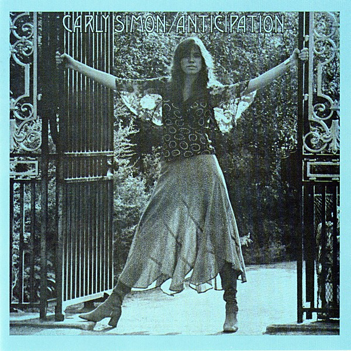

# Anticipation

By **Carly Simon**

## Album Data

- **Catalog:** Beets
- **Format:** Digital, Album
- **Album:** Anticipation
- **Artist:** Carly Simon
- **Albumartist:** Carly Simon
- **Genre:** Soft Rock
- **MusicBrainz Album Artist ID:** [c4df30f5-5487-4806-9189-b69c9f27532c](https://musicbrainz.org/artist/c4df30f5-5487-4806-9189-b69c9f27532c)
- **MusicBrainz Album ID:** [f572517b-bbf2-43b1-ae5d-f3638eee4b00](https://musicbrainz.org/release/f572517b-bbf2-43b1-ae5d-f3638eee4b00)
- **MusicBrainz Release Group ID:** [da4b0fc6-5c7b-39cc-9948-c45a3bddbcd5](https://musicbrainz.org/release-group/da4b0fc6-5c7b-39cc-9948-c45a3bddbcd5)
- **Year:** 2008
- **Catalog #:** 1096613
- **Label:** Elektra
- **Total Tracks:** 10

## Album Tracks

### Track 01 - That's the Way I've Always Heard It Should Be

- **Artist:** Carly Simon
- **Format:** ALAC
- **Genre:** Soft Rock
- **Length:** 4:18
- **MusicBrainz Track ID:** [6bf3aed1-7507-429c-9446-60805b7731fd](https://musicbrainz.org/recording/6bf3aed1-7507-429c-9446-60805b7731fd)
- **Title:** That's the Way I've Always Heard It Should Be
- **Track:** 01
- **Year:** 1990

### Track 02 - Alone

- **Artist:** Carly Simon
- **Format:** ALAC
- **Genre:** Pop Rock
- **Length:** 3:36
- **MusicBrainz Track ID:** [a8186e4f-f957-4da1-bbf3-c6b7e261e1a9](https://musicbrainz.org/recording/a8186e4f-f957-4da1-bbf3-c6b7e261e1a9)
- **Title:** Alone
- **Track:** 02
- **Year:** 1990

### Track 03 - One More Time

- **Artist:** Carly Simon
- **Format:** ALAC
- **Genre:** Pop Rock
- **Length:** 3:32
- **MusicBrainz Track ID:** [7824ea69-9278-49ba-8aca-a1460590af10](https://musicbrainz.org/recording/7824ea69-9278-49ba-8aca-a1460590af10)
- **Title:** One More Time
- **Track:** 03
- **Year:** 1990

### Track 04 - The Best Thing

- **Artist:** Carly Simon
- **Format:** ALAC
- **Genre:** Pop Rock
- **Length:** 4:23
- **MusicBrainz Track ID:** [b0943870-0478-4260-a336-36966f5f4fab](https://musicbrainz.org/recording/b0943870-0478-4260-a336-36966f5f4fab)
- **Title:** The Best Thing
- **Track:** 04
- **Year:** 1990

### Track 05 - Just a Sinner

- **Artist:** Carly Simon
- **Format:** ALAC
- **Genre:** Pop Rock
- **Length:** 3:13
- **MusicBrainz Track ID:** [c2c5f67f-30d3-4598-a311-20a169a42802](https://musicbrainz.org/recording/c2c5f67f-30d3-4598-a311-20a169a42802)
- **Title:** Just a Sinner
- **Track:** 05
- **Year:** 1990

### Track 06 - Dan, My Fling

- **Artist:** Carly Simon
- **Format:** ALAC
- **Genre:** Pop Rock
- **Length:** 5:27
- **MusicBrainz Track ID:** [6ba916f2-03eb-4c8c-a59f-07fd1dd0e6cc](https://musicbrainz.org/recording/6ba916f2-03eb-4c8c-a59f-07fd1dd0e6cc)
- **Title:** Dan, My Fling
- **Track:** 06
- **Year:** 1990

### Track 07 - Another Door

- **Artist:** Carly Simon
- **Format:** ALAC
- **Genre:** Pop Rock
- **Length:** 3:20
- **MusicBrainz Track ID:** [87fadb2b-6df9-4f06-8c03-337786a55dde](https://musicbrainz.org/recording/87fadb2b-6df9-4f06-8c03-337786a55dde)
- **Title:** Another Door
- **Track:** 07
- **Year:** 1990

### Track 08 - Reunions

- **Artist:** Carly Simon
- **Format:** ALAC
- **Genre:** Pop Rock
- **Length:** 3:08
- **MusicBrainz Track ID:** [757b44da-6d95-465e-9a75-03a73c88eb4e](https://musicbrainz.org/recording/757b44da-6d95-465e-9a75-03a73c88eb4e)
- **Title:** Reunions
- **Track:** 08
- **Year:** 1990

### Track 09 - Rolling Down the Hills

- **Artist:** Carly Simon
- **Format:** ALAC
- **Genre:** Pop Rock
- **Length:** 3:39
- **MusicBrainz Track ID:** [6ce8a7e9-cbec-4752-96e6-7d5bcab536b5](https://musicbrainz.org/recording/6ce8a7e9-cbec-4752-96e6-7d5bcab536b5)
- **Title:** Rolling Down the Hills
- **Track:** 09
- **Year:** 1990

### Track 10 - The Love's Still Growing

- **Artist:** Carly Simon
- **Format:** ALAC
- **Genre:** Pop Rock
- **Length:** 4:07
- **MusicBrainz Track ID:** [b38da04d-24da-4252-ac18-95c0d6f2d1e0](https://musicbrainz.org/recording/b38da04d-24da-4252-ac18-95c0d6f2d1e0)
- **Title:** The Love's Still Growing
- **Track:** 10
- **Year:** 1990

## See also

- [Carly Simon](Carly_Simon.md)
- [Hotcakes](Hotcakes.md)
- [No Secrets (Amazon download)](No_Secrets_Amazon_download.md)
- [No Secrets](No_Secrets.md)
- [Playing Possum](Playing_Possum.md)
- [Roon: Anticipation](../../Roon/Carly_Simon/Anticipation.md)
- [Roon: Carly Simon](../../Roon/Carly_Simon/Carly_Simon.md)
- [Roon: No Secrets](../../Roon/Carly_Simon/No_Secrets.md)
- [Vinyl: ](../../Vinyl/Carly_Simon/Carly_Simon.md)
- [Vinyl: No Secrets](../../Vinyl/Carly_Simon/No_Secrets.md)
