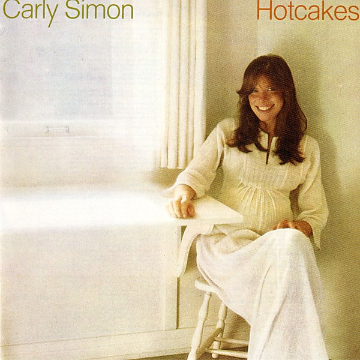

# Hotcakes

By **Carly Simon**

## Album Data

- **Catalog:** Beets
- **Format:** Digital, Album
- **Album:** Hotcakes
- **Artist:** Carly Simon
- **Albumartist:** Carly Simon
- **Genre:** Pop Rock
- **MusicBrainz Album Artist ID:** [c4df30f5-5487-4806-9189-b69c9f27532c](https://musicbrainz.org/artist/c4df30f5-5487-4806-9189-b69c9f27532c)
- **MusicBrainz Album ID:** [c73dfc8d-230c-44a2-89bc-80d9d8a5f6db](https://musicbrainz.org/release/c73dfc8d-230c-44a2-89bc-80d9d8a5f6db)
- **MusicBrainz Release Group ID:** [ffa14620-55c6-3400-a0c8-d33be34da334](https://musicbrainz.org/release-group/ffa14620-55c6-3400-a0c8-d33be34da334)
- **Year:** 1974
- **Catalog #:** 75049-2
- **Label:** Elektra
- **Total Tracks:** 10

## Album Tracks

### Track 01 - The Right Thing to Do

- **Artist:** Carly Simon
- **Format:** ALAC
- **Genre:** Soft Rock
- **Length:** 2:58
- **MusicBrainz Track ID:** [c3ef0f1e-e552-4234-8d06-d5611832d179](https://musicbrainz.org/recording/c3ef0f1e-e552-4234-8d06-d5611832d179)
- **Title:** The Right Thing to Do
- **Track:** 01
- **Year:** 1972

### Track 02 - The Carter Family

- **Artist:** Carly Simon
- **Format:** ALAC
- **Genre:** Pop Rock
- **Length:** 3:30
- **MusicBrainz Track ID:** [a5232b3b-27b0-4788-a509-f7579e2da45b](https://musicbrainz.org/recording/a5232b3b-27b0-4788-a509-f7579e2da45b)
- **Title:** The Carter Family
- **Track:** 02
- **Year:** 1972

### Track 03 - You're So Vain

- **Artist:** Carly Simon
- **Format:** ALAC
- **Genre:** Rock
- **Length:** 4:18
- **MusicBrainz Track ID:** [27089139-92c0-499c-9597-c66c9b11bdfd](https://musicbrainz.org/recording/27089139-92c0-499c-9597-c66c9b11bdfd)
- **Title:** You're So Vain
- **Track:** 03
- **Year:** 1972

### Track 04 - His Friends Are More Than Fond of Robin

- **Artist:** Carly Simon
- **Format:** ALAC
- **Genre:** Pop Rock
- **Length:** 3:01
- **MusicBrainz Track ID:** [eef07a90-a6dd-473a-bf59-60992a6da54c](https://musicbrainz.org/recording/eef07a90-a6dd-473a-bf59-60992a6da54c)
- **Title:** His Friends Are More Than Fond of Robin
- **Track:** 04
- **Year:** 1972

### Track 05 - We Have No Secrets

- **Artist:** Carly Simon
- **Format:** ALAC
- **Genre:** Soft Rock
- **Length:** 3:56
- **MusicBrainz Track ID:** [efb254fe-758f-42fc-8dc0-a0d97ee7e58b](https://musicbrainz.org/recording/efb254fe-758f-42fc-8dc0-a0d97ee7e58b)
- **Title:** We Have No Secrets
- **Track:** 05
- **Year:** 1972

### Track 06 - Embrace Me, You Child

- **Artist:** Carly Simon
- **Format:** ALAC
- **Genre:** Pop Rock
- **Length:** 4:08
- **MusicBrainz Track ID:** [b501dbaa-2650-421b-99a5-54f1f98ef1d5](https://musicbrainz.org/recording/b501dbaa-2650-421b-99a5-54f1f98ef1d5)
- **Title:** Embrace Me, You Child
- **Track:** 06
- **Year:** 1972

### Track 07 - Waited So Long

- **Artist:** Carly Simon
- **Format:** ALAC
- **Genre:** Soft Rock
- **Length:** 4:28
- **MusicBrainz Track ID:** [52875627-ce28-4145-9690-d28d79038d97](https://musicbrainz.org/recording/52875627-ce28-4145-9690-d28d79038d97)
- **Title:** Waited So Long
- **Track:** 07
- **Year:** 1972

### Track 08 - It Was So Easy

- **Artist:** Carly Simon
- **Format:** ALAC
- **Genre:** Pop Rock
- **Length:** 3:08
- **MusicBrainz Track ID:** [8d6834b2-e981-4c48-a9fe-88b1173c4ec6](https://musicbrainz.org/recording/8d6834b2-e981-4c48-a9fe-88b1173c4ec6)
- **Title:** It Was So Easy
- **Track:** 08
- **Year:** 1972

### Track 09 - Night Owl

- **Artist:** Carly Simon
- **Format:** ALAC
- **Genre:** Pop Rock
- **Length:** 3:50
- **MusicBrainz Track ID:** [3a17055c-b7d0-4dee-88c2-3fec1422017a](https://musicbrainz.org/recording/3a17055c-b7d0-4dee-88c2-3fec1422017a)
- **Title:** Night Owl
- **Track:** 09
- **Year:** 1972

### Track 10 - When You Close Your Eyes

- **Artist:** Carly Simon
- **Format:** ALAC
- **Genre:** Soft Rock
- **Length:** 3:13
- **MusicBrainz Track ID:** [c4b622ba-4f7a-4fab-952f-a3234663414b](https://musicbrainz.org/recording/c4b622ba-4f7a-4fab-952f-a3234663414b)
- **Title:** When You Close Your Eyes
- **Track:** 10
- **Year:** 1972

## See also

- [Anticipation](Anticipation.md)
- [Carly Simon](Carly_Simon.md)
- [No Secrets (Amazon download)](No_Secrets_Amazon_download.md)
- [No Secrets](No_Secrets.md)
- [Playing Possum](Playing_Possum.md)
- [Roon: Anticipation](../../Roon/Carly_Simon/Anticipation.md)
- [Roon: Carly Simon](../../Roon/Carly_Simon/Carly_Simon.md)
- [Roon: No Secrets](../../Roon/Carly_Simon/No_Secrets.md)
- [Vinyl: ](../../Vinyl/Carly_Simon/Carly_Simon.md)
- [Vinyl: No Secrets](../../Vinyl/Carly_Simon/No_Secrets.md)
