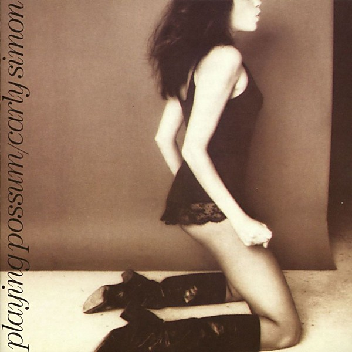

# Playing Possum

By **Carly Simon**

## Album Data

- **Catalog:** Beets
- **Format:** Digital, Album
- **Album:** Playing Possum
- **Artist:** Carly Simon
- **Albumartist:** Carly Simon
- **Genre:** Rock
- **MusicBrainz Album Artist ID:** [c4df30f5-5487-4806-9189-b69c9f27532c](https://musicbrainz.org/artist/c4df30f5-5487-4806-9189-b69c9f27532c)
- **MusicBrainz Album ID:** [30431db5-c93d-4d17-a026-a933db26500c](https://musicbrainz.org/release/30431db5-c93d-4d17-a026-a933db26500c)
- **MusicBrainz Release Group ID:** [bf5b1fdf-2931-3aba-9be0-d117c0d9af00](https://musicbrainz.org/release-group/bf5b1fdf-2931-3aba-9be0-d117c0d9af00)
- **Year:** 1990
- **Catalog #:** 1033-2
- **Label:** Elektra
- **Total Tracks:** 10

## Album Tracks

### Track 01 - After the Storm

- **Artist:** Carly Simon
- **Format:** ALAC
- **Genre:** Pop
- **Length:** 2:49
- **MusicBrainz Track ID:** [5f5c4eb2-8730-4166-98d5-db397664c65e](https://musicbrainz.org/recording/5f5c4eb2-8730-4166-98d5-db397664c65e)
- **Title:** After the Storm
- **Track:** 01
- **Year:** 1990

### Track 02 - Love out in the Street

- **Artist:** Carly Simon
- **Format:** ALAC
- **Genre:** Pop
- **Length:** 3:42
- **MusicBrainz Track ID:** [b75c0eb9-56ce-4c25-b7e1-4a49623d1a51](https://musicbrainz.org/recording/b75c0eb9-56ce-4c25-b7e1-4a49623d1a51)
- **Title:** Love out in the Street
- **Track:** 02
- **Year:** 1990

### Track 03 - Look Me in the Eyes

- **Artist:** Carly Simon
- **Format:** ALAC
- **Genre:** Pop
- **Length:** 3:36
- **MusicBrainz Track ID:** [0a14fc11-93a0-46b9-ae03-6c624a0b1c27](https://musicbrainz.org/recording/0a14fc11-93a0-46b9-ae03-6c624a0b1c27)
- **Title:** Look Me in the Eyes
- **Track:** 03
- **Year:** 1990

### Track 04 - More and More

- **Artist:** Carly Simon
- **Format:** ALAC
- **Genre:** Pop
- **Length:** 4:04
- **MusicBrainz Track ID:** [d2f50eb2-5489-4111-b186-7c8486bb5c8f](https://musicbrainz.org/recording/d2f50eb2-5489-4111-b186-7c8486bb5c8f)
- **Title:** More and More
- **Track:** 04
- **Year:** 1990

### Track 05 - Slave

- **Artist:** Carly Simon
- **Format:** ALAC
- **Genre:** Pop
- **Length:** 3:56
- **MusicBrainz Track ID:** [aacd95e8-6442-4a58-9065-e173f6b67ae8](https://musicbrainz.org/recording/aacd95e8-6442-4a58-9065-e173f6b67ae8)
- **Title:** Slave
- **Track:** 05
- **Year:** 1990

### Track 06 - Attitude Dancing

- **Artist:** Carly Simon
- **Format:** ALAC
- **Genre:** Pop Rock
- **Length:** 3:53
- **MusicBrainz Track ID:** [ef70e02c-5366-425c-9f23-774ce457afb7](https://musicbrainz.org/recording/ef70e02c-5366-425c-9f23-774ce457afb7)
- **Title:** Attitude Dancing
- **Track:** 06
- **Year:** 1990

### Track 07 - Sons of Summer

- **Artist:** Carly Simon
- **Format:** ALAC
- **Genre:** Pop
- **Length:** 3:08
- **MusicBrainz Track ID:** [73d7c65a-5eca-45b5-88a9-3b8caee7343e](https://musicbrainz.org/recording/73d7c65a-5eca-45b5-88a9-3b8caee7343e)
- **Title:** Sons of Summer
- **Track:** 07
- **Year:** 1990

### Track 08 - Waterfall

- **Artist:** Carly Simon
- **Format:** ALAC
- **Genre:** Pop
- **Length:** 3:33
- **MusicBrainz Track ID:** [7ffe216f-523e-4c18-af2e-b06d005b6fa6](https://musicbrainz.org/recording/7ffe216f-523e-4c18-af2e-b06d005b6fa6)
- **Title:** Waterfall
- **Track:** 08
- **Year:** 1990

### Track 09 - Are You Ticklish

- **Artist:** Carly Simon
- **Format:** ALAC
- **Genre:** Pop
- **Length:** 2:28
- **MusicBrainz Track ID:** [af622dd1-da2a-416f-9577-b278f1de2963](https://musicbrainz.org/recording/af622dd1-da2a-416f-9577-b278f1de2963)
- **Title:** Are You Ticklish
- **Track:** 09
- **Year:** 1990

### Track 10 - Playing Possum

- **Artist:** Carly Simon
- **Format:** ALAC
- **Genre:** Pop
- **Length:** 3:56
- **MusicBrainz Track ID:** [f44ddeab-5c41-4a92-b85c-05e995e166b1](https://musicbrainz.org/recording/f44ddeab-5c41-4a92-b85c-05e995e166b1)
- **Title:** Playing Possum
- **Track:** 10
- **Year:** 1990

## See also

- [Anticipation](Anticipation.md)
- [Carly Simon](Carly_Simon.md)
- [Hotcakes](Hotcakes.md)
- [No Secrets (Amazon download)](No_Secrets_Amazon_download.md)
- [No Secrets](No_Secrets.md)
- [Roon: Anticipation](../../Roon/Carly_Simon/Anticipation.md)
- [Roon: Carly Simon](../../Roon/Carly_Simon/Carly_Simon.md)
- [Roon: No Secrets](../../Roon/Carly_Simon/No_Secrets.md)
- [Vinyl: ](../../Vinyl/Carly_Simon/Carly_Simon.md)
- [Vinyl: No Secrets](../../Vinyl/Carly_Simon/No_Secrets.md)
