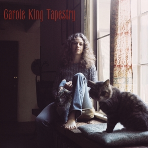

# Tapestry

By **Carole King**

## Album Data

- **Catalog:** Beets
- **Format:** Digital, Album
- **Album:** Tapestry
- **Artist:** Carole King
- **Albumartist:** Carole King
- **Genre:** Soft Rock
- **MusicBrainz Album Artist ID:** [bf6c29f5-b69f-4842-9031-37f9645d365d](https://musicbrainz.org/artist/bf6c29f5-b69f-4842-9031-37f9645d365d)
- **MusicBrainz Album ID:** [26bd4a35-027d-4a0e-8d5b-4458cf6da5b7](https://musicbrainz.org/release/26bd4a35-027d-4a0e-8d5b-4458cf6da5b7)
- **MusicBrainz Release Group ID:** [6e4f39e6-3403-39d7-81c6-8e61a990d509](https://musicbrainz.org/release-group/6e4f39e6-3403-39d7-81c6-8e61a990d509)
- **Year:** 1999
- **Catalog #:** EPC 493180 2
- **Label:** Epic
- **Total Tracks:** 14

## Album Tracks

### Track 01 - I Feel the Earth Move

- **Artist:** Carole King
- **Format:** MP3
- **Genre:** Soft Rock
- **Length:** 2:58
- **MusicBrainz Track ID:** [eb5fd781-d917-402f-ac3b-50c432d45c2f](https://musicbrainz.org/recording/eb5fd781-d917-402f-ac3b-50c432d45c2f)
- **Title:** I Feel the Earth Move
- **Track:** 01
- **Year:** 1999

### Track 02 - So Far Away

- **Artist:** Carole King
- **Format:** MP3
- **Genre:** Soft Rock
- **Length:** 3:55
- **MusicBrainz Track ID:** [62f3141c-7da8-497b-8ed3-8716db4a8e2d](https://musicbrainz.org/recording/62f3141c-7da8-497b-8ed3-8716db4a8e2d)
- **Title:** So Far Away
- **Track:** 02
- **Year:** 1999

### Track 03 - It’s Too Late

- **Artist:** Carole King
- **Format:** MP3
- **Genre:** Soft Rock
- **Length:** 3:53
- **MusicBrainz Track ID:** [eaf83421-d3d7-4661-a905-07fd5ab1ca61](https://musicbrainz.org/recording/eaf83421-d3d7-4661-a905-07fd5ab1ca61)
- **Title:** It’s Too Late
- **Track:** 03
- **Year:** 1999

### Track 04 - Home Again

- **Artist:** Carole King
- **Format:** MP3
- **Genre:** Soft Rock
- **Length:** 2:29
- **MusicBrainz Track ID:** [782f530a-05f5-4b09-b733-672e5559a3cd](https://musicbrainz.org/recording/782f530a-05f5-4b09-b733-672e5559a3cd)
- **Title:** Home Again
- **Track:** 04
- **Year:** 1999

### Track 05 - Beautiful

- **Artist:** Carole King
- **Format:** MP3
- **Genre:** Soft Rock
- **Length:** 3:06
- **MusicBrainz Track ID:** [28a97ef2-fc3b-4931-97dc-5b9eee248895](https://musicbrainz.org/recording/28a97ef2-fc3b-4931-97dc-5b9eee248895)
- **Title:** Beautiful
- **Track:** 05
- **Year:** 1999

### Track 06 - Way Over Yonder

- **Artist:** Carole King
- **Format:** MP3
- **Genre:** Soul
- **Length:** 4:43
- **MusicBrainz Track ID:** [b2b1452d-b460-4270-a2cf-fbe7b8856892](https://musicbrainz.org/recording/b2b1452d-b460-4270-a2cf-fbe7b8856892)
- **Title:** Way Over Yonder
- **Track:** 06
- **Year:** 1999

### Track 07 - You’ve Got a Friend

- **Artist:** Carole King
- **Format:** MP3
- **Genre:** Soft Rock
- **Length:** 5:09
- **MusicBrainz Track ID:** [2fcd8ef9-b8f6-44c5-b90f-43226789846f](https://musicbrainz.org/recording/2fcd8ef9-b8f6-44c5-b90f-43226789846f)
- **Title:** You’ve Got a Friend
- **Track:** 07
- **Year:** 1999

### Track 08 - Where You Lead

- **Artist:** Carole King
- **Format:** MP3
- **Genre:** Soft Rock
- **Length:** 3:20
- **MusicBrainz Track ID:** [0de91748-2b38-466a-824e-f026c2c3aa0e](https://musicbrainz.org/recording/0de91748-2b38-466a-824e-f026c2c3aa0e)
- **Title:** Where You Lead
- **Track:** 08
- **Year:** 1999

### Track 09 - Will You Love Me Tomorrow?

- **Artist:** Carole King
- **Format:** MP3
- **Genre:** Soft Rock
- **Length:** 4:12
- **MusicBrainz Track ID:** [982a95a1-782a-4221-9a1c-530fee858351](https://musicbrainz.org/recording/982a95a1-782a-4221-9a1c-530fee858351)
- **Title:** Will You Love Me Tomorrow?
- **Track:** 09
- **Year:** 1999

### Track 10 - Smackwater Jack

- **Artist:** Carole King
- **Format:** MP3
- **Genre:** Soft Rock
- **Length:** 3:41
- **MusicBrainz Track ID:** [6252678d-4b67-431f-8768-d19eea8722ae](https://musicbrainz.org/recording/6252678d-4b67-431f-8768-d19eea8722ae)
- **Title:** Smackwater Jack
- **Track:** 10
- **Year:** 1999

### Track 11 - Tapestry

- **Artist:** Carole King
- **Format:** MP3
- **Genre:** Soft Rock
- **Length:** 3:13
- **MusicBrainz Track ID:** [2c647eb6-e43b-4d68-9459-0720de45bc90](https://musicbrainz.org/recording/2c647eb6-e43b-4d68-9459-0720de45bc90)
- **Title:** Tapestry
- **Track:** 11
- **Year:** 1999

### Track 12 - (You Make Me Feel Like) A Natural Woman

- **Artist:** Carole King
- **Format:** MP3
- **Genre:** Soul
- **Length:** 3:49
- **MusicBrainz Track ID:** [fcddd46b-e5d9-4745-baff-af23ef4a8046](https://musicbrainz.org/recording/fcddd46b-e5d9-4745-baff-af23ef4a8046)
- **Title:** (You Make Me Feel Like) A Natural Woman
- **Track:** 12
- **Year:** 1999

### Track 14 - Smackwater Jack (live)

- **Artist:** Carole King
- **Format:** AAC
- **Genre:** Soft Rock
- **Length:** 3:55
- **MusicBrainz Track ID:** [852da16c-01eb-4e28-831b-921c5064090a](https://musicbrainz.org/recording/852da16c-01eb-4e28-831b-921c5064090a)
- **Title:** Smackwater Jack (live)
- **Track:** 14
- **Year:** 1999

## See also

- [Roon: Tapestry](../../Roon/Carole_King/Tapestry.md)
- [Vinyl: ](../../Vinyl/Carole_King/Carole_King.md)
- [Vinyl: Tapestry](../../Vinyl/Carole_King/Tapestry.md)
