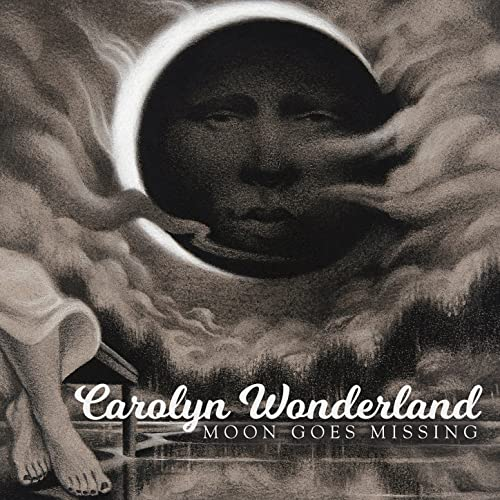

# Moon Goes Missing

By **Carolyn Wonderland**

## Album Data

- **Catalog:** Beets
- **Format:** Digital, Album
- **Album:** Moon Goes Missing
- **Artist:** Carolyn Wonderland
- **Albumartist:** Carolyn Wonderland
- **Genre:** Soul
- **MusicBrainz Album Artist ID:** [b290f6a9-ca07-4026-85f7-231ceaf58309](https://musicbrainz.org/artist/b290f6a9-ca07-4026-85f7-231ceaf58309)
- **MusicBrainz Album ID:** [60029af0-f701-4643-9566-f05bb0cd63ca](https://musicbrainz.org/release/60029af0-f701-4643-9566-f05bb0cd63ca)
- **MusicBrainz Release Group ID:** [344b5c31-963a-4167-8425-cc0cea469bb8](https://musicbrainz.org/release-group/344b5c31-963a-4167-8425-cc0cea469bb8)
- **Year:** 2017
- **Catalog #:** HRD-1001
- **Label:** Home Records
- **Total Tracks:** 11

## Album Tracks

### Track 01 - Moon Goes Missing

- **Artist:** Carolyn Wonderland
- **Format:** ALAC
- **Genre:** Soul
- **Length:** 4:31
- **MusicBrainz Track ID:** [67628d9b-c4dc-45ee-96fd-99c3661f72b2](https://musicbrainz.org/recording/67628d9b-c4dc-45ee-96fd-99c3661f72b2)
- **Title:** Moon Goes Missing
- **Track:** 01
- **Year:** 2017

### Track 02 - Open Eyes

- **Artist:** Carolyn Wonderland
- **Format:** ALAC
- **Genre:** Blues
- **Length:** 5:21
- **MusicBrainz Track ID:** [30f55c7e-8b5f-4667-918d-14556d4569b9](https://musicbrainz.org/recording/30f55c7e-8b5f-4667-918d-14556d4569b9)
- **Title:** Open Eyes
- **Track:** 02
- **Year:** 2017

### Track 03 - Hellfire Bitters

- **Artist:** Carolyn Wonderland
- **Format:** ALAC
- **Genre:** Soul
- **Length:** 3:50
- **MusicBrainz Track ID:** [5bf6d3e6-cf79-47fd-9c4f-37a3891f6036](https://musicbrainz.org/recording/5bf6d3e6-cf79-47fd-9c4f-37a3891f6036)
- **Title:** Hellfire Bitters
- **Track:** 03
- **Year:** 2017

### Track 04 - Can't Nobody Hide From God

- **Artist:** Carolyn Wonderland
- **Format:** ALAC
- **Genre:** Soul
- **Length:** 4:17
- **MusicBrainz Track ID:** [f81f83c2-ce3c-405c-94f0-8e2a45fa6055](https://musicbrainz.org/recording/f81f83c2-ce3c-405c-94f0-8e2a45fa6055)
- **Title:** Can't Nobody Hide From God
- **Track:** 04
- **Year:** 2017

### Track 05 - Swamp

- **Artist:** Carolyn Wonderland
- **Format:** ALAC
- **Genre:** Soul
- **Length:** 3:24
- **MusicBrainz Track ID:** [bfd27658-4faa-482b-b128-a680722956fb](https://musicbrainz.org/recording/bfd27658-4faa-482b-b128-a680722956fb)
- **Title:** Swamp
- **Track:** 05
- **Year:** 2017

### Track 06 - Leopard Skin Pillbox Hat

- **Artist:** Carolyn Wonderland
- **Format:** ALAC
- **Genre:** Soul
- **Length:** 5:33
- **MusicBrainz Track ID:** [346f21e9-3fc9-412e-9b30-58a5b170b068](https://musicbrainz.org/recording/346f21e9-3fc9-412e-9b30-58a5b170b068)
- **Title:** Leopard Skin Pillbox Hat
- **Track:** 06
- **Year:** 2017

### Track 07 - She Wants to Know

- **Artist:** Carolyn Wonderland
- **Format:** ALAC
- **Genre:** Soul
- **Length:** 8:16
- **MusicBrainz Track ID:** [738a18f9-3074-44a5-885d-e18190e3c1ad](https://musicbrainz.org/recording/738a18f9-3074-44a5-885d-e18190e3c1ad)
- **Title:** She Wants to Know
- **Track:** 07
- **Year:** 2017

### Track 08 - To Be Free

- **Artist:** Carolyn Wonderland
- **Format:** ALAC
- **Genre:** Soul
- **Length:** 3:36
- **MusicBrainz Track ID:** [3649e871-0b2a-4a69-af59-c93977723eb9](https://musicbrainz.org/recording/3649e871-0b2a-4a69-af59-c93977723eb9)
- **Title:** To Be Free
- **Track:** 08
- **Year:** 2017

### Track 09 - Every Time You Go

- **Artist:** Carolyn Wonderland
- **Format:** ALAC
- **Genre:** Soul
- **Length:** 2:51
- **MusicBrainz Track ID:** [76d8b2a7-cab2-497c-99cc-5b441125cbd6](https://musicbrainz.org/recording/76d8b2a7-cab2-497c-99cc-5b441125cbd6)
- **Title:** Every Time You Go
- **Track:** 09
- **Year:** 2017

### Track 10 - Come Together

- **Artist:** Carolyn Wonderland
- **Format:** ALAC
- **Genre:** Soul
- **Length:** 3:47
- **MusicBrainz Track ID:** [6f8931b9-430f-45de-8790-e6231bd25f76](https://musicbrainz.org/recording/6f8931b9-430f-45de-8790-e6231bd25f76)
- **Title:** Come Together
- **Track:** 10
- **Year:** 2017

### Track 11 - Bad to the Bone

- **Artist:** Carolyn Wonderland
- **Format:** ALAC
- **Genre:** Blues
- **Length:** 4:05
- **MusicBrainz Track ID:** [c526b709-ecff-4647-bfd8-b8199edf916f](https://musicbrainz.org/recording/c526b709-ecff-4647-bfd8-b8199edf916f)
- **Title:** Bad to the Bone
- **Track:** 11
- **Year:** 2017

## See also

- [CD: ](../../CD/Carolyn_Wonderland/Carolyn_Wonderland.md)
- [CD: Moon Goes Missing](../../CD/Carolyn_Wonderland/Moon_Goes_Missing.md)
