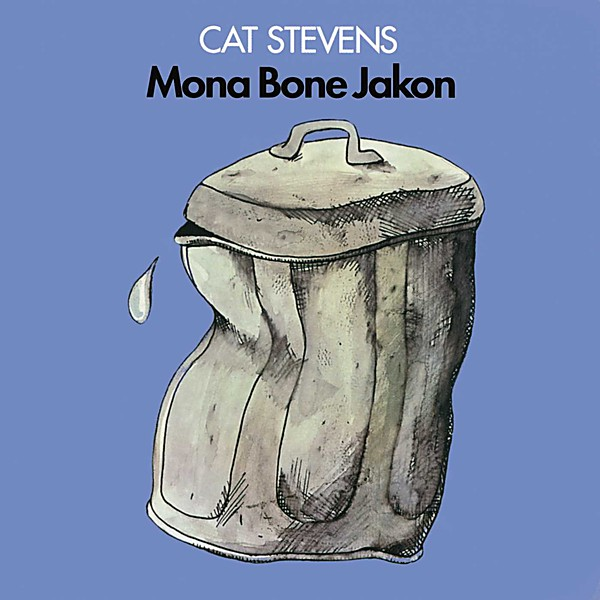

# Mona Bone Jakon

By **Cat Stevens**

## Album Data

- **Catalog:** Beets
- **Format:** Digital, Album
- **Album:** Mona Bone Jakon
- **Artist:** Cat Stevens
- **Albumartist:** Cat Stevens
- **Genre:** Folk Rock
- **MusicBrainz Album Artist ID:** [e2345fdf-2be7-47c5-a6dd-be64353ad134](https://musicbrainz.org/artist/e2345fdf-2be7-47c5-a6dd-be64353ad134)
- **MusicBrainz Album ID:** [ad24c2db-7895-34ab-bba6-e63550c961a9](https://musicbrainz.org/release/ad24c2db-7895-34ab-bba6-e63550c961a9)
- **MusicBrainz Release Group ID:** [1abae419-530e-3b01-a43f-000aea0c90c5](https://musicbrainz.org/release-group/1abae419-530e-3b01-a43f-000aea0c90c5)
- **Year:** 2000
- **Catalog #:** 314 546 884-2
- **Label:** A&M Records
- **Total Tracks:** 11

## Album Tracks

### Track 01 - Where Do the Children Play?

- **Artist:** Cat Stevens
- **Format:** MP3
- **Genre:** Folk Rock
- **Length:** 3:52
- **MusicBrainz Track ID:** [a3fa1f81-c446-4beb-8937-16d3ff341d8c](https://musicbrainz.org/recording/a3fa1f81-c446-4beb-8937-16d3ff341d8c)
- **Title:** Where Do the Children Play?
- **Track:** 01
- **Year:** 2000

### Track 02 - Hard Headed Woman

- **Artist:** Cat Stevens
- **Format:** MP3
- **Genre:** Soft Rock
- **Length:** 3:47
- **MusicBrainz Track ID:** [1a8cc784-6736-494d-947f-628c802e1950](https://musicbrainz.org/recording/1a8cc784-6736-494d-947f-628c802e1950)
- **Title:** Hard Headed Woman
- **Track:** 02
- **Year:** 2000

### Track 03 - Wild World

- **Artist:** Cat Stevens
- **Format:** MP3
- **Genre:** Folk Rock
- **Length:** 3:20
- **MusicBrainz Track ID:** [7d7e146d-0742-4236-a880-926f38581750](https://musicbrainz.org/recording/7d7e146d-0742-4236-a880-926f38581750)
- **Title:** Wild World
- **Track:** 03
- **Year:** 2000

### Track 04 - Sad Lisa

- **Artist:** Cat Stevens
- **Format:** MP3
- **Genre:** Folk Rock
- **Length:** 3:45
- **MusicBrainz Track ID:** [d4e59cf2-c632-42d6-968b-00128bd79642](https://musicbrainz.org/recording/d4e59cf2-c632-42d6-968b-00128bd79642)
- **Title:** Sad Lisa
- **Track:** 04
- **Year:** 2000

### Track 05 - Miles From Nowhere

- **Artist:** Cat Stevens
- **Format:** MP3
- **Genre:** Folk Rock
- **Length:** 3:37
- **MusicBrainz Track ID:** [29ccfa84-ddf0-4a3d-8e57-c0e85186653b](https://musicbrainz.org/recording/29ccfa84-ddf0-4a3d-8e57-c0e85186653b)
- **Title:** Miles From Nowhere
- **Track:** 05
- **Year:** 2000

### Track 06 - But I Might Die Tonight

- **Artist:** Cat Stevens
- **Format:** MP3
- **Genre:** Soft Rock
- **Length:** 1:53
- **MusicBrainz Track ID:** [dfa63fa6-f5e3-4900-9f3d-9e572ffb5aed](https://musicbrainz.org/recording/dfa63fa6-f5e3-4900-9f3d-9e572ffb5aed)
- **Title:** But I Might Die Tonight
- **Track:** 06
- **Year:** 2000

### Track 07 - Longer Boats

- **Artist:** Cat Stevens
- **Format:** MP3
- **Genre:** Soft Rock
- **Length:** 3:12
- **MusicBrainz Track ID:** [ea9604d3-6ec2-4467-a046-f5cc1a042a8b](https://musicbrainz.org/recording/ea9604d3-6ec2-4467-a046-f5cc1a042a8b)
- **Title:** Longer Boats
- **Track:** 07
- **Year:** 2000

### Track 08 - Into White

- **Artist:** Cat Stevens
- **Format:** MP3
- **Genre:** Folk Rock
- **Length:** 3:24
- **MusicBrainz Track ID:** [5ad64fb1-346f-4541-8c96-f5bb6a4f1f22](https://musicbrainz.org/recording/5ad64fb1-346f-4541-8c96-f5bb6a4f1f22)
- **Title:** Into White
- **Track:** 08
- **Year:** 2000

### Track 09 - On the Road to Find Out

- **Artist:** Cat Stevens
- **Format:** MP3
- **Genre:** Folk Rock
- **Length:** 5:04
- **MusicBrainz Track ID:** [3dc50f9e-10b9-492b-a610-e1761e60c4ee](https://musicbrainz.org/recording/3dc50f9e-10b9-492b-a610-e1761e60c4ee)
- **Title:** On the Road to Find Out
- **Track:** 09
- **Year:** 2000

### Track 10 - Father and Son

- **Artist:** Cat Stevens
- **Format:** MP3
- **Genre:** Folk Rock
- **Length:** 3:41
- **MusicBrainz Track ID:** [1fbde198-a68c-451c-b50d-20f272ddc157](https://musicbrainz.org/recording/1fbde198-a68c-451c-b50d-20f272ddc157)
- **Title:** Father and Son
- **Track:** 10
- **Year:** 2000

### Track 11 - Tea for the Tillerman

- **Artist:** Cat Stevens
- **Format:** MP3
- **Genre:** Folk Rock
- **Length:** 1:01
- **MusicBrainz Track ID:** [3a6ea4b0-3ecc-4a09-805f-76a630ce7986](https://musicbrainz.org/recording/3a6ea4b0-3ecc-4a09-805f-76a630ce7986)
- **Title:** Tea for the Tillerman
- **Track:** 11
- **Year:** 2000

## See also

- [Tea for the Tillerman](Tea_for_the_Tillerman.md)
- [Roon: Harold and Maude [Original Motion Picture Soundtrack]](../../Roon/Cat_Stevens/Harold_and_Maude_[Original_Motion_Picture_Soundtrack].md)
- [Roon: Tea For The Tillerman](../../Roon/Cat_Stevens/Tea_For_The_Tillerman.md)
- [Vinyl: ](../../Vinyl/Cat_Stevens/Cat_Stevens.md)
- [Vinyl: Tea For The Tillerman](../../Vinyl/Cat_Stevens/Tea_For_The_Tillerman.md)
