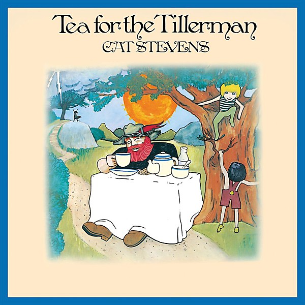

# Tea for the Tillerman

By Cat Stevens

## Album Data

- Catalog: Beets
- Format: Digital, Album
- Album: Tea for the Tillerman
- Artist: Cat Stevens
- Albumartist: Cat Stevens
- Genre: Folk Rock
- MusicBrainz Album Artist ID: e2345fdf-2be7-47c5-a6dd-be64353ad134
- MusicBrainz Album ID: 3cd2187d-fafb-3e8e-a350-086e1046d346
- MusicBrainz Release Group ID: 418678e7-2807-3bed-a305-11b4181e533e
- Year: 2000

