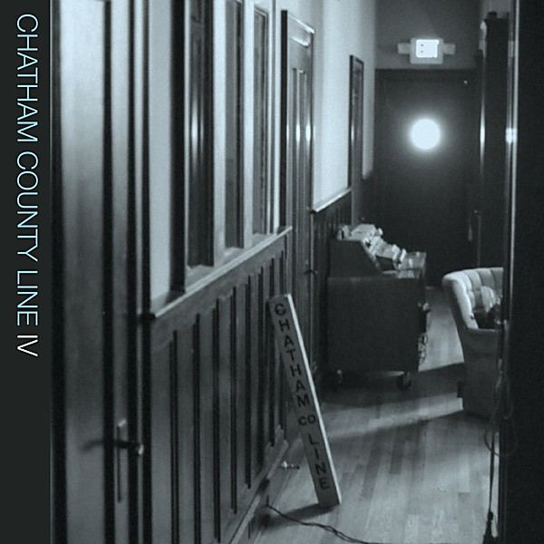

# IV

By **Chatham County Line**

## Album Data

- **Catalog:** Beets
- **Format:** Digital, Album
- **Album:** IV
- **Artist:** Chatham County Line
- **Albumartist:** Chatham County Line
- **Genre:** Bluegrass
- **MusicBrainz Album Artist ID:** 
- **MusicBrainz Album ID:** 
- **MusicBrainz Release Group ID:** 
- **Year:** 2008
- **Catalog #:** 
- **Label:** 
- **Total Tracks:** 00

## Album Tracks

### Track 01 - Chip Of A Star

- **Artist:** Chatham County Line
- **Format:** AAC
- **Genre:** Bluegrass
- **Length:** 4:30
- **MusicBrainz Track ID:** 
- **Title:** Chip Of A Star
- **Track:** 01
- **Year:** 2008

