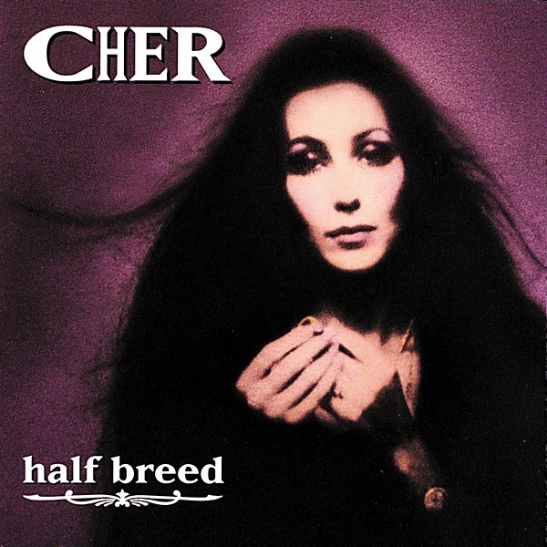

# Half‐Breed

By **Cher**

## Album Data

- **Catalog:** Beets
- **Format:** Digital, Album
- **Album:** Half‐Breed
- **Artist:** Cher
- **Albumartist:** Cher
- **Genre:** Rock
- **MusicBrainz Album Artist ID:** [bfcc6d75-a6a5-4bc6-8282-47aec8531818](https://musicbrainz.org/artist/bfcc6d75-a6a5-4bc6-8282-47aec8531818)
- **MusicBrainz Album ID:** [9398e3a6-c2ae-4195-946e-f11d8960dbd3](https://musicbrainz.org/release/9398e3a6-c2ae-4195-946e-f11d8960dbd3)
- **MusicBrainz Release Group ID:** [874af664-0d17-313f-aca7-ad363b972f15](https://musicbrainz.org/release-group/874af664-0d17-313f-aca7-ad363b972f15)
- **Year:** 2016
- **Catalog #:** 
- **Label:** Geffen Records
- **Total Tracks:** 11

## Album Tracks

### Track 01 - My Love

- **Artist:** Cher
- **Format:** MP3
- **Genre:** Dance-Pop
- **Length:** 3:39
- **MusicBrainz Track ID:** [7243fa75-4b8e-4785-ba7e-f0ac3f8c5b02](https://musicbrainz.org/recording/7243fa75-4b8e-4785-ba7e-f0ac3f8c5b02)
- **Title:** My Love
- **Track:** 01
- **Year:** 2016

### Track 02 - Two People Clinging to a Thread

- **Artist:** Cher
- **Format:** MP3
- **Genre:** Pop
- **Length:** 2:43
- **MusicBrainz Track ID:** [82074d96-728c-41a8-a78c-1dbcb0cb0d14](https://musicbrainz.org/recording/82074d96-728c-41a8-a78c-1dbcb0cb0d14)
- **Title:** Two People Clinging to a Thread
- **Track:** 02
- **Year:** 2016

### Track 03 - Half‐Breed

- **Artist:** Cher
- **Format:** MP3
- **Genre:** Pop Rock
- **Length:** 2:49
- **MusicBrainz Track ID:** [61ba0e74-bdd6-4751-a7a5-45d9841a89ef](https://musicbrainz.org/recording/61ba0e74-bdd6-4751-a7a5-45d9841a89ef)
- **Title:** Half‐Breed
- **Track:** 03
- **Year:** 2016

### Track 04 - Greatest Song I Ever Heard

- **Artist:** Cher
- **Format:** MP3
- **Genre:** Rock
- **Length:** 2:55
- **MusicBrainz Track ID:** [15cc734c-2259-40f1-93c5-2d29996d486a](https://musicbrainz.org/recording/15cc734c-2259-40f1-93c5-2d29996d486a)
- **Title:** Greatest Song I Ever Heard
- **Track:** 04
- **Year:** 2016

### Track 05 - How Can You Mend a Broken Heart

- **Artist:** Cher
- **Format:** MP3
- **Genre:** Pop
- **Length:** 3:25
- **MusicBrainz Track ID:** [a120d3c7-d8c7-479d-accf-18c4ad44ae10](https://musicbrainz.org/recording/a120d3c7-d8c7-479d-accf-18c4ad44ae10)
- **Title:** How Can You Mend a Broken Heart
- **Track:** 05
- **Year:** 2016

### Track 06 - Carousel Man

- **Artist:** Cher
- **Format:** MP3
- **Genre:** Soft Rock
- **Length:** 3:07
- **MusicBrainz Track ID:** [9a9d2b03-0120-4376-9e1a-2771885702c2](https://musicbrainz.org/recording/9a9d2b03-0120-4376-9e1a-2771885702c2)
- **Title:** Carousel Man
- **Track:** 06
- **Year:** 2016

### Track 07 - David’s Song

- **Artist:** Cher
- **Format:** MP3
- **Genre:** Rock
- **Length:** 3:24
- **MusicBrainz Track ID:** [e2f193ed-27bb-48a3-81bf-f7d45ea7c4e5](https://musicbrainz.org/recording/e2f193ed-27bb-48a3-81bf-f7d45ea7c4e5)
- **Title:** David’s Song
- **Track:** 07
- **Year:** 2016

### Track 08 - Melody

- **Artist:** Cher
- **Format:** MP3
- **Genre:** Pop
- **Length:** 2:41
- **MusicBrainz Track ID:** [87f2c753-a219-4e5f-abd8-7717b7c36762](https://musicbrainz.org/recording/87f2c753-a219-4e5f-abd8-7717b7c36762)
- **Title:** Melody
- **Track:** 08
- **Year:** 2016

### Track 09 - The Long and Winding Road

- **Artist:** Cher
- **Format:** MP3
- **Genre:** Pop
- **Length:** 3:15
- **MusicBrainz Track ID:** [bc0902d0-1ee9-4869-9357-ccfcf63b1636](https://musicbrainz.org/recording/bc0902d0-1ee9-4869-9357-ccfcf63b1636)
- **Title:** The Long and Winding Road
- **Track:** 09
- **Year:** 2016

### Track 10 - This God‐Forsaken Day

- **Artist:** Cher
- **Format:** MP3
- **Genre:** Pop
- **Length:** 2:48
- **MusicBrainz Track ID:** [aaedf41d-8f14-4b96-9765-c812c10ad66d](https://musicbrainz.org/recording/aaedf41d-8f14-4b96-9765-c812c10ad66d)
- **Title:** This God‐Forsaken Day
- **Track:** 10
- **Year:** 2016

### Track 11 - Chastity Sun

- **Artist:** Cher
- **Format:** MP3
- **Genre:** Rock
- **Length:** 4:20
- **MusicBrainz Track ID:** [e9d7edfb-31bd-46d1-932c-80f2184bd447](https://musicbrainz.org/recording/e9d7edfb-31bd-46d1-932c-80f2184bd447)
- **Title:** Chastity Sun
- **Track:** 11
- **Year:** 2016

## See also

- [Roon: Burlesque Original Motion Picture Soundtrack](../../Roon/Cher/Burlesque_Original_Motion_Picture_Soundtrack.md)
- [Roon: Dancing Queen](../../Roon/Cher/Dancing_Queen.md)
- [Roon: Gypsys, Tramps & Thieves](../../Roon/Cher/Gypsys__Tramps_and_Thieves.md)
- [Roon: Half-Breed](../../Roon/Cher/Half-Breed.md)
- [Roon: Heart Of Stone](../../Roon/Cher/Heart_Of_Stone.md)
