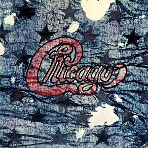

# Chicago II

By **Chicago**

## Album Data

- **Catalog:** Beets
- **Format:** Digital, Album
- **Album:** Chicago II
- **Artist:** Chicago
- **Albumartist:** Chicago
- **Genre:** Soft Rock
- **MusicBrainz Album Artist ID:** [3f5be744-e867-42fb-8913-5fd69e4099b5](https://musicbrainz.org/artist/3f5be744-e867-42fb-8913-5fd69e4099b5)
- **MusicBrainz Album ID:** [7e2b4644-f17a-4e2f-9e1c-a44b4daafc52](https://musicbrainz.org/release/7e2b4644-f17a-4e2f-9e1c-a44b4daafc52)
- **MusicBrainz Release Group ID:** [8d81d044-ab8e-3130-862d-e10ec4e5aff9](https://musicbrainz.org/release-group/8d81d044-ab8e-3130-862d-e10ec4e5aff9)
- **Year:** 1995
- **Catalog #:** 
- **Label:** Rhino
- **Total Tracks:** 12

## Album Tracks

### Track 01 - Introduction

- **Artist:** Chicago
- **Format:** ALAC
- **Genre:** Jazz Fusion
- **Length:** 6:35
- **MusicBrainz Track ID:** [6818f04e-7b14-4aa9-909c-cac2b5e23a96](https://musicbrainz.org/recording/6818f04e-7b14-4aa9-909c-cac2b5e23a96)
- **Title:** Introduction
- **Track:** 01
- **Year:** 2002

### Track 02 - Does Anybody Really Know What Time It Is?

- **Artist:** Chicago
- **Format:** ALAC
- **Genre:** Soft Rock
- **Length:** 4:36
- **MusicBrainz Track ID:** [d170683d-215d-42f3-a55f-a9e1c28a73b3](https://musicbrainz.org/recording/d170683d-215d-42f3-a55f-a9e1c28a73b3)
- **Title:** Does Anybody Really Know What Time It Is?
- **Track:** 02
- **Year:** 2002

### Track 03 - Beginnings

- **Artist:** Chicago
- **Format:** ALAC
- **Genre:** Soft Rock
- **Length:** 7:54
- **MusicBrainz Track ID:** [a7a3b965-50d9-45f0-97f8-52a5f2cb25f5](https://musicbrainz.org/recording/a7a3b965-50d9-45f0-97f8-52a5f2cb25f5)
- **Title:** Beginnings
- **Track:** 03
- **Year:** 2002

### Track 04 - Questions 67 and 68

- **Artist:** Chicago
- **Format:** ALAC
- **Genre:** Soft Rock
- **Length:** 5:02
- **MusicBrainz Track ID:** [3fe876c3-76c4-4f14-a50a-497e0be51044](https://musicbrainz.org/recording/3fe876c3-76c4-4f14-a50a-497e0be51044)
- **Title:** Questions 67 and 68
- **Track:** 04
- **Year:** 2002

### Track 05 - Listen

- **Artist:** Chicago
- **Format:** ALAC
- **Genre:** Progressive Rock
- **Length:** 3:21
- **MusicBrainz Track ID:** [0012cc4a-3a86-4806-a98b-a92053ac8e42](https://musicbrainz.org/recording/0012cc4a-3a86-4806-a98b-a92053ac8e42)
- **Title:** Listen
- **Track:** 05
- **Year:** 2002

### Track 06 - Poem 58

- **Artist:** Chicago
- **Format:** ALAC
- **Genre:** Jazz Fusion
- **Length:** 8:37
- **MusicBrainz Track ID:** [2cffb186-7348-40cd-9a47-d50d3b33b87b](https://musicbrainz.org/recording/2cffb186-7348-40cd-9a47-d50d3b33b87b)
- **Title:** Poem 58
- **Track:** 06
- **Year:** 2002

### Track 07 - Free Form Guitar

- **Artist:** Chicago
- **Format:** ALAC
- **Genre:** Noise Rock
- **Length:** 6:47
- **MusicBrainz Track ID:** [b2ba50d4-bcf9-4828-9eb4-28ae171b7a51](https://musicbrainz.org/recording/b2ba50d4-bcf9-4828-9eb4-28ae171b7a51)
- **Title:** Free Form Guitar
- **Track:** 07
- **Year:** 2002

### Track 08 - South California Purples

- **Artist:** Chicago
- **Format:** ALAC
- **Genre:** Psychedelic Rock
- **Length:** 6:11
- **MusicBrainz Track ID:** [ca1991d7-d93f-4fb3-8638-485c59180c87](https://musicbrainz.org/recording/ca1991d7-d93f-4fb3-8638-485c59180c87)
- **Title:** South California Purples
- **Track:** 08
- **Year:** 2002

### Track 09 - I’m a Man

- **Artist:** Chicago
- **Format:** ALAC
- **Genre:** Progressive Rock
- **Length:** 7:39
- **MusicBrainz Track ID:** [fa8e0364-008d-414f-a579-be82de0a3d32](https://musicbrainz.org/recording/fa8e0364-008d-414f-a579-be82de0a3d32)
- **Title:** I’m a Man
- **Track:** 09
- **Year:** 2002

### Track 10 - Prologue, August 29, 1968

- **Artist:** Chicago
- **Format:** ALAC
- **Genre:** Jazz
- **Length:** 0:57
- **MusicBrainz Track ID:** [50874860-c66a-43da-bf18-8ef92b50e7c8](https://musicbrainz.org/recording/50874860-c66a-43da-bf18-8ef92b50e7c8)
- **Title:** Prologue, August 29, 1968
- **Track:** 10
- **Year:** 2002

### Track 11 - Someday (August 29, 1968)

- **Artist:** Chicago
- **Format:** ALAC
- **Genre:** Rock
- **Length:** 4:13
- **MusicBrainz Track ID:** [bec1695f-f485-4d8c-b3d5-16fb7bc317ca](https://musicbrainz.org/recording/bec1695f-f485-4d8c-b3d5-16fb7bc317ca)
- **Title:** Someday (August 29, 1968)
- **Track:** 11
- **Year:** 2002

### Track 12 - Liberation

- **Artist:** Chicago
- **Format:** ALAC
- **Genre:** Rock
- **Length:** 14:38
- **MusicBrainz Track ID:** [397a708a-76a0-4424-b499-09f2beff9cdc](https://musicbrainz.org/recording/397a708a-76a0-4424-b499-09f2beff9cdc)
- **Title:** Liberation
- **Track:** 12
- **Year:** 2002

## See also

- [Chicago Transit Authority](Chicago_Transit_Authority.md)
- [Chicago VI](Chicago_VI.md)
- [Roon: Chicago II (Steven Wilson Remix)](../../Roon/Chicago/Chicago_II_Steven_Wilson_Remix.md)
- [Roon: Chicago Transit Authority (50th Anniversary Remix)](../../Roon/Chicago/Chicago_Transit_Authority_50th_Anniversary_Remix.md)
- [Roon: Chicago VI (Expanded & Remastered)](../../Roon/Chicago/Chicago_VI_Expanded_and_Remastered.md)
- [Vinyl: ](../../Vinyl/Chicago/Chicago.md)
- [Vinyl: Chicago VI](../../Vinyl/Chicago/Chicago_VI.md)
