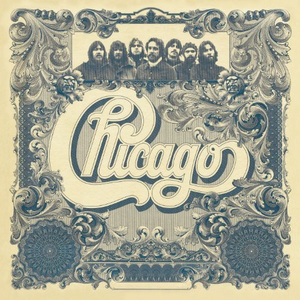

# Chicago VI

By **Chicago**

## Album Data

- **Catalog:** Beets
- **Format:** Digital, Album
- **Album:** Chicago VI
- **Artist:** Chicago
- **Albumartist:** Chicago
- **Genre:** Soft Rock
- **MusicBrainz Album Artist ID:** [3f5be744-e867-42fb-8913-5fd69e4099b5](https://musicbrainz.org/artist/3f5be744-e867-42fb-8913-5fd69e4099b5)
- **MusicBrainz Album ID:** [2af5b8c9-e8e3-4d68-9397-fa1eb68eb894](https://musicbrainz.org/release/2af5b8c9-e8e3-4d68-9397-fa1eb68eb894)
- **MusicBrainz Release Group ID:** [6ba3d80e-34eb-3eeb-83a1-4ccd8d749d3b](https://musicbrainz.org/release-group/6ba3d80e-34eb-3eeb-83a1-4ccd8d749d3b)
- **Year:** 2002
- **Catalog #:** 
- **Label:** Rhino
- **Total Tracks:** 12

## Album Tracks

### Track 01 - Critics’ Choice

- **Artist:** Chicago
- **Format:** MP3
- **Genre:** Soft Rock
- **Length:** 2:51
- **MusicBrainz Track ID:** [c49bde58-06d4-4c4a-9205-fccfb0259cf6](https://musicbrainz.org/recording/c49bde58-06d4-4c4a-9205-fccfb0259cf6)
- **Title:** Critics’ Choice
- **Track:** 01
- **Year:** 2002

### Track 02 - Just You ’n’ Me

- **Artist:** Chicago
- **Format:** MP3
- **Genre:** Soft Rock
- **Length:** 3:42
- **MusicBrainz Track ID:** [d637b4e9-9034-4836-9a24-001bc6bc687e](https://musicbrainz.org/recording/d637b4e9-9034-4836-9a24-001bc6bc687e)
- **Title:** Just You ’n’ Me
- **Track:** 02
- **Year:** 2002

### Track 03 - Darlin’ Dear

- **Artist:** Chicago
- **Format:** MP3
- **Genre:** Soft Rock
- **Length:** 2:57
- **MusicBrainz Track ID:** [5e348627-75fa-41c4-ab85-ab577c2dbe68](https://musicbrainz.org/recording/5e348627-75fa-41c4-ab85-ab577c2dbe68)
- **Title:** Darlin’ Dear
- **Track:** 03
- **Year:** 2002

### Track 04 - Jenny

- **Artist:** Chicago
- **Format:** MP3
- **Genre:** Jazz Fusion
- **Length:** 3:35
- **MusicBrainz Track ID:** [451e2b3b-7791-4836-9e84-b262bd3ecd60](https://musicbrainz.org/recording/451e2b3b-7791-4836-9e84-b262bd3ecd60)
- **Title:** Jenny
- **Track:** 04
- **Year:** 2002

### Track 05 - What’s This World Comin’ To

- **Artist:** Chicago
- **Format:** MP3
- **Genre:** Soft Rock
- **Length:** 5:00
- **MusicBrainz Track ID:** [a0e497eb-d0bd-429b-baba-93730d7b16ba](https://musicbrainz.org/recording/a0e497eb-d0bd-429b-baba-93730d7b16ba)
- **Title:** What’s This World Comin’ To
- **Track:** 05
- **Year:** 2002

### Track 06 - Something in This City Changes People

- **Artist:** Chicago
- **Format:** MP3
- **Genre:** Jazz Fusion
- **Length:** 3:42
- **MusicBrainz Track ID:** [b840f105-fd9f-4e7d-b213-a7a1a81db3cc](https://musicbrainz.org/recording/b840f105-fd9f-4e7d-b213-a7a1a81db3cc)
- **Title:** Something in This City Changes People
- **Track:** 06
- **Year:** 2002

### Track 07 - Hollywood

- **Artist:** Chicago
- **Format:** MP3
- **Genre:** Jazz Fusion
- **Length:** 3:51
- **MusicBrainz Track ID:** [8ff9afdf-389e-4e72-9375-12bbb8805bf4](https://musicbrainz.org/recording/8ff9afdf-389e-4e72-9375-12bbb8805bf4)
- **Title:** Hollywood
- **Track:** 07
- **Year:** 2002

### Track 08 - In Terms of Two

- **Artist:** Chicago
- **Format:** MP3
- **Genre:** Jazz Fusion
- **Length:** 3:28
- **MusicBrainz Track ID:** [c9c0b550-9a02-4aaa-a568-20458257d32d](https://musicbrainz.org/recording/c9c0b550-9a02-4aaa-a568-20458257d32d)
- **Title:** In Terms of Two
- **Track:** 08
- **Year:** 2002

### Track 09 - Rediscovery

- **Artist:** Chicago
- **Format:** MP3
- **Genre:** Jazz Fusion
- **Length:** 4:48
- **MusicBrainz Track ID:** [4bd57c1e-92b5-4a03-ad07-5b4bfb9991db](https://musicbrainz.org/recording/4bd57c1e-92b5-4a03-ad07-5b4bfb9991db)
- **Title:** Rediscovery
- **Track:** 09
- **Year:** 2002

### Track 10 - Feelin’ Stronger Every Day

- **Artist:** Chicago
- **Format:** MP3
- **Genre:** Soft Rock
- **Length:** 4:14
- **MusicBrainz Track ID:** [6765530c-766a-4e8c-85ef-bb9278605515](https://musicbrainz.org/recording/6765530c-766a-4e8c-85ef-bb9278605515)
- **Title:** Feelin’ Stronger Every Day
- **Track:** 10
- **Year:** 2002

### Track 11 - Beyond All Our Sorrows

- **Artist:** Chicago
- **Format:** MP3
- **Genre:** Soft Rock
- **Length:** 7:06
- **MusicBrainz Track ID:** [81e85b65-c055-4848-b9ee-65316c413bb4](https://musicbrainz.org/recording/81e85b65-c055-4848-b9ee-65316c413bb4)
- **Title:** Beyond All Our Sorrows
- **Track:** 11
- **Year:** 2002

### Track 12 - Tired of Being Alone

- **Artist:** Chicago
- **Format:** MP3
- **Genre:** Soft Rock
- **Length:** 4:09
- **MusicBrainz Track ID:** [db2901fd-ca4a-48af-909d-8897e68461d9](https://musicbrainz.org/recording/db2901fd-ca4a-48af-909d-8897e68461d9)
- **Title:** Tired of Being Alone
- **Track:** 12
- **Year:** 2002

## See also

- [Chicago II](Chicago_II.md)
- [Chicago Transit Authority](Chicago_Transit_Authority.md)
- [Roon: Chicago II (Steven Wilson Remix)](../../Roon/Chicago/Chicago_II_Steven_Wilson_Remix.md)
- [Roon: Chicago Transit Authority (50th Anniversary Remix)](../../Roon/Chicago/Chicago_Transit_Authority_50th_Anniversary_Remix.md)
- [Roon: Chicago VI (Expanded & Remastered)](../../Roon/Chicago/Chicago_VI_Expanded_and_Remastered.md)
- [Vinyl: ](../../Vinyl/Chicago/Chicago.md)
- [Vinyl: Chicago VI](../../Vinyl/Chicago/Chicago_VI.md)
