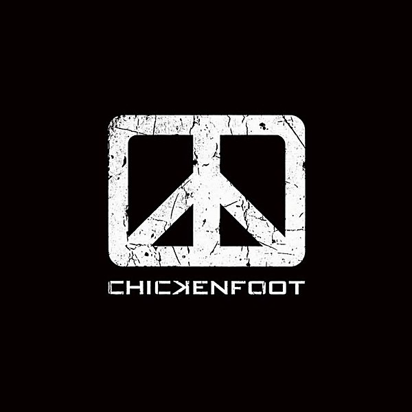

# Chickenfoot (Deluxe Edition)

By **Chickenfoot**

## Album Data

- **Catalog:** Beets
- **Format:** Digital, Album
- **Album:** Chickenfoot (Deluxe Edition)
- **Artist:** Chickenfoot
- **Albumartist:** Chickenfoot
- **Genre:** Hard Rock
- **MusicBrainz Album Artist ID:** [https](https://musicbrainz.org/artist/https)
- **MusicBrainz Album ID:** [https](https://musicbrainz.org/release/https)
- **MusicBrainz Release Group ID:** 
- **Year:** 2012
- **Catalog #:** 
- **Label:** MNRK Heavy
- **Total Tracks:** 16

## Album Tracks

### Track 02 - Soap On A Rope

- **Artist:** Chickenfoot
- **Format:** MP3
- **Genre:** Hard Rock
- **Length:** 5:32
- **MusicBrainz Track ID:** [https](https://musicbrainz.org/recording/https)
- **Title:** Soap On A Rope
- **Track:** 02
- **Year:** 2012

### Track 03 - Sexy Little Thing

- **Artist:** Chickenfoot
- **Format:** MP3
- **Genre:** Uk Garage
- **Length:** 4:14
- **MusicBrainz Track ID:** [https](https://musicbrainz.org/recording/https)
- **Title:** Sexy Little Thing
- **Track:** 03
- **Year:** 2012

### Track 04 - Oh Yeah

- **Artist:** Chickenfoot
- **Format:** MP3
- **Genre:** Heavy Metal
- **Length:** 4:54
- **MusicBrainz Track ID:** [https](https://musicbrainz.org/recording/https)
- **Title:** Oh Yeah
- **Track:** 04
- **Year:** 2012

### Track 05 - Runnin' Out

- **Artist:** Chickenfoot
- **Format:** MP3
- **Genre:** Hard Rock
- **Length:** 3:52
- **MusicBrainz Track ID:** [https](https://musicbrainz.org/recording/https)
- **Title:** Runnin' Out
- **Track:** 05
- **Year:** 2012

### Track 06 - Get It Up

- **Artist:** Chickenfoot
- **Format:** MP3
- **Genre:** Heavy Metal
- **Length:** 4:41
- **MusicBrainz Track ID:** [https](https://musicbrainz.org/recording/https)
- **Title:** Get It Up
- **Track:** 06
- **Year:** 2012

### Track 07 - Down The Drain

- **Artist:** Chickenfoot
- **Format:** MP3
- **Genre:** Hard Rock
- **Length:** 6:17
- **MusicBrainz Track ID:** [https](https://musicbrainz.org/recording/https)
- **Title:** Down The Drain
- **Track:** 07
- **Year:** 2012

### Track 08 - My Kinda Girl

- **Artist:** Chickenfoot
- **Format:** MP3
- **Genre:** Hard Rock
- **Length:** 4:34
- **MusicBrainz Track ID:** [https](https://musicbrainz.org/recording/https)
- **Title:** My Kinda Girl
- **Track:** 08
- **Year:** 2012

### Track 09 - Learning To Fall

- **Artist:** Chickenfoot
- **Format:** MP3
- **Genre:** Hard Rock
- **Length:** 5:13
- **MusicBrainz Track ID:** [https](https://musicbrainz.org/recording/https)
- **Title:** Learning To Fall
- **Track:** 09
- **Year:** 2012

### Track 10 - Turnin' Left

- **Artist:** Chickenfoot
- **Format:** MP3
- **Genre:** Hard Rock
- **Length:** 5:48
- **MusicBrainz Track ID:** [https](https://musicbrainz.org/recording/https)
- **Title:** Turnin' Left
- **Track:** 10
- **Year:** 2012

### Track 11 - Future In The Past

- **Artist:** Chickenfoot
- **Format:** MP3
- **Genre:** Hard Rock
- **Length:** 6:43
- **MusicBrainz Track ID:** [https](https://musicbrainz.org/recording/https)
- **Title:** Future In The Past
- **Track:** 11
- **Year:** 2012

### Track 12 - Bitten By The Wolf

- **Artist:** Chickenfoot
- **Format:** AAC
- **Genre:** Hard Rock
- **Length:** 4:24
- **MusicBrainz Track ID:** [https](https://musicbrainz.org/recording/https)
- **Title:** Bitten By The Wolf
- **Track:** 12
- **Year:** 2012

### Track 13 - Lighten Up (Live)

- **Artist:** Chickenfoot
- **Format:** MP3
- **Genre:** Hard Rock
- **Length:** 6:57
- **MusicBrainz Track ID:** [https](https://musicbrainz.org/recording/https)
- **Title:** Lighten Up (Live)
- **Track:** 13
- **Year:** 2012

### Track 14 - Bigfoot (Live)

- **Artist:** Chickenfoot
- **Format:** MP3
- **Genre:** Hard Rock
- **Length:** 4:21
- **MusicBrainz Track ID:** [https](https://musicbrainz.org/recording/https)
- **Title:** Bigfoot (Live)
- **Track:** 14
- **Year:** 2012

### Track 15 - Last Temptation (Live)

- **Artist:** Chickenfoot
- **Format:** AAC
- **Genre:** Hard Rock
- **Length:** 4:09
- **MusicBrainz Track ID:** [https](https://musicbrainz.org/recording/https)
- **Title:** Last Temptation (Live)
- **Track:** 15
- **Year:** 2012

### Track 16 - Something Going Wrong (Live)

- **Artist:** Chickenfoot
- **Format:** AAC
- **Genre:** Hard Rock
- **Length:** 6:42
- **MusicBrainz Track ID:** [https](https://musicbrainz.org/recording/https)
- **Title:** Something Going Wrong (Live)
- **Track:** 16
- **Year:** 2012

## See also

- [Chickenfoot](Chickenfoot.md)
- [Roon: Chickenfoot (Deluxe Edition)](../../Roon/Chickenfoot/Chickenfoot_Deluxe_Edition.md)
