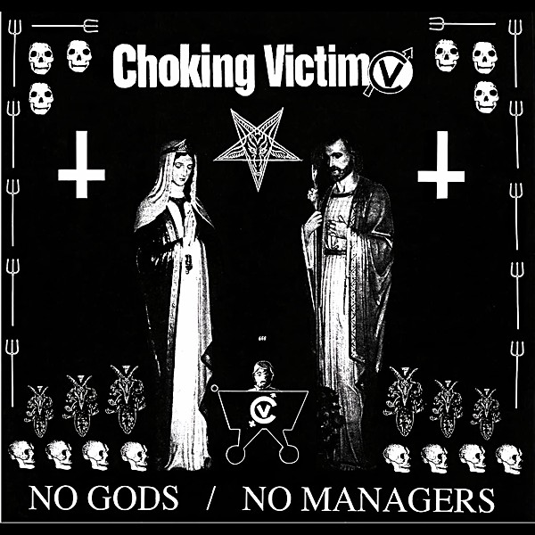

# No Gods / No Managers

By **Choking Victim**

## Album Data

- **Catalog:** Beets
- **Format:** Digital, Album
- **Album:** No Gods / No Managers
- **Artist:** Choking Victim
- **Albumartist:** Choking Victim
- **Genre:** Crust Punk
- **MusicBrainz Album Artist ID:** [a0c82dc1-950a-464d-bd97-5a01296b1c8d](https://musicbrainz.org/artist/a0c82dc1-950a-464d-bd97-5a01296b1c8d)
- **MusicBrainz Album ID:** [f5df4817-0c95-4e61-8bf2-cb18ea19a161](https://musicbrainz.org/release/f5df4817-0c95-4e61-8bf2-cb18ea19a161)
- **MusicBrainz Release Group ID:** [e6035bf8-17bf-33e4-a7ea-7a3a27f16e87](https://musicbrainz.org/release-group/e6035bf8-17bf-33e4-a7ea-7a3a27f16e87)
- **Year:** 1999
- **Catalog #:** 80408-2
- **Label:** Hellcat Records
- **Total Tracks:** 13

## Album Tracks

### Track 01 - 500 Channels

- **Artist:** Choking Victim
- **Format:** AAC
- **Genre:** Ska Punk
- **Length:** 2:40
- **MusicBrainz Track ID:** [9667907d-1379-4c2f-a24f-0fee6bb232d7](https://musicbrainz.org/recording/9667907d-1379-4c2f-a24f-0fee6bb232d7)
- **Title:** 500 Channels
- **Track:** 01
- **Year:** 1999

### Track 02 - In Hell

- **Artist:** Choking Victim
- **Format:** AAC
- **Genre:** Ska Punk
- **Length:** 2:05
- **MusicBrainz Track ID:** [b94cc621-03dc-4f18-a06d-22959edf9e58](https://musicbrainz.org/recording/b94cc621-03dc-4f18-a06d-22959edf9e58)
- **Title:** In Hell
- **Track:** 02
- **Year:** 1999

### Track 03 - Crack Rock Steady

- **Artist:** Choking Victim
- **Format:** AAC
- **Genre:** Ska Punk
- **Length:** 3:04
- **MusicBrainz Track ID:** [23d5b476-8f5d-46a5-ac5e-9a0ce773c22b](https://musicbrainz.org/recording/23d5b476-8f5d-46a5-ac5e-9a0ce773c22b)
- **Title:** Crack Rock Steady
- **Track:** 03
- **Year:** 1999

### Track 04 - Suicide (A Better Way)

- **Artist:** Choking Victim
- **Format:** AAC
- **Genre:** Ska Punk
- **Length:** 2:53
- **MusicBrainz Track ID:** [e968691b-5b57-47f8-829b-4121062feac6](https://musicbrainz.org/recording/e968691b-5b57-47f8-829b-4121062feac6)
- **Title:** Suicide (A Better Way)
- **Track:** 04
- **Year:** 1999

### Track 05 - In My Grave

- **Artist:** Choking Victim
- **Format:** AAC
- **Genre:** Ska Punk
- **Length:** 2:48
- **MusicBrainz Track ID:** [efb66d83-cc5b-48a6-b96e-338a2f5d5db6](https://musicbrainz.org/recording/efb66d83-cc5b-48a6-b96e-338a2f5d5db6)
- **Title:** In My Grave
- **Track:** 05
- **Year:** 1999

### Track 06 - Fucked Reality

- **Artist:** Choking Victim
- **Format:** AAC
- **Genre:** Ska Punk
- **Length:** 2:28
- **MusicBrainz Track ID:** [998d7891-74f6-4bd8-955d-5b2618829633](https://musicbrainz.org/recording/998d7891-74f6-4bd8-955d-5b2618829633)
- **Title:** Fucked Reality
- **Track:** 06
- **Year:** 1999

### Track 07 - Money

- **Artist:** Choking Victim
- **Format:** AAC
- **Genre:** Ska Punk
- **Length:** 3:32
- **MusicBrainz Track ID:** [4c9c4299-2ad5-4b6a-a706-fd63f2c0fa1c](https://musicbrainz.org/recording/4c9c4299-2ad5-4b6a-a706-fd63f2c0fa1c)
- **Title:** Money
- **Track:** 07
- **Year:** 1999

### Track 08 - Hate Yer State

- **Artist:** Choking Victim
- **Format:** AAC
- **Genre:** Emo
- **Length:** 2:49
- **MusicBrainz Track ID:** [cb488535-6f4c-4026-a50a-ff3229e7e1a2](https://musicbrainz.org/recording/cb488535-6f4c-4026-a50a-ff3229e7e1a2)
- **Title:** Hate Yer State
- **Track:** 08
- **Year:** 1999

### Track 09 - Fuck America

- **Artist:** Choking Victim
- **Format:** AAC
- **Genre:** Ska Punk
- **Length:** 2:19
- **MusicBrainz Track ID:** [556f4d3d-211b-4bd3-921b-ead9f452f511](https://musicbrainz.org/recording/556f4d3d-211b-4bd3-921b-ead9f452f511)
- **Title:** Fuck America
- **Track:** 09
- **Year:** 1999

### Track 10 - War Story

- **Artist:** Choking Victim
- **Format:** AAC
- **Genre:** Ska Punk
- **Length:** 2:53
- **MusicBrainz Track ID:** [94036a1b-a015-4f29-a12d-485108bf8bed](https://musicbrainz.org/recording/94036a1b-a015-4f29-a12d-485108bf8bed)
- **Title:** War Story
- **Track:** 10
- **Year:** 1999

### Track 11 - Five-Finger Discount

- **Artist:** Choking Victim
- **Format:** AAC
- **Genre:** Ska Punk
- **Length:** 2:32
- **MusicBrainz Track ID:** [dd62433c-5362-45ed-850d-ade9bf3e48b3](https://musicbrainz.org/recording/dd62433c-5362-45ed-850d-ade9bf3e48b3)
- **Title:** Five-Finger Discount
- **Track:** 11
- **Year:** 1999

### Track 12 - Praise to the Sinners

- **Artist:** Choking Victim
- **Format:** AAC
- **Genre:** Hardcore Punk
- **Length:** 2:11
- **MusicBrainz Track ID:** [0d0ee4c5-743a-4028-a9eb-709a21f49dee](https://musicbrainz.org/recording/0d0ee4c5-743a-4028-a9eb-709a21f49dee)
- **Title:** Praise to the Sinners
- **Track:** 12
- **Year:** 1999

### Track 13 - Living the Laws / Crack Rock Steady

- **Artist:** Choking Victim
- **Format:** AAC
- **Genre:** Crust Punk
- **Length:** 9:19
- **MusicBrainz Track ID:** [1bebdc95-a2ba-4841-a5be-d5ebbffadc5c](https://musicbrainz.org/recording/1bebdc95-a2ba-4841-a5be-d5ebbffadc5c)
- **Title:** Living the Laws / Crack Rock Steady
- **Track:** 13
- **Year:** 1999

## See also

- [Crack Rock Steady Demo](Crack_Rock_Steady_Demo.md)
- [Crack Rock Steady / Squatta's Paradise](Crack_Rock_Steady_-_Squattas_Paradise.md)
