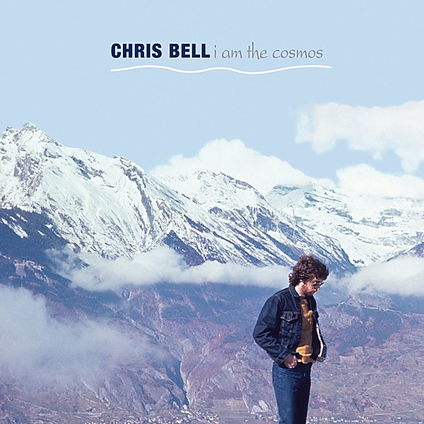

# I Am the Cosmos

By **Chris Bell**

## Album Data

- **Catalog:** Beets
- **Format:** Digital, Album
- **Album:** I Am the Cosmos
- **Artist:** Chris Bell
- **Albumartist:** Chris Bell
- **Genre:** Indie Rock
- **MusicBrainz Album Artist ID:** [db6ac2f7-5bbb-4ed4-88f4-540d5b29542a](https://musicbrainz.org/artist/db6ac2f7-5bbb-4ed4-88f4-540d5b29542a)
- **MusicBrainz Album ID:** [0abc1563-c4b9-4c27-beff-036c65c56cf4](https://musicbrainz.org/release/0abc1563-c4b9-4c27-beff-036c65c56cf4)
- **MusicBrainz Release Group ID:** [86bb6f43-d3a1-3470-bce4-793b39045630](https://musicbrainz.org/release-group/86bb6f43-d3a1-3470-bce4-793b39045630)
- **Year:** 1992
- **Catalog #:** RCD 10222
- **Label:** Rykodisc
- **Total Tracks:** 15

## Album Tracks

### Track 01 - I Am the Cosmos

- **Artist:** Chris Bell
- **Format:** MP3
- **Genre:** Power Pop
- **Length:** 3:49
- **MusicBrainz Track ID:** [abb39f2a-46f9-48c6-98c6-37543bd086ce](https://musicbrainz.org/recording/abb39f2a-46f9-48c6-98c6-37543bd086ce)
- **Title:** I Am the Cosmos
- **Track:** 01
- **Year:** 1992

### Track 02 - Better Save Yourself

- **Artist:** Chris Bell
- **Format:** MP3
- **Genre:** Power Pop
- **Length:** 4:28
- **MusicBrainz Track ID:** [b9c9829a-f60a-486c-850d-6d02fb80641d](https://musicbrainz.org/recording/b9c9829a-f60a-486c-850d-6d02fb80641d)
- **Title:** Better Save Yourself
- **Track:** 02
- **Year:** 1992

### Track 03 - Speed of Sound

- **Artist:** Chris Bell
- **Format:** MP3
- **Genre:** Power Pop
- **Length:** 5:14
- **MusicBrainz Track ID:** [d2e6eee8-9c05-47aa-8c07-d26114517a47](https://musicbrainz.org/recording/d2e6eee8-9c05-47aa-8c07-d26114517a47)
- **Title:** Speed of Sound
- **Track:** 03
- **Year:** 1992

### Track 04 - Get Away

- **Artist:** Chris Bell
- **Format:** MP3
- **Genre:** Power Pop
- **Length:** 3:29
- **MusicBrainz Track ID:** [3617346d-f0d8-4410-b45f-dc21647e9df7](https://musicbrainz.org/recording/3617346d-f0d8-4410-b45f-dc21647e9df7)
- **Title:** Get Away
- **Track:** 04
- **Year:** 1992

### Track 05 - You and Your Sister

- **Artist:** Chris Bell
- **Format:** MP3
- **Genre:** Jangle Pop
- **Length:** 3:14
- **MusicBrainz Track ID:** [faf4091b-a6b7-4a6d-9c0f-7ab1d4d30abb](https://musicbrainz.org/recording/faf4091b-a6b7-4a6d-9c0f-7ab1d4d30abb)
- **Title:** You and Your Sister
- **Track:** 05
- **Year:** 1992

### Track 06 - Make a Scene

- **Artist:** Chris Bell
- **Format:** MP3
- **Genre:** Power Pop
- **Length:** 4:11
- **MusicBrainz Track ID:** [826f5fe5-183f-43c3-9414-450df1a018c1](https://musicbrainz.org/recording/826f5fe5-183f-43c3-9414-450df1a018c1)
- **Title:** Make a Scene
- **Track:** 06
- **Year:** 1992

### Track 07 - Look Up

- **Artist:** Chris Bell
- **Format:** MP3
- **Genre:** Power Pop
- **Length:** 3:17
- **MusicBrainz Track ID:** [a8878dc1-a178-4dc3-94e4-a646b40cb5c2](https://musicbrainz.org/recording/a8878dc1-a178-4dc3-94e4-a646b40cb5c2)
- **Title:** Look Up
- **Track:** 07
- **Year:** 1992

### Track 08 - I Got Kinda Lost

- **Artist:** Chris Bell
- **Format:** MP3
- **Genre:** Power Pop
- **Length:** 2:44
- **MusicBrainz Track ID:** [7ed35318-ef9a-4e60-8790-c5c0cdb22c13](https://musicbrainz.org/recording/7ed35318-ef9a-4e60-8790-c5c0cdb22c13)
- **Title:** I Got Kinda Lost
- **Track:** 08
- **Year:** 1992

### Track 09 - There Was a Light

- **Artist:** Chris Bell
- **Format:** MP3
- **Genre:** Rock
- **Length:** 3:20
- **MusicBrainz Track ID:** [7ef7ad23-5100-4714-a1b7-f54cf06c9f5d](https://musicbrainz.org/recording/7ef7ad23-5100-4714-a1b7-f54cf06c9f5d)
- **Title:** There Was a Light
- **Track:** 09
- **Year:** 1992

### Track 10 - Fight at the Table

- **Artist:** Chris Bell
- **Format:** MP3
- **Genre:** Psychedelic Rock
- **Length:** 3:44
- **MusicBrainz Track ID:** [35939a60-68eb-4309-adc8-8837a3f996e0](https://musicbrainz.org/recording/35939a60-68eb-4309-adc8-8837a3f996e0)
- **Title:** Fight at the Table
- **Track:** 10
- **Year:** 1992

### Track 11 - I Don't Know

- **Artist:** Chris Bell
- **Format:** MP3
- **Genre:** Power Pop
- **Length:** 3:25
- **MusicBrainz Track ID:** [39ff9ccc-f25f-4f43-8bce-5296a8e372ac](https://musicbrainz.org/recording/39ff9ccc-f25f-4f43-8bce-5296a8e372ac)
- **Title:** I Don't Know
- **Track:** 11
- **Year:** 1992

### Track 12 - Though I Know She Lies

- **Artist:** Chris Bell
- **Format:** MP3
- **Genre:** Power Pop
- **Length:** 3:37
- **MusicBrainz Track ID:** [335bf4b5-4641-4f1e-85ef-fcc4abfff5b3](https://musicbrainz.org/recording/335bf4b5-4641-4f1e-85ef-fcc4abfff5b3)
- **Title:** Though I Know She Lies
- **Track:** 12
- **Year:** 1992

### Track 13 - I Am the Cosmos (slow version)

- **Artist:** Chris Bell
- **Format:** MP3
- **Genre:** Indie Rock
- **Length:** 3:41
- **MusicBrainz Track ID:** [0a28918a-d833-4f66-8c9c-bc952a3a2c29](https://musicbrainz.org/recording/0a28918a-d833-4f66-8c9c-bc952a3a2c29)
- **Title:** I Am the Cosmos (slow version)
- **Track:** 13
- **Year:** 1992

### Track 14 - You and Your Sister (country version)

- **Artist:** Chris Bell
- **Format:** MP3
- **Genre:** Power Pop
- **Length:** 2:57
- **MusicBrainz Track ID:** [e87c7ea5-f261-4188-ab4f-f800d782583a](https://musicbrainz.org/recording/e87c7ea5-f261-4188-ab4f-f800d782583a)
- **Title:** You and Your Sister (country version)
- **Track:** 14
- **Year:** 1992

### Track 15 - You and Your Sister (acoustic version)

- **Artist:** Chris Bell
- **Format:** MP3
- **Genre:** Power Pop
- **Length:** 2:54
- **MusicBrainz Track ID:** [43bfc45b-15c9-4220-9da4-0ec919a58cdd](https://musicbrainz.org/recording/43bfc45b-15c9-4220-9da4-0ec919a58cdd)
- **Title:** You and Your Sister (acoustic version)
- **Track:** 15
- **Year:** 1992

