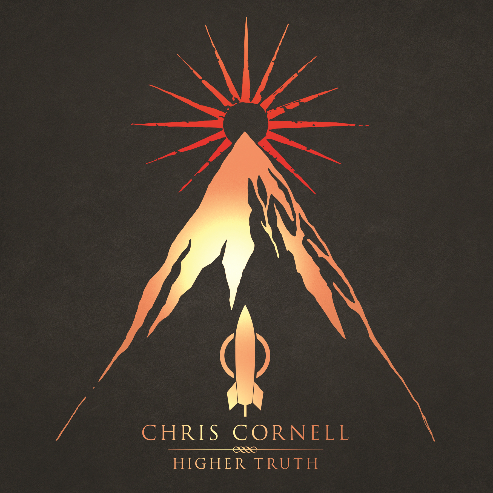

# Higher Truth

By **Chris Cornell**

## Album Data

- **Catalog:** Beets
- **Format:** Digital, Album
- **Album:** Higher Truth
- **Artist:** Chris Cornell
- **Albumartist:** Chris Cornell
- **Genre:** Hard Rock
- **MusicBrainz Album Artist ID:** [cbf9738d-8f81-4a92-bc64-ede09341652d](https://musicbrainz.org/artist/cbf9738d-8f81-4a92-bc64-ede09341652d)
- **MusicBrainz Album ID:** [4c9aaf1c-97ab-45e7-b62e-8a9c62571464](https://musicbrainz.org/release/4c9aaf1c-97ab-45e7-b62e-8a9c62571464)
- **MusicBrainz Release Group ID:** [645e1796-89aa-4afe-b35d-e6cbd094af2d](https://musicbrainz.org/release-group/645e1796-89aa-4afe-b35d-e6cbd094af2d)
- **Year:** 2015
- **Catalog #:** 
- **Label:** UMe
- **Total Tracks:** 16

## Album Tracks

### Track 01 - Nearly Forgot My Broken Heart

- **Artist:** Chris Cornell
- **Format:** ALAC
- **Genre:** Alternative Rock
- **Length:** 3:54
- **MusicBrainz Track ID:** [95d3a16e-3542-4289-92d8-a4c1d3757537](https://musicbrainz.org/recording/95d3a16e-3542-4289-92d8-a4c1d3757537)
- **Title:** Nearly Forgot My Broken Heart
- **Track:** 01
- **Year:** 2015

### Track 02 - Dead Wishes

- **Artist:** Chris Cornell
- **Format:** ALAC
- **Genre:** Hard Rock
- **Length:** 4:55
- **MusicBrainz Track ID:** [78553f66-2b34-4b40-9c2d-87a10ad10a2b](https://musicbrainz.org/recording/78553f66-2b34-4b40-9c2d-87a10ad10a2b)
- **Title:** Dead Wishes
- **Track:** 02
- **Year:** 2015

### Track 03 - Worried Moon

- **Artist:** Chris Cornell
- **Format:** ALAC
- **Genre:** Hard Rock
- **Length:** 4:32
- **MusicBrainz Track ID:** [1429de9f-00d1-4b73-8214-4c5bd920c022](https://musicbrainz.org/recording/1429de9f-00d1-4b73-8214-4c5bd920c022)
- **Title:** Worried Moon
- **Track:** 03
- **Year:** 2015

### Track 04 - Before We Disappear

- **Artist:** Chris Cornell
- **Format:** ALAC
- **Genre:** Hard Rock
- **Length:** 3:51
- **MusicBrainz Track ID:** [1f912323-9588-4dee-890e-a2db1aae7de0](https://musicbrainz.org/recording/1f912323-9588-4dee-890e-a2db1aae7de0)
- **Title:** Before We Disappear
- **Track:** 04
- **Year:** 2015

### Track 05 - Through the Window

- **Artist:** Chris Cornell
- **Format:** ALAC
- **Genre:** Hard Rock
- **Length:** 4:41
- **MusicBrainz Track ID:** [9427dc73-06e9-4e18-9e24-c00138610995](https://musicbrainz.org/recording/9427dc73-06e9-4e18-9e24-c00138610995)
- **Title:** Through the Window
- **Track:** 05
- **Year:** 2015

### Track 06 - Josephine

- **Artist:** Chris Cornell
- **Format:** ALAC
- **Genre:** Hard Rock
- **Length:** 3:38
- **MusicBrainz Track ID:** [7debd070-2ddb-4489-9fb0-1984f7efc5f0](https://musicbrainz.org/recording/7debd070-2ddb-4489-9fb0-1984f7efc5f0)
- **Title:** Josephine
- **Track:** 06
- **Year:** 2015

### Track 07 - Murderer of Blue Skies

- **Artist:** Chris Cornell
- **Format:** ALAC
- **Genre:** Hard Rock
- **Length:** 3:42
- **MusicBrainz Track ID:** [046c7705-f38f-41c5-9b3b-64ccce38ae2f](https://musicbrainz.org/recording/046c7705-f38f-41c5-9b3b-64ccce38ae2f)
- **Title:** Murderer of Blue Skies
- **Track:** 07
- **Year:** 2015

### Track 08 - Higher Truth

- **Artist:** Chris Cornell
- **Format:** ALAC
- **Genre:** Hard Rock
- **Length:** 5:06
- **MusicBrainz Track ID:** [047be9d4-6500-4176-9640-aabec12ded54](https://musicbrainz.org/recording/047be9d4-6500-4176-9640-aabec12ded54)
- **Title:** Higher Truth
- **Track:** 08
- **Year:** 2015

### Track 09 - Let Your Eyes Wander

- **Artist:** Chris Cornell
- **Format:** ALAC
- **Genre:** Hard Rock
- **Length:** 3:42
- **MusicBrainz Track ID:** [ebfc87c9-a282-4c39-bca5-1db875e462d7](https://musicbrainz.org/recording/ebfc87c9-a282-4c39-bca5-1db875e462d7)
- **Title:** Let Your Eyes Wander
- **Track:** 09
- **Year:** 2015

### Track 10 - Only These Words

- **Artist:** Chris Cornell
- **Format:** ALAC
- **Genre:** Hard Rock
- **Length:** 3:29
- **MusicBrainz Track ID:** [eb505269-36d9-449d-a104-6efbc8500468](https://musicbrainz.org/recording/eb505269-36d9-449d-a104-6efbc8500468)
- **Title:** Only These Words
- **Track:** 10
- **Year:** 2015

### Track 11 - Circling

- **Artist:** Chris Cornell
- **Format:** ALAC
- **Genre:** Hard Rock
- **Length:** 3:28
- **MusicBrainz Track ID:** [82706db5-ba3e-4691-b82b-026622b00a74](https://musicbrainz.org/recording/82706db5-ba3e-4691-b82b-026622b00a74)
- **Title:** Circling
- **Track:** 11
- **Year:** 2015

### Track 12 - Our Time in the Universe

- **Artist:** Chris Cornell
- **Format:** ALAC
- **Genre:** Hard Rock
- **Length:** 4:21
- **MusicBrainz Track ID:** [8b28d0f3-3b89-4c74-bc2c-0e2468540f70](https://musicbrainz.org/recording/8b28d0f3-3b89-4c74-bc2c-0e2468540f70)
- **Title:** Our Time in the Universe
- **Track:** 12
- **Year:** 2015

### Track 13 - Bend in the Road

- **Artist:** Chris Cornell
- **Format:** ALAC
- **Genre:** Hard Rock
- **Length:** 3:37
- **MusicBrainz Track ID:** [30b2e7e7-e43d-43a5-90fc-ded8655ff056](https://musicbrainz.org/recording/30b2e7e7-e43d-43a5-90fc-ded8655ff056)
- **Title:** Bend in the Road
- **Track:** 13
- **Year:** 2015

### Track 14 - Wrong Side

- **Artist:** Chris Cornell
- **Format:** ALAC
- **Genre:** Hard Rock
- **Length:** 5:13
- **MusicBrainz Track ID:** [a770ab64-db82-4417-9268-13744dffd20a](https://musicbrainz.org/recording/a770ab64-db82-4417-9268-13744dffd20a)
- **Title:** Wrong Side
- **Track:** 14
- **Year:** 2015

### Track 15 - Misery Chain

- **Artist:** Chris Cornell
- **Format:** ALAC
- **Genre:** Hard Rock
- **Length:** 4:42
- **MusicBrainz Track ID:** [3bfe66c5-b823-45a2-a4ba-55c6d379c0de](https://musicbrainz.org/recording/3bfe66c5-b823-45a2-a4ba-55c6d379c0de)
- **Title:** Misery Chain
- **Track:** 15
- **Year:** 2015

### Track 16 - Our Time in the Universe (remix)

- **Artist:** Chris Cornell
- **Format:** ALAC
- **Genre:** Hard Rock
- **Length:** 3:58
- **MusicBrainz Track ID:** [fa2b08fa-4ca0-4299-bf40-6966115613d7](https://musicbrainz.org/recording/fa2b08fa-4ca0-4299-bf40-6966115613d7)
- **Title:** Our Time in the Universe (remix)
- **Track:** 16
- **Year:** 2015

## See also

- [Euphoria Morning](Euphoria_Morning.md)
- [Euphoria Mourning](Euphoria_Mourning.md)
- [CD: ](../../CD/Chris_Cornell/Chris_Cornell.md)
- [CD: Euphoria Morning](../../CD/Chris_Cornell/Euphoria_Morning.md)
- [CD: Higher Truth](../../CD/Chris_Cornell/Higher_Truth.md)
- [Roon: Chris Cornell (Deluxe Edition)](../../Roon/Chris_Cornell/Chris_Cornell_Deluxe_Edition.md)
- [Roon: Euphoria Mourning](../../Roon/Chris_Cornell/Euphoria_Mourning.md)
- [Vinyl: ](../../Vinyl/Chris_Cornell/Chris_Cornell.md)
- [Vinyl: Euphoria Mourning](../../Vinyl/Chris_Cornell/Euphoria_Mourning.md)
