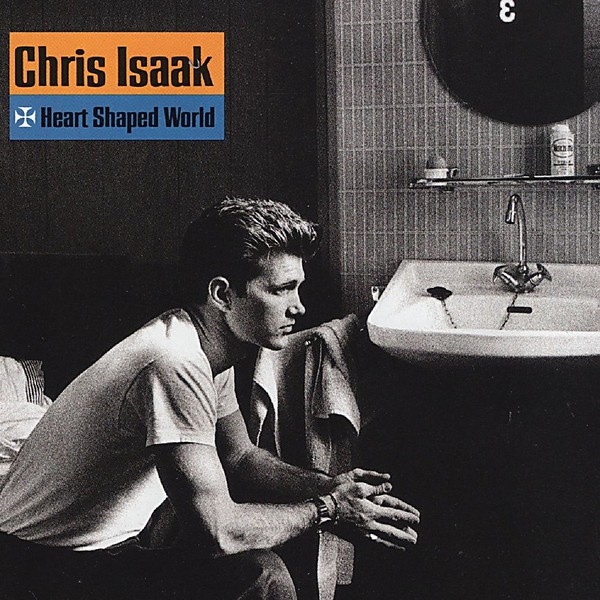

# Heart Shaped World

By **Chris Isaak**

## Album Data

- **Catalog:** Beets
- **Format:** Digital, Album
- **Album:** Heart Shaped World
- **Artist:** Chris Isaak
- **Albumartist:** Chris Isaak
- **Genre:** Rockabilly
- **MusicBrainz Album Artist ID:** [479497d4-e7c2-4e78-972e-56e78fac3995](https://musicbrainz.org/artist/479497d4-e7c2-4e78-972e-56e78fac3995)
- **MusicBrainz Album ID:** [4f9612f3-673b-4245-b95e-3f2a48e76599](https://musicbrainz.org/release/4f9612f3-673b-4245-b95e-3f2a48e76599)
- **MusicBrainz Release Group ID:** [f6f75c7a-f1bb-3b22-ae18-269bf5bd7f47](https://musicbrainz.org/release-group/f6f75c7a-f1bb-3b22-ae18-269bf5bd7f47)
- **Year:** 1989
- **Catalog #:** 9 25837-2
- **Label:** Reprise Records
- **Total Tracks:** 11

## Album Tracks

### Track 01 - Heart Shaped World

- **Artist:** Chris Isaak
- **Format:** ALAC
- **Genre:** Soft Rock
- **Length:** 3:29
- **MusicBrainz Track ID:** [45620bac-b149-4a73-af06-c2da1d33494d](https://musicbrainz.org/recording/45620bac-b149-4a73-af06-c2da1d33494d)
- **Title:** Heart Shaped World
- **Track:** 01
- **Year:** 1989

### Track 02 - I’m Not Waiting

- **Artist:** Chris Isaak
- **Format:** ALAC
- **Genre:** Rockabilly
- **Length:** 3:16
- **MusicBrainz Track ID:** [ce2ad909-8eb5-4142-b939-c1e447885bdd](https://musicbrainz.org/recording/ce2ad909-8eb5-4142-b939-c1e447885bdd)
- **Title:** I’m Not Waiting
- **Track:** 02
- **Year:** 1989

### Track 03 - Don’t Make Me Dream About You

- **Artist:** Chris Isaak
- **Format:** ALAC
- **Genre:** Rockabilly
- **Length:** 3:33
- **MusicBrainz Track ID:** [f658e542-37a3-4f1b-b2b2-1e2c92269d21](https://musicbrainz.org/recording/f658e542-37a3-4f1b-b2b2-1e2c92269d21)
- **Title:** Don’t Make Me Dream About You
- **Track:** 03
- **Year:** 1989

### Track 04 - Kings of the Highway

- **Artist:** Chris Isaak
- **Format:** ALAC
- **Genre:** Rockabilly
- **Length:** 4:46
- **MusicBrainz Track ID:** [a3a8408f-13a4-4bc8-a1d7-86cb918650fb](https://musicbrainz.org/recording/a3a8408f-13a4-4bc8-a1d7-86cb918650fb)
- **Title:** Kings of the Highway
- **Track:** 04
- **Year:** 1989

### Track 05 - Wicked Game

- **Artist:** Chris Isaak
- **Format:** ALAC
- **Genre:** Soft Rock
- **Length:** 4:49
- **MusicBrainz Track ID:** [203ba510-daa7-4389-9ca8-0af3700ef784](https://musicbrainz.org/recording/203ba510-daa7-4389-9ca8-0af3700ef784)
- **Title:** Wicked Game
- **Track:** 05
- **Year:** 1989

### Track 06 - Blue Spanish Sky

- **Artist:** Chris Isaak
- **Format:** ALAC
- **Genre:** Soft Rock
- **Length:** 3:58
- **MusicBrainz Track ID:** [3d033511-85f9-42b4-8ce0-646cacbbbbb5](https://musicbrainz.org/recording/3d033511-85f9-42b4-8ce0-646cacbbbbb5)
- **Title:** Blue Spanish Sky
- **Track:** 06
- **Year:** 1989

### Track 07 - Wrong to Love You

- **Artist:** Chris Isaak
- **Format:** ALAC
- **Genre:** Surf Rock
- **Length:** 4:19
- **MusicBrainz Track ID:** [30a98145-bf29-4b64-b1ca-2df59c86bc85](https://musicbrainz.org/recording/30a98145-bf29-4b64-b1ca-2df59c86bc85)
- **Title:** Wrong to Love You
- **Track:** 07
- **Year:** 1989

### Track 08 - Forever Young

- **Artist:** Chris Isaak
- **Format:** ALAC
- **Genre:** Soft Rock
- **Length:** 3:23
- **MusicBrainz Track ID:** [d223c5e6-0726-404c-b36c-53ca0d8e4767](https://musicbrainz.org/recording/d223c5e6-0726-404c-b36c-53ca0d8e4767)
- **Title:** Forever Young
- **Track:** 08
- **Year:** 1989

### Track 09 - Nothing’s Changed

- **Artist:** Chris Isaak
- **Format:** ALAC
- **Genre:** Rockabilly
- **Length:** 4:08
- **MusicBrainz Track ID:** [be6f7f5a-2a11-4614-bfd9-6b9b9e56f3a4](https://musicbrainz.org/recording/be6f7f5a-2a11-4614-bfd9-6b9b9e56f3a4)
- **Title:** Nothing’s Changed
- **Track:** 09
- **Year:** 1989

### Track 10 - In the Heat of the Jungle

- **Artist:** Chris Isaak
- **Format:** ALAC
- **Genre:** Soft Rock
- **Length:** 6:19
- **MusicBrainz Track ID:** [bd82c156-c545-4d8d-921d-b2ddb6d88d2d](https://musicbrainz.org/recording/bd82c156-c545-4d8d-921d-b2ddb6d88d2d)
- **Title:** In the Heat of the Jungle
- **Track:** 10
- **Year:** 1989

### Track 11 - Diddley Daddy

- **Artist:** Chris Isaak
- **Format:** ALAC
- **Genre:** Rockabilly
- **Length:** 4:05
- **MusicBrainz Track ID:** [7ec02644-ad00-4ab2-b46e-b011c5670bfc](https://musicbrainz.org/recording/7ec02644-ad00-4ab2-b46e-b011c5670bfc)
- **Title:** Diddley Daddy
- **Track:** 11
- **Year:** 1989

