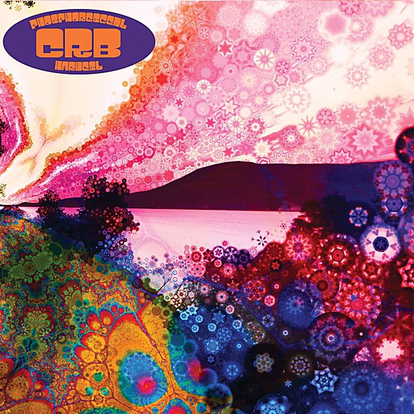

# Phosphorescent Harvest

By **Chris Robinson Brotherhood**

## Album Data

- **Catalog:** Beets
- **Format:** Digital, Album
- **Album:** Phosphorescent Harvest
- **Artist:** Chris Robinson Brotherhood
- **Albumartist:** Chris Robinson Brotherhood
- **Genre:** Southern Rock
- **MusicBrainz Album Artist ID:** [21e31312-bfc1-4425-a93b-bab5cc5969af](https://musicbrainz.org/artist/21e31312-bfc1-4425-a93b-bab5cc5969af)
- **MusicBrainz Album ID:** [35ab44e9-fa09-4e71-a90c-a2a2ade22447](https://musicbrainz.org/release/35ab44e9-fa09-4e71-a90c-a2a2ade22447)
- **MusicBrainz Release Group ID:** [200fc070-8f68-4e4b-abaa-880be0c99852](https://musicbrainz.org/release-group/200fc070-8f68-4e4b-abaa-880be0c99852)
- **Year:** 2014
- **Catalog #:** SA12LP
- **Label:** Silver Arrow
- **Total Tracks:** 12

## Album Tracks

### Track 01 - Shore Power

- **Artist:** Chris Robinson Brotherhood
- **Format:** MP3
- **Genre:** Blues
- **Length:** 4:41
- **MusicBrainz Track ID:** [7028153d-e27d-42e4-9518-3adda936ab28](https://musicbrainz.org/recording/7028153d-e27d-42e4-9518-3adda936ab28)
- **Title:** Shore Power
- **Track:** 01
- **Year:** 2014

### Track 02 - About a Stranger

- **Artist:** Chris Robinson Brotherhood
- **Format:** MP3
- **Genre:** Southern Rock
- **Length:** 5:07
- **MusicBrainz Track ID:** [b3ba680e-9c61-408a-9c7f-7f3287b680eb](https://musicbrainz.org/recording/b3ba680e-9c61-408a-9c7f-7f3287b680eb)
- **Title:** About a Stranger
- **Track:** 02
- **Year:** 2014

### Track 03 - Meanwhile in the Gods...

- **Artist:** Chris Robinson Brotherhood
- **Format:** MP3
- **Genre:** Southern Rock
- **Length:** 6:08
- **MusicBrainz Track ID:** [604de07b-4130-4541-afd6-5595facb125e](https://musicbrainz.org/recording/604de07b-4130-4541-afd6-5595facb125e)
- **Title:** Meanwhile in the Gods...
- **Track:** 03
- **Year:** 2014

### Track 04 - Badlands Here We Come

- **Artist:** Chris Robinson Brotherhood
- **Format:** MP3
- **Genre:** Blues
- **Length:** 5:24
- **MusicBrainz Track ID:** [b4965ee0-b877-43a9-8e5e-82cb6d30f11a](https://musicbrainz.org/recording/b4965ee0-b877-43a9-8e5e-82cb6d30f11a)
- **Title:** Badlands Here We Come
- **Track:** 04
- **Year:** 2014

### Track 05 - Clear Blue Sky & The Good Doctor

- **Artist:** Chris Robinson Brotherhood
- **Format:** MP3
- **Genre:** Southern Rock
- **Length:** 7:47
- **MusicBrainz Track ID:** [4e5b2ec1-3c40-4322-afa1-6e3ea661a2cc](https://musicbrainz.org/recording/4e5b2ec1-3c40-4322-afa1-6e3ea661a2cc)
- **Title:** Clear Blue Sky & The Good Doctor
- **Track:** 05
- **Year:** 2014

### Track 06 - Beggar's Moon

- **Artist:** Chris Robinson Brotherhood
- **Format:** MP3
- **Genre:** Southern Rock
- **Length:** 6:55
- **MusicBrainz Track ID:** [2fb4a052-cc73-4105-b249-aac4270e83a6](https://musicbrainz.org/recording/2fb4a052-cc73-4105-b249-aac4270e83a6)
- **Title:** Beggar's Moon
- **Track:** 06
- **Year:** 2014

### Track 07 - Wanderer's Lament

- **Artist:** Chris Robinson Brotherhood
- **Format:** MP3
- **Genre:** Southern Rock
- **Length:** 5:37
- **MusicBrainz Track ID:** [074b00a8-dc92-4e55-85cc-03740c034101](https://musicbrainz.org/recording/074b00a8-dc92-4e55-85cc-03740c034101)
- **Title:** Wanderer's Lament
- **Track:** 07
- **Year:** 2014

### Track 08 - Tornado

- **Artist:** Chris Robinson Brotherhood
- **Format:** MP3
- **Genre:** Southern Rock
- **Length:** 5:04
- **MusicBrainz Track ID:** [33732493-5e65-48a4-bd23-359ab93a8f25](https://musicbrainz.org/recording/33732493-5e65-48a4-bd23-359ab93a8f25)
- **Title:** Tornado
- **Track:** 08
- **Year:** 2014

### Track 09 - Jump the Turnstiles

- **Artist:** Chris Robinson Brotherhood
- **Format:** MP3
- **Genre:** Southern Rock
- **Length:** 6:40
- **MusicBrainz Track ID:** [a39099d1-fe55-4db2-abb6-c37907ca984e](https://musicbrainz.org/recording/a39099d1-fe55-4db2-abb6-c37907ca984e)
- **Title:** Jump the Turnstiles
- **Track:** 09
- **Year:** 2014

### Track 10 - Burn Slow

- **Artist:** Chris Robinson Brotherhood
- **Format:** MP3
- **Genre:** Southern Rock
- **Length:** 7:13
- **MusicBrainz Track ID:** [348965c4-2430-43ca-a008-a5bdca49ffb1](https://musicbrainz.org/recording/348965c4-2430-43ca-a008-a5bdca49ffb1)
- **Title:** Burn Slow
- **Track:** 10
- **Year:** 2014

### Track 11 - Humboldt Windchimes

- **Artist:** Chris Robinson Brotherhood
- **Format:** MP3
- **Genre:** Southern Rock
- **Length:** 4:36
- **MusicBrainz Track ID:** [44e6399b-b77a-41a8-8cac-ff6826dedea9](https://musicbrainz.org/recording/44e6399b-b77a-41a8-8cac-ff6826dedea9)
- **Title:** Humboldt Windchimes
- **Track:** 11
- **Year:** 2014

### Track 12 - Star Crossed Lonely Sailor

- **Artist:** Chris Robinson Brotherhood
- **Format:** MP3
- **Genre:** Southern Rock
- **Length:** 5:34
- **MusicBrainz Track ID:** [c757c37f-1678-47cd-acd2-6fd578107c6c](https://musicbrainz.org/recording/c757c37f-1678-47cd-acd2-6fd578107c6c)
- **Title:** Star Crossed Lonely Sailor
- **Track:** 12
- **Year:** 2014

## See also

- [The Magic Door](The_Magic_Door.md)
