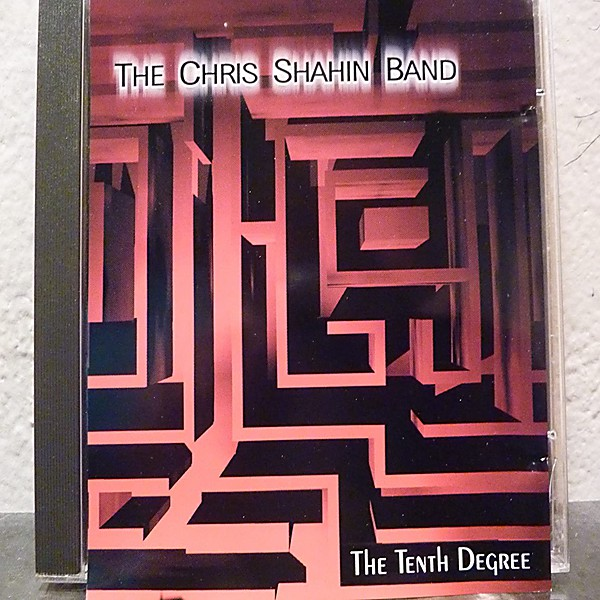

# The Tenth Degree

By **Chris Shahin**

## Album Data

- **Catalog:** Beets
- **Format:** Digital, Album
- **Album:** The Tenth Degree
- **Artist:** Chris Shahin
- **Albumartist:** Chris Shahin
- **Genre:** Jazz
- **MusicBrainz Album Artist ID:** [https](https://musicbrainz.org/artist/https)
- **MusicBrainz Album ID:** [https](https://musicbrainz.org/release/https)
- **MusicBrainz Release Group ID:** 
- **Year:** 1998
- **Catalog #:** 
- **Label:** Chris Shahin
- **Total Tracks:** 13

## Album Tracks

### Track 01 - The Industrial Juggernaut

- **Artist:** Chris Shahin
- **Format:** MP3
- **Genre:** Jazz
- **Length:** 3:13
- **MusicBrainz Track ID:** [https](https://musicbrainz.org/recording/https)
- **Title:** The Industrial Juggernaut
- **Track:** 01
- **Year:** 1998

### Track 02 - Surf's Down

- **Artist:** Chris Shahin
- **Format:** MP3
- **Genre:** Jazz
- **Length:** 4:36
- **MusicBrainz Track ID:** [https](https://musicbrainz.org/recording/https)
- **Title:** Surf's Down
- **Track:** 02
- **Year:** 1998

### Track 03 - Los `Los

- **Artist:** Chris Shahin
- **Format:** MP3
- **Genre:** Jazz
- **Length:** 3:01
- **MusicBrainz Track ID:** [https](https://musicbrainz.org/recording/https)
- **Title:** Los `Los
- **Track:** 03
- **Year:** 1998

### Track 04 - Emancipate This Water Planet

- **Artist:** Chris Shahin
- **Format:** MP3
- **Genre:** Jazz
- **Length:** 3:59
- **MusicBrainz Track ID:** [https](https://musicbrainz.org/recording/https)
- **Title:** Emancipate This Water Planet
- **Track:** 04
- **Year:** 1998

### Track 05 - Surf, Don't Run

- **Artist:** Chris Shahin
- **Format:** MP3
- **Genre:** Jazz
- **Length:** 1:44
- **MusicBrainz Track ID:** [https](https://musicbrainz.org/recording/https)
- **Title:** Surf, Don't Run
- **Track:** 05
- **Year:** 1998

### Track 06 - Psychic Friends

- **Artist:** Chris Shahin
- **Format:** MP3
- **Genre:** Jazz
- **Length:** 3:59
- **MusicBrainz Track ID:** [https](https://musicbrainz.org/recording/https)
- **Title:** Psychic Friends
- **Track:** 06
- **Year:** 1998

### Track 07 - Baroque Again

- **Artist:** Chris Shahin
- **Format:** MP3
- **Genre:** Jazz
- **Length:** 1:05
- **MusicBrainz Track ID:** [https](https://musicbrainz.org/recording/https)
- **Title:** Baroque Again
- **Track:** 07
- **Year:** 1998

### Track 08 - Baja Cactus

- **Artist:** Chris Shahin
- **Format:** MP3
- **Genre:** Jazz
- **Length:** 1:56
- **MusicBrainz Track ID:** [https](https://musicbrainz.org/recording/https)
- **Title:** Baja Cactus
- **Track:** 08
- **Year:** 1998

### Track 09 - Agent 99

- **Artist:** Chris Shahin
- **Format:** MP3
- **Genre:** Jazz
- **Length:** 2:42
- **MusicBrainz Track ID:** [https](https://musicbrainz.org/recording/https)
- **Title:** Agent 99
- **Track:** 09
- **Year:** 1998

### Track 10 - The Tenth Degree

- **Artist:** Chris Shahin
- **Format:** MP3
- **Genre:** Jazz
- **Length:** 2:20
- **MusicBrainz Track ID:** [https](https://musicbrainz.org/recording/https)
- **Title:** The Tenth Degree
- **Track:** 10
- **Year:** 1998

### Track 11 - Chime

- **Artist:** Chris Shahin
- **Format:** MP3
- **Genre:** Jazz
- **Length:** 2:59
- **MusicBrainz Track ID:** [https](https://musicbrainz.org/recording/https)
- **Title:** Chime
- **Track:** 11
- **Year:** 1998

### Track 12 - Americana

- **Artist:** Chris Shahin
- **Format:** MP3
- **Genre:** Jazz
- **Length:** 3:44
- **MusicBrainz Track ID:** [https](https://musicbrainz.org/recording/https)
- **Title:** Americana
- **Track:** 12
- **Year:** 1998

### Track 13 - Baja Cactus (Restaurant Remix)

- **Artist:** Chris Shahin
- **Format:** MP3
- **Genre:** Jazz
- **Length:** 2:32
- **MusicBrainz Track ID:** [https](https://musicbrainz.org/recording/https)
- **Title:** Baja Cactus (Restaurant Remix)
- **Track:** 13
- **Year:** 1998

