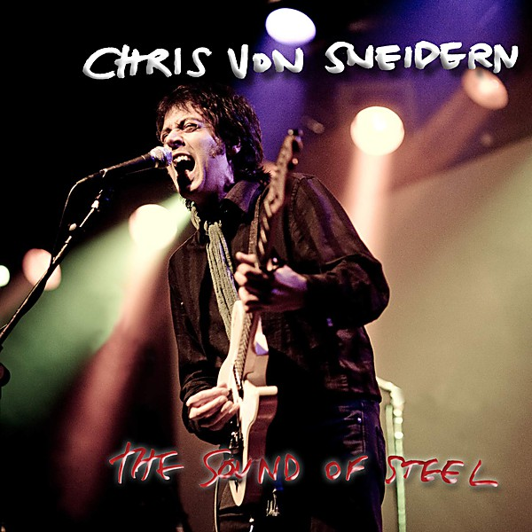

# Big White Lies

By **Chris von Sneidern**

## Album Data

- **Catalog:** Beets
- **Format:** Digital, Album
- **Album:** Big White Lies
- **Artist:** Chris Von Sneidern
- **Albumartist:** Chris von Sneidern
- **Genre:** Indie Pop
- **MusicBrainz Album Artist ID:** [703c7062-cc25-47e0-919e-ef740b88c725](https://musicbrainz.org/artist/703c7062-cc25-47e0-919e-ef740b88c725)
- **MusicBrainz Album ID:** [6422fda7-c012-4d27-afed-57d7e2acdcd5](https://musicbrainz.org/release/6422fda7-c012-4d27-afed-57d7e2acdcd5)
- **MusicBrainz Release Group ID:** [feb700d4-aa8b-3763-b1a9-4751fed471b5](https://musicbrainz.org/release-group/feb700d4-aa8b-3763-b1a9-4751fed471b5)
- **Year:** 1994
- **Catalog #:** 7018
- **Label:** Innerstate
- **Total Tracks:** 16

## Album Tracks

### Track 01 - Remember

- **Artist:** Chris von Sneidern
- **Format:** AAC
- **Genre:** Indie Pop
- **Length:** 4:57
- **MusicBrainz Track ID:** [5dc12657-6bec-45e3-a10c-f1b9d7251c99](https://musicbrainz.org/recording/5dc12657-6bec-45e3-a10c-f1b9d7251c99)
- **Title:** Remember
- **Track:** 01
- **Year:** 2003

### Track 02 - Glory Days Are Gone

- **Artist:** Chris von Sneidern
- **Format:** AAC
- **Genre:** Indie Pop
- **Length:** 4:30
- **MusicBrainz Track ID:** [bab8e865-ae3b-4e7c-b696-4bbca26e919f](https://musicbrainz.org/recording/bab8e865-ae3b-4e7c-b696-4bbca26e919f)
- **Title:** Glory Days Are Gone
- **Track:** 02
- **Year:** 2003

### Track 03 - Take Me Back

- **Artist:** Chris von Sneidern
- **Format:** AAC
- **Genre:** Indie Pop
- **Length:** 4:15
- **MusicBrainz Track ID:** [ba994ba0-fec7-493c-9831-769fdb69f109](https://musicbrainz.org/recording/ba994ba0-fec7-493c-9831-769fdb69f109)
- **Title:** Take Me Back
- **Track:** 03
- **Year:** 2003

### Track 04 - Identity

- **Artist:** Chris von Sneidern
- **Format:** AAC
- **Genre:** Indie Pop
- **Length:** 4:48
- **MusicBrainz Track ID:** [48a63edd-7e1c-4ecd-b312-691e41b5e3dc](https://musicbrainz.org/recording/48a63edd-7e1c-4ecd-b312-691e41b5e3dc)
- **Title:** Identity
- **Track:** 04
- **Year:** 2003

### Track 05 - Ooh Mama Mama

- **Artist:** Chris von Sneidern
- **Format:** AAC
- **Genre:** Indie Pop
- **Length:** 3:54
- **MusicBrainz Track ID:** [926d5c0b-85ee-4565-826a-feb127536afc](https://musicbrainz.org/recording/926d5c0b-85ee-4565-826a-feb127536afc)
- **Title:** Ooh Mama Mama
- **Track:** 05
- **Year:** 2003

### Track 06 - A Simple Tune

- **Artist:** Chris von Sneidern
- **Format:** AAC
- **Genre:** Indie Pop
- **Length:** 1:35
- **MusicBrainz Track ID:** [f20df0a7-2ad3-4129-b49a-9264b19241e9](https://musicbrainz.org/recording/f20df0a7-2ad3-4129-b49a-9264b19241e9)
- **Title:** A Simple Tune
- **Track:** 06
- **Year:** 2003

### Track 07 - Neighbor's Dog

- **Artist:** Chris von Sneidern
- **Format:** AAC
- **Genre:** Indie Pop
- **Length:** 2:41
- **MusicBrainz Track ID:** [3d370422-d3ca-4236-aa4f-7e84a9f9abc1](https://musicbrainz.org/recording/3d370422-d3ca-4236-aa4f-7e84a9f9abc1)
- **Title:** Neighbor's Dog
- **Track:** 07
- **Year:** 2003

### Track 08 - The Ballad of Zoe Snow

- **Artist:** Chris von Sneidern
- **Format:** AAC
- **Genre:** Indie Pop
- **Length:** 3:43
- **MusicBrainz Track ID:** [fe64d8de-e006-45d6-a681-3ecd1a1d3d15](https://musicbrainz.org/recording/fe64d8de-e006-45d6-a681-3ecd1a1d3d15)
- **Title:** The Ballad of Zoe Snow
- **Track:** 08
- **Year:** 2003

### Track 09 - Downtown

- **Artist:** Chris von Sneidern
- **Format:** AAC
- **Genre:** Indie Pop
- **Length:** 2:50
- **MusicBrainz Track ID:** [47231ea4-5746-4ead-99e2-0c5eb6489e5b](https://musicbrainz.org/recording/47231ea4-5746-4ead-99e2-0c5eb6489e5b)
- **Title:** Downtown
- **Track:** 09
- **Year:** 2003

### Track 10 - Great American Dream

- **Artist:** Chris von Sneidern
- **Format:** AAC
- **Genre:** Indie Pop
- **Length:** 5:18
- **MusicBrainz Track ID:** [ea229759-c602-4c12-b68e-11212df830c3](https://musicbrainz.org/recording/ea229759-c602-4c12-b68e-11212df830c3)
- **Title:** Great American Dream
- **Track:** 10
- **Year:** 2003

### Track 11 - Horse House

- **Artist:** Chris von Sneidern
- **Format:** AAC
- **Genre:** Indie Pop
- **Length:** 4:26
- **MusicBrainz Track ID:** [b384c45f-d65a-4505-9ed1-c650253a89c4](https://musicbrainz.org/recording/b384c45f-d65a-4505-9ed1-c650253a89c4)
- **Title:** Horse House
- **Track:** 11
- **Year:** 2003

### Track 12 - Our Last Waltz

- **Artist:** Chris von Sneidern
- **Format:** AAC
- **Genre:** Indie Pop
- **Length:** 2:08
- **MusicBrainz Track ID:** [e22c6a54-9737-4d01-9578-5e4db55b0b31](https://musicbrainz.org/recording/e22c6a54-9737-4d01-9578-5e4db55b0b31)
- **Title:** Our Last Waltz
- **Track:** 12
- **Year:** 2003

### Track 13 - (Watch Them) Ride Away

- **Artist:** Chris von Sneidern
- **Format:** AAC
- **Genre:** Indie Pop
- **Length:** 3:25
- **MusicBrainz Track ID:** [2bfb4075-6aa0-4bc8-82e1-bdb69d255076](https://musicbrainz.org/recording/2bfb4075-6aa0-4bc8-82e1-bdb69d255076)
- **Title:** (Watch Them) Ride Away
- **Track:** 13
- **Year:** 2003

### Track 14 - Finest Hour

- **Artist:** Chris von Sneidern
- **Format:** AAC
- **Genre:** Indie Pop
- **Length:** 3:54
- **MusicBrainz Track ID:** [13c3b6ca-a914-454c-8516-9ec2ef4b1cb3](https://musicbrainz.org/recording/13c3b6ca-a914-454c-8516-9ec2ef4b1cb3)
- **Title:** Finest Hour
- **Track:** 14
- **Year:** 2003

### Track 15 - Remember 6/8

- **Artist:** Chris von Sneidern
- **Format:** AAC
- **Genre:** Indie Pop
- **Length:** 6:40
- **MusicBrainz Track ID:** [5c699d5d-ee30-45cc-9cdc-3c8029699688](https://musicbrainz.org/recording/5c699d5d-ee30-45cc-9cdc-3c8029699688)
- **Title:** Remember 6/8
- **Track:** 15
- **Year:** 2003

### Track 16 - [untitled]

- **Artist:** Chris von Sneidern
- **Format:** AAC
- **Genre:** Indie Pop
- **Length:** 0:04
- **MusicBrainz Track ID:** [96cf3fd0-ba28-44a1-a2b1-ba7de5a5274c](https://musicbrainz.org/recording/96cf3fd0-ba28-44a1-a2b1-ba7de5a5274c)
- **Title:** [untitled]
- **Track:** 16
- **Year:** 2003

## See also

- [The Wild Horse](The_Wild_Horse.md)
- [Wood + Wire](Wood_+_Wire.md)
