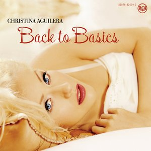

# Back to Basics

By **Christina Aguilera**

## Album Data

- **Catalog:** Beets
- **Format:** Digital, Album
- **Album:** Back to Basics
- **Artist:** Christina Aguilera
- **Albumartist:** Christina Aguilera
- **Genre:** Soul
- **MusicBrainz Album Artist ID:** [b202beb7-99bd-47e7-8b72-195c8d72ebdd](https://musicbrainz.org/artist/b202beb7-99bd-47e7-8b72-195c8d72ebdd)
- **MusicBrainz Album ID:** [e35e0144-76a3-4a7b-a200-7987ca4d3ff4](https://musicbrainz.org/release/e35e0144-76a3-4a7b-a200-7987ca4d3ff4)
- **MusicBrainz Release Group ID:** [909875a2-dced-346f-a341-b0c3bbd4b8b7](https://musicbrainz.org/release-group/909875a2-dced-346f-a341-b0c3bbd4b8b7)
- **Year:** 2006
- **Catalog #:** 07863 67690-2
- **Label:** RCA
- **Total Tracks:** 12

## Album Tracks

### Track 01 - Genie in a Bottle

- **Artist:** Christina Aguilera
- **Format:** ALAC
- **Genre:** Pop
- **Length:** 3:38
- **MusicBrainz Track ID:** [fbe9ad8c-3a31-4b5a-9710-228b8c77907b](https://musicbrainz.org/recording/fbe9ad8c-3a31-4b5a-9710-228b8c77907b)
- **Title:** Genie in a Bottle
- **Track:** 01
- **Year:** 1999

### Track 02 - What a Girl Wants

- **Artist:** Christina Aguilera
- **Format:** ALAC
- **Genre:** Pop
- **Length:** 3:35
- **MusicBrainz Track ID:** [6002e85b-46e0-453c-9ef6-12fb383fabfb](https://musicbrainz.org/recording/6002e85b-46e0-453c-9ef6-12fb383fabfb)
- **Title:** What a Girl Wants
- **Track:** 02
- **Year:** 1999

### Track 03 - I Turn to You

- **Artist:** Christina Aguilera
- **Format:** ALAC
- **Genre:** Soul
- **Length:** 4:33
- **MusicBrainz Track ID:** [cf4399bc-d85e-4bfb-9492-0b4578df6355](https://musicbrainz.org/recording/cf4399bc-d85e-4bfb-9492-0b4578df6355)
- **Title:** I Turn to You
- **Track:** 03
- **Year:** 1999

### Track 04 - So Emotional

- **Artist:** Christina Aguilera
- **Format:** ALAC
- **Genre:** Teen Pop
- **Length:** 4:00
- **MusicBrainz Track ID:** [805c3e2d-1883-4a82-bafa-34b7a84175f6](https://musicbrainz.org/recording/805c3e2d-1883-4a82-bafa-34b7a84175f6)
- **Title:** So Emotional
- **Track:** 04
- **Year:** 1999

### Track 05 - Come On Over (All I Want Is You)

- **Artist:** Christina Aguilera
- **Format:** ALAC
- **Genre:** Teen Pop
- **Length:** 3:09
- **MusicBrainz Track ID:** [9fafb5c0-92ed-469a-98c0-de767edc5dd0](https://musicbrainz.org/recording/9fafb5c0-92ed-469a-98c0-de767edc5dd0)
- **Title:** Come On Over (All I Want Is You)
- **Track:** 05
- **Year:** 1999

### Track 06 - Reflection

- **Artist:** Christina Aguilera
- **Format:** ALAC
- **Genre:** Soul
- **Length:** 3:33
- **MusicBrainz Track ID:** [8e1a9607-0c2c-4453-8048-f7ffa4a3e656](https://musicbrainz.org/recording/8e1a9607-0c2c-4453-8048-f7ffa4a3e656)
- **Title:** Reflection
- **Track:** 06
- **Year:** 1999

### Track 07 - Love for All Seasons

- **Artist:** Christina Aguilera
- **Format:** ALAC
- **Genre:** Teen Pop
- **Length:** 3:59
- **MusicBrainz Track ID:** [3ed5c998-9753-4230-9d83-0e5413052a59](https://musicbrainz.org/recording/3ed5c998-9753-4230-9d83-0e5413052a59)
- **Title:** Love for All Seasons
- **Track:** 07
- **Year:** 1999

### Track 08 - Somebody’s Somebody

- **Artist:** Christina Aguilera
- **Format:** ALAC
- **Genre:** Teen Pop
- **Length:** 5:03
- **MusicBrainz Track ID:** [426d7593-2207-45a7-8a1b-a8e89b6e585a](https://musicbrainz.org/recording/426d7593-2207-45a7-8a1b-a8e89b6e585a)
- **Title:** Somebody’s Somebody
- **Track:** 08
- **Year:** 1999

### Track 09 - When You Put Your Hands on Me

- **Artist:** Christina Aguilera
- **Format:** ALAC
- **Genre:** Teen Pop
- **Length:** 3:35
- **MusicBrainz Track ID:** [498a44a7-125c-4c9f-822f-f80e98a4b308](https://musicbrainz.org/recording/498a44a7-125c-4c9f-822f-f80e98a4b308)
- **Title:** When You Put Your Hands on Me
- **Track:** 09
- **Year:** 1999

### Track 10 - Blessed

- **Artist:** Christina Aguilera
- **Format:** ALAC
- **Genre:** Teen Pop
- **Length:** 3:05
- **MusicBrainz Track ID:** [c3666618-cc84-42cc-915b-96554e7d2935](https://musicbrainz.org/recording/c3666618-cc84-42cc-915b-96554e7d2935)
- **Title:** Blessed
- **Track:** 10
- **Year:** 1999

### Track 11 - Love Will Find a Way

- **Artist:** Christina Aguilera
- **Format:** ALAC
- **Genre:** Teen Pop
- **Length:** 3:56
- **MusicBrainz Track ID:** [f78d9e71-536f-4a8e-aac6-a6f1ca12fb4a](https://musicbrainz.org/recording/f78d9e71-536f-4a8e-aac6-a6f1ca12fb4a)
- **Title:** Love Will Find a Way
- **Track:** 11
- **Year:** 1999

### Track 12 - Obvious

- **Artist:** Christina Aguilera
- **Format:** ALAC
- **Genre:** Soul
- **Length:** 3:58
- **MusicBrainz Track ID:** [f31fef74-4017-4c93-a397-cc5c77bcf0d3](https://musicbrainz.org/recording/f31fef74-4017-4c93-a397-cc5c77bcf0d3)
- **Title:** Obvious
- **Track:** 12
- **Year:** 1999

## See also

- [Christina Aguilera](Christina_Aguilera.md)
- [Justin & Christina](Justin_and_Christina.md)
- [Stripped](Stripped.md)
- [CD: Back To Basics (Disc 1)](../../CD/Christina_Aguilera/Back_To_Basics_Disc_1.md)
- [CD: Back To Basics (Disc 2)](../../CD/Christina_Aguilera/Back_To_Basics_Disc_2.md)
- [CD: Christina Aguilera (Disc 1)](../../CD/Christina_Aguilera/Christina_Aguilera_Disc_1.md)
- [CD: ](../../CD/Christina_Aguilera/Christina_Aguilera.md)
- [CD: Stripped](../../CD/Christina_Aguilera/Stripped.md)
- [Roon: Back To Basics](../../Roon/Christina_Aguilera/Back_To_Basics.md)
- [Roon: Burlesque Original Motion Picture Soundtrack](../../Roon/Christina_Aguilera/Burlesque_Original_Motion_Picture_Soundtrack.md)
- [Roon: Christina Aguilera (Expanded Edition)](../../Roon/Christina_Aguilera/Christina_Aguilera_Expanded_Edition.md)
- [Roon: Justin & Christina](../../Roon/Christina_Aguilera/Justin_and_Christina.md)
- [Roon: Keeps Gettin' Better](../../Roon/Christina_Aguilera/Keeps_Gettin_Better-_A_Decade_of_Hits.md)
- [Roon: Liberation](../../Roon/Christina_Aguilera/Liberation.md)
- [Roon: Stripped](../../Roon/Christina_Aguilera/Stripped.md)
