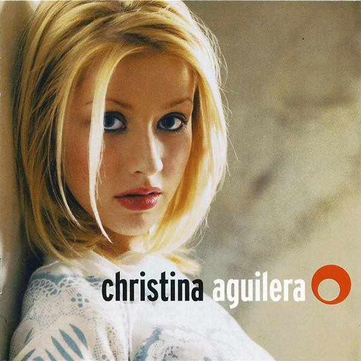

# Christina Aguilera

By **Christina Aguilera**

## Album Data

- **Catalog:** Beets
- **Format:** Digital, Album
- **Album:** Christina Aguilera
- **Artist:** Christina Aguilera
- **Albumartist:** Christina Aguilera
- **Genre:** Teen Pop
- **MusicBrainz Album Artist ID:** [b202beb7-99bd-47e7-8b72-195c8d72ebdd](https://musicbrainz.org/artist/b202beb7-99bd-47e7-8b72-195c8d72ebdd)
- **MusicBrainz Album ID:** [d4faf895-c0c0-45ab-a912-42e99672425f](https://musicbrainz.org/release/d4faf895-c0c0-45ab-a912-42e99672425f)
- **MusicBrainz Release Group ID:** [6f47450a-6f77-3af2-80bb-4e7012c07180](https://musicbrainz.org/release-group/6f47450a-6f77-3af2-80bb-4e7012c07180)
- **Year:** 1999
- **Catalog #:** 07863 68037-2
- **Label:** RCA
- **Total Tracks:** 20

## Album Tracks

### Track 01 - Stripped (intro)

- **Artist:** Christina Aguilera
- **Format:** ALAC
- **Genre:** Soul
- **Length:** 1:39
- **MusicBrainz Track ID:** [7f61e366-1580-4763-8565-be04e710e6e2](https://musicbrainz.org/recording/7f61e366-1580-4763-8565-be04e710e6e2)
- **Title:** Stripped (intro)
- **Track:** 01
- **Year:** 2002

### Track 03 - Walk Away

- **Artist:** Christina Aguilera
- **Format:** ALAC
- **Genre:** Soul
- **Length:** 5:47
- **MusicBrainz Track ID:** [60fb17b9-650c-43d4-87f6-1d4c9876f98c](https://musicbrainz.org/recording/60fb17b9-650c-43d4-87f6-1d4c9876f98c)
- **Title:** Walk Away
- **Track:** 03
- **Year:** 2002

### Track 04 - Fighter

- **Artist:** Christina Aguilera
- **Format:** ALAC
- **Genre:** Pop Rock
- **Length:** 4:05
- **MusicBrainz Track ID:** [e275dce5-f674-4964-aa23-9d857f3f820c](https://musicbrainz.org/recording/e275dce5-f674-4964-aa23-9d857f3f820c)
- **Title:** Fighter
- **Track:** 04
- **Year:** 2002

### Track 05 - Primer Amor (interlude)

- **Artist:** Christina Aguilera
- **Format:** ALAC
- **Genre:** Pop
- **Length:** 0:53
- **MusicBrainz Track ID:** [36a6e84a-2f54-4c37-8edb-b20411b4b456](https://musicbrainz.org/recording/36a6e84a-2f54-4c37-8edb-b20411b4b456)
- **Title:** Primer Amor (interlude)
- **Track:** 05
- **Year:** 2002

### Track 06 - Infatuation

- **Artist:** Christina Aguilera
- **Format:** ALAC
- **Genre:** Latin Pop
- **Length:** 4:17
- **MusicBrainz Track ID:** [814e9b24-5124-4c69-97bf-30352ba3c883](https://musicbrainz.org/recording/814e9b24-5124-4c69-97bf-30352ba3c883)
- **Title:** Infatuation
- **Track:** 06
- **Year:** 2002

### Track 07 - Loves Embrace (interlude)

- **Artist:** Christina Aguilera
- **Format:** ALAC
- **Genre:** Soul
- **Length:** 0:46
- **MusicBrainz Track ID:** [9942198b-f934-4175-850e-9a3fb115e9ec](https://musicbrainz.org/recording/9942198b-f934-4175-850e-9a3fb115e9ec)
- **Title:** Loves Embrace (interlude)
- **Track:** 07
- **Year:** 2002

### Track 08 - Loving Me 4 Me

- **Artist:** Christina Aguilera
- **Format:** ALAC
- **Genre:** Soul
- **Length:** 4:36
- **MusicBrainz Track ID:** [a0514696-0eb8-4627-ba35-057a99087eda](https://musicbrainz.org/recording/a0514696-0eb8-4627-ba35-057a99087eda)
- **Title:** Loving Me 4 Me
- **Track:** 08
- **Year:** 2002

### Track 10 - Underappreciated

- **Artist:** Christina Aguilera
- **Format:** ALAC
- **Genre:** Soul
- **Length:** 4:00
- **MusicBrainz Track ID:** [110e21c4-47cb-4324-88d1-cb228220c4f6](https://musicbrainz.org/recording/110e21c4-47cb-4324-88d1-cb228220c4f6)
- **Title:** Underappreciated
- **Track:** 10
- **Year:** 2002

### Track 11 - Beautiful

- **Artist:** Christina Aguilera
- **Format:** ALAC
- **Genre:** Soul
- **Length:** 3:58
- **MusicBrainz Track ID:** [77fba263-80bc-4233-9694-210567d5c947](https://musicbrainz.org/recording/77fba263-80bc-4233-9694-210567d5c947)
- **Title:** Beautiful
- **Track:** 11
- **Year:** 2002

### Track 12 - Make Over

- **Artist:** Christina Aguilera
- **Format:** ALAC
- **Genre:** Pop Rock
- **Length:** 4:12
- **MusicBrainz Track ID:** [8a69e1b6-e276-4b2e-8e68-69dfc8109bca](https://musicbrainz.org/recording/8a69e1b6-e276-4b2e-8e68-69dfc8109bca)
- **Title:** Make Over
- **Track:** 12
- **Year:** 2002

### Track 13 - Cruz

- **Artist:** Christina Aguilera
- **Format:** ALAC
- **Genre:** Soul
- **Length:** 3:49
- **MusicBrainz Track ID:** [aab98ae1-e827-4fcf-a179-b96a067c5597](https://musicbrainz.org/recording/aab98ae1-e827-4fcf-a179-b96a067c5597)
- **Title:** Cruz
- **Track:** 13
- **Year:** 2002

### Track 14 - Soar

- **Artist:** Christina Aguilera
- **Format:** ALAC
- **Genre:** Soul
- **Length:** 4:45
- **MusicBrainz Track ID:** [6730a3fe-3645-4320-9ecd-28c90b018dd0](https://musicbrainz.org/recording/6730a3fe-3645-4320-9ecd-28c90b018dd0)
- **Title:** Soar
- **Track:** 14
- **Year:** 2002

### Track 15 - Get Mine, Get Yours

- **Artist:** Christina Aguilera
- **Format:** ALAC
- **Genre:** Soul
- **Length:** 3:44
- **MusicBrainz Track ID:** [08ef8b0a-73ce-4b0b-b7d9-a6890e648f9b](https://musicbrainz.org/recording/08ef8b0a-73ce-4b0b-b7d9-a6890e648f9b)
- **Title:** Get Mine, Get Yours
- **Track:** 15
- **Year:** 2002

### Track 17 - Stripped, Part 2

- **Artist:** Christina Aguilera
- **Format:** ALAC
- **Genre:** Pop
- **Length:** 0:46
- **MusicBrainz Track ID:** [bde0459f-449b-4943-9fcf-48f3fa9365a4](https://musicbrainz.org/recording/bde0459f-449b-4943-9fcf-48f3fa9365a4)
- **Title:** Stripped, Part 2
- **Track:** 17
- **Year:** 2002

### Track 18 - The Voice Within

- **Artist:** Christina Aguilera
- **Format:** ALAC
- **Genre:** Soul
- **Length:** 5:04
- **MusicBrainz Track ID:** [cc3c7a36-1e62-4c62-9a81-327a4693b4ef](https://musicbrainz.org/recording/cc3c7a36-1e62-4c62-9a81-327a4693b4ef)
- **Title:** The Voice Within
- **Track:** 18
- **Year:** 2002

### Track 19 - I'm OK

- **Artist:** Christina Aguilera
- **Format:** ALAC
- **Genre:** Soul
- **Length:** 5:19
- **MusicBrainz Track ID:** [6ce618a6-2a36-46f2-b6e4-91d493cdb5fa](https://musicbrainz.org/recording/6ce618a6-2a36-46f2-b6e4-91d493cdb5fa)
- **Title:** I'm OK
- **Track:** 19
- **Year:** 2002

### Track 20 - Keep On Singin' My Song

- **Artist:** Christina Aguilera
- **Format:** ALAC
- **Genre:** Soul
- **Length:** 6:29
- **MusicBrainz Track ID:** [f0da8171-f7d3-4428-bc94-9515b14875e9](https://musicbrainz.org/recording/f0da8171-f7d3-4428-bc94-9515b14875e9)
- **Title:** Keep On Singin' My Song
- **Track:** 20
- **Year:** 2002

### Track 09 - Impossible

- **Artist:** Christina Aguilera feat. Alicia Keys
- **Format:** ALAC
- **Genre:** Soul
- **Length:** 4:14
- **MusicBrainz Track ID:** [f2d82cae-3623-4a99-bb0d-2a34ca7aa2d5](https://musicbrainz.org/recording/f2d82cae-3623-4a99-bb0d-2a34ca7aa2d5)
- **Title:** Impossible
- **Track:** 09
- **Year:** 2002

### Track 02 - Can't Hold Us Down

- **Artist:** Christina Aguilera feat. Lil’ Kim
- **Format:** ALAC
- **Genre:** Soul
- **Length:** 4:15
- **MusicBrainz Track ID:** [e2efe5fd-ac48-4e59-b580-15e829ba856e](https://musicbrainz.org/recording/e2efe5fd-ac48-4e59-b580-15e829ba856e)
- **Title:** Can't Hold Us Down
- **Track:** 02
- **Year:** 2002

### Track 16 - Dirrty

- **Artist:** Christina Aguilera feat. Redman
- **Format:** ALAC
- **Genre:** Pop
- **Length:** 4:58
- **MusicBrainz Track ID:** [df0792b6-cf89-490f-9497-04f2be5c30b7](https://musicbrainz.org/recording/df0792b6-cf89-490f-9497-04f2be5c30b7)
- **Title:** Dirrty
- **Track:** 16
- **Year:** 2002

## See also

- [Back to Basics](Back_to_Basics.md)
- [Justin & Christina](Justin_and_Christina.md)
- [Stripped](Stripped.md)
- [CD: Back To Basics (Disc 1)](../../CD/Christina_Aguilera/Back_To_Basics_Disc_1.md)
- [CD: Back To Basics (Disc 2)](../../CD/Christina_Aguilera/Back_To_Basics_Disc_2.md)
- [CD: Christina Aguilera (Disc 1)](../../CD/Christina_Aguilera/Christina_Aguilera_Disc_1.md)
- [CD: ](../../CD/Christina_Aguilera/Christina_Aguilera.md)
- [CD: Stripped](../../CD/Christina_Aguilera/Stripped.md)
- [Roon: Back To Basics](../../Roon/Christina_Aguilera/Back_To_Basics.md)
- [Roon: Burlesque Original Motion Picture Soundtrack](../../Roon/Christina_Aguilera/Burlesque_Original_Motion_Picture_Soundtrack.md)
- [Roon: Christina Aguilera (Expanded Edition)](../../Roon/Christina_Aguilera/Christina_Aguilera_Expanded_Edition.md)
- [Roon: Justin & Christina](../../Roon/Christina_Aguilera/Justin_and_Christina.md)
- [Roon: Keeps Gettin' Better](../../Roon/Christina_Aguilera/Keeps_Gettin_Better-_A_Decade_of_Hits.md)
- [Roon: Liberation](../../Roon/Christina_Aguilera/Liberation.md)
- [Roon: Stripped](../../Roon/Christina_Aguilera/Stripped.md)
