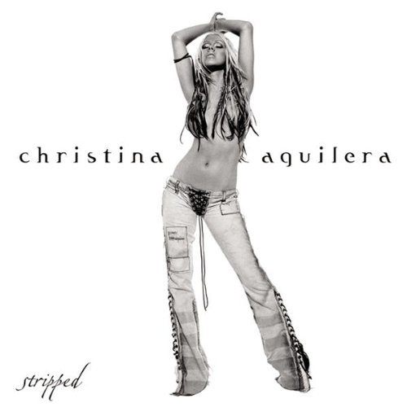

# Stripped

By **Christina Aguilera**

## Album Data

- **Catalog:** Beets
- **Format:** Digital, Album
- **Album:** Stripped
- **Artist:** Christina Aguilera
- **Albumartist:** Christina Aguilera
- **Genre:** Soul
- **MusicBrainz Album Artist ID:** [b202beb7-99bd-47e7-8b72-195c8d72ebdd](https://musicbrainz.org/artist/b202beb7-99bd-47e7-8b72-195c8d72ebdd)
- **MusicBrainz Album ID:** [be8c6dcd-5a06-39b9-a423-5209ad0dd268](https://musicbrainz.org/release/be8c6dcd-5a06-39b9-a423-5209ad0dd268)
- **MusicBrainz Release Group ID:** [46feff2b-8218-3432-8a01-a6082b4c93d4](https://musicbrainz.org/release-group/46feff2b-8218-3432-8a01-a6082b4c93d4)
- **Year:** 2002
- **Catalog #:** 
- **Label:** 
- **Total Tracks:** 06

## Album Tracks

### Track 01 - That's What Love Can Do

- **Artist:** Christina Aguilera
- **Format:** ALAC
- **Genre:** Soul
- **Length:** 3:44
- **MusicBrainz Track ID:** 
- **Title:** That's What Love Can Do
- **Track:** 01
- **Year:** 2003

### Track 03 - Beautiful (Valentin Club Mix)

- **Artist:** Christina Aguilera
- **Format:** ALAC
- **Genre:** Trance
- **Length:** 5:56
- **MusicBrainz Track ID:** 
- **Title:** Beautiful (Valentin Club Mix)
- **Track:** 03
- **Year:** 2003

### Track 05 - Fighter (Hellraiser Remix)

- **Artist:** Christina Aguilera
- **Format:** ALAC
- **Genre:** Soul
- **Length:** 5:13
- **MusicBrainz Track ID:** 
- **Title:** Fighter (Hellraiser Remix)
- **Track:** 05
- **Year:** 2003

### Track 02 - Why, When, How

- **Artist:** Justin Timberlake
- **Format:** ALAC
- **Genre:** Pop
- **Length:** 4:01
- **MusicBrainz Track ID:** 
- **Title:** Why, When, How
- **Track:** 02
- **Year:** 2003

### Track 04 - Rock Your Body (Paul Oakenfold Mix)

- **Artist:** Justin Timberlake
- **Format:** ALAC
- **Genre:** Electropop
- **Length:** 5:38
- **MusicBrainz Track ID:** 
- **Title:** Rock Your Body (Paul Oakenfold Mix)
- **Track:** 04
- **Year:** 2003

### Track 06 - Cry Me A River (Bill Hamel Justinough Vocal Mix)

- **Artist:** Justin Timberlake
- **Format:** ALAC
- **Genre:** Pop
- **Length:** 7:44
- **MusicBrainz Track ID:** 
- **Title:** Cry Me A River (Bill Hamel Justinough Vocal Mix)
- **Track:** 06
- **Year:** 2003

