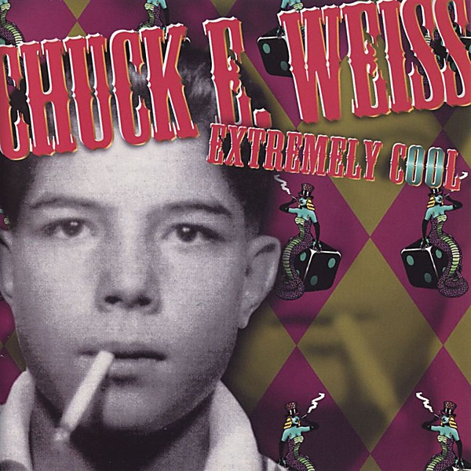

# Extremely Cool

By **Chuck E. Weiss**

## Album Data

- **Catalog:** Beets
- **Format:** Digital, Album
- **Album:** Extremely Cool
- **Artist:** Chuck E. Weiss
- **Albumartist:** Chuck E. Weiss
- **Genre:** Blues
- **MusicBrainz Album Artist ID:** [afd7c687-be28-44c2-a003-3fe698fa88eb](https://musicbrainz.org/artist/afd7c687-be28-44c2-a003-3fe698fa88eb)
- **MusicBrainz Album ID:** [9561c6bb-fd65-46fe-9365-2bad8360593e](https://musicbrainz.org/release/9561c6bb-fd65-46fe-9365-2bad8360593e)
- **MusicBrainz Release Group ID:** [5ba264d8-0cdc-36e7-954a-60a6300eb8a7](https://musicbrainz.org/release-group/5ba264d8-0cdc-36e7-954a-60a6300eb8a7)
- **Year:** 1999
- **Catalog #:** SRRCD 41
- **Label:** Rykodisc
- **Total Tracks:** 13

## Album Tracks

### Track 01 - Devil with Blue Suede Shoes

- **Artist:** Chuck E. Weiss
- **Format:** MP3
- **Genre:** Blues
- **Length:** 5:02
- **MusicBrainz Track ID:** [2330b55e-4876-41d9-86ed-ec8da791edf4](https://musicbrainz.org/recording/2330b55e-4876-41d9-86ed-ec8da791edf4)
- **Title:** Devil with Blue Suede Shoes
- **Track:** 01
- **Year:** 1999

### Track 02 - Deeply Sorry

- **Artist:** Chuck E. Weiss
- **Format:** MP3
- **Genre:** Blues
- **Length:** 5:15
- **MusicBrainz Track ID:** [2535cc51-49c5-4c13-a830-6e4ad7e5a2e5](https://musicbrainz.org/recording/2535cc51-49c5-4c13-a830-6e4ad7e5a2e5)
- **Title:** Deeply Sorry
- **Track:** 02
- **Year:** 1999

### Track 03 - Oh Marcy

- **Artist:** Chuck E. Weiss
- **Format:** MP3
- **Genre:** Blues
- **Length:** 2:54
- **MusicBrainz Track ID:** [536c0171-1962-4dfe-a904-32558af36031](https://musicbrainz.org/recording/536c0171-1962-4dfe-a904-32558af36031)
- **Title:** Oh Marcy
- **Track:** 03
- **Year:** 1999

### Track 04 - Pygmy Fund

- **Artist:** Chuck E. Weiss
- **Format:** MP3
- **Genre:** Blues
- **Length:** 3:06
- **MusicBrainz Track ID:** [2a5acc25-68aa-42a2-9e73-407a4cf40614](https://musicbrainz.org/recording/2a5acc25-68aa-42a2-9e73-407a4cf40614)
- **Title:** Pygmy Fund
- **Track:** 04
- **Year:** 1999

### Track 05 - It Rains on Me

- **Artist:** Chuck E. Weiss
- **Format:** MP3
- **Genre:** Blues
- **Length:** 2:34
- **MusicBrainz Track ID:** [3d6ef250-4abd-413e-ae2a-57ba7a3ec8d8](https://musicbrainz.org/recording/3d6ef250-4abd-413e-ae2a-57ba7a3ec8d8)
- **Title:** It Rains on Me
- **Track:** 05
- **Year:** 1999

### Track 06 - Sonny Could Lick all Them Cats

- **Artist:** Chuck E. Weiss
- **Format:** MP3
- **Genre:** Blues
- **Length:** 3:32
- **MusicBrainz Track ID:** [ea339206-496b-4c2d-af39-3ac82081770f](https://musicbrainz.org/recording/ea339206-496b-4c2d-af39-3ac82081770f)
- **Title:** Sonny Could Lick all Them Cats
- **Track:** 06
- **Year:** 1999

### Track 07 - Jimmy Would

- **Artist:** Chuck E. Weiss
- **Format:** MP3
- **Genre:** Blues
- **Length:** 2:37
- **MusicBrainz Track ID:** [f82e6f2b-c6a2-4eee-957f-32478f18639e](https://musicbrainz.org/recording/f82e6f2b-c6a2-4eee-957f-32478f18639e)
- **Title:** Jimmy Would
- **Track:** 07
- **Year:** 1999

### Track 08 - Extremely Cool

- **Artist:** Chuck E. Weiss
- **Format:** MP3
- **Genre:** Blues
- **Length:** 4:44
- **MusicBrainz Track ID:** [e62a228b-8853-41f0-a8f6-f7f1c520eadf](https://musicbrainz.org/recording/e62a228b-8853-41f0-a8f6-f7f1c520eadf)
- **Title:** Extremely Cool
- **Track:** 08
- **Year:** 1999

### Track 09 - Just Don't Care

- **Artist:** Chuck E. Weiss
- **Format:** MP3
- **Genre:** Blues
- **Length:** 2:37
- **MusicBrainz Track ID:** [a048150b-612f-45bc-9f8f-344a09add580](https://musicbrainz.org/recording/a048150b-612f-45bc-9f8f-344a09add580)
- **Title:** Just Don't Care
- **Track:** 09
- **Year:** 1999

### Track 10 - Roll on Jordan

- **Artist:** Chuck E. Weiss
- **Format:** MP3
- **Genre:** Blues
- **Length:** 2:15
- **MusicBrainz Track ID:** [d4baff4e-0aa0-49d4-a964-ffd57a124d16](https://musicbrainz.org/recording/d4baff4e-0aa0-49d4-a964-ffd57a124d16)
- **Title:** Roll on Jordan
- **Track:** 10
- **Year:** 1999

### Track 11 - Do You Know What I Idi Amin

- **Artist:** Chuck E. Weiss
- **Format:** MP3
- **Genre:** Blues
- **Length:** 5:35
- **MusicBrainz Track ID:** [dc02c904-348b-4a87-a3a4-668cd47b26e6](https://musicbrainz.org/recording/dc02c904-348b-4a87-a3a4-668cd47b26e6)
- **Title:** Do You Know What I Idi Amin
- **Track:** 11
- **Year:** 1999

### Track 12 - Horseface

- **Artist:** Chuck E. Weiss
- **Format:** MP3
- **Genre:** Jazz
- **Length:** 3:06
- **MusicBrainz Track ID:** [f069a581-0e32-4b3a-974e-3a80da545729](https://musicbrainz.org/recording/f069a581-0e32-4b3a-974e-3a80da545729)
- **Title:** Horseface
- **Track:** 12
- **Year:** 1999

### Track 13 - Rocking in the Kibbitz Room

- **Artist:** Chuck E. Weiss
- **Format:** MP3
- **Genre:** Blues
- **Length:** 3:36
- **MusicBrainz Track ID:** [7f6b29ae-8c44-4350-b110-9948a18935be](https://musicbrainz.org/recording/7f6b29ae-8c44-4350-b110-9948a18935be)
- **Title:** Rocking in the Kibbitz Room
- **Track:** 13
- **Year:** 1999

