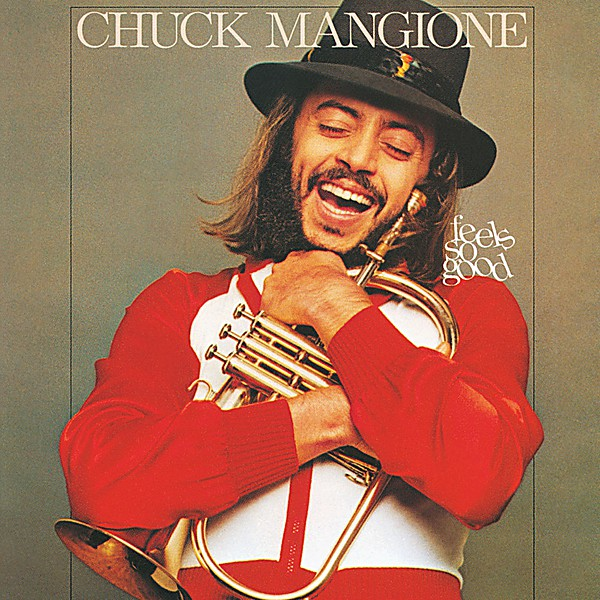

# Feels So Good

By **Chuck Mangione**

## Album Data

- **Catalog:** Beets
- **Format:** Digital, Album
- **Album:** Feels So Good
- **Artist:** Chuck Mangione
- **Albumartist:** Chuck Mangione
- **Genre:** Smooth Jazz
- **MusicBrainz Album Artist ID:** 
- **MusicBrainz Album ID:** 
- **MusicBrainz Release Group ID:** 
- **Year:** 1977
- **Catalog #:** 
- **Label:** Universal Distribution
- **Total Tracks:** 00

## Album Tracks

### Track 01 - Theme From ''Side Street''

- **Artist:** Chuck Mangione
- **Format:** MP3
- **Genre:** Jazz Fusion
- **Length:** 2:05
- **MusicBrainz Track ID:** 
- **Title:** Theme From ''Side Street''
- **Track:** 01
- **Year:** 1977

