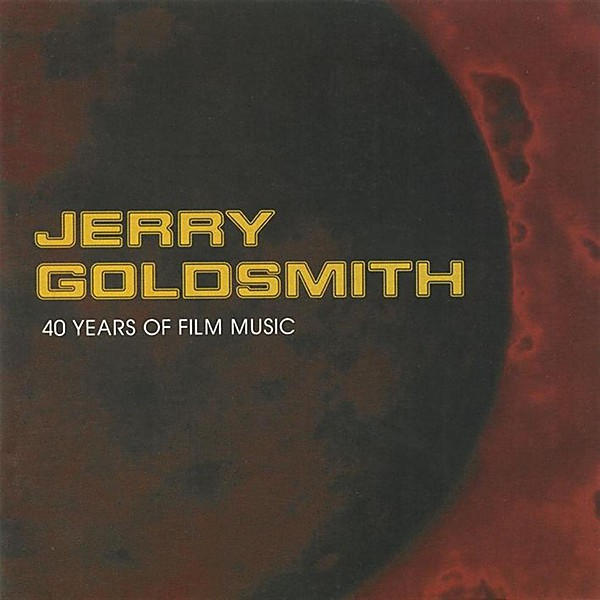

# Gremlins 2

By **City Of Prague Philharmonic**

## Album Data

- **Catalog:** Beets
- **Format:** Digital, Album
- **Album:** Gremlins 2
- **Artist:** City Of Prague Philharmonic
- **Albumartist:** City Of Prague Philharmonic
- **Genre:** Orchestral
- **MusicBrainz Album Artist ID:** 
- **MusicBrainz Album ID:** 
- **MusicBrainz Release Group ID:** 
- **Year:** 1994
- **Catalog #:** 
- **Label:** Silva America
- **Total Tracks:** 20

## Album Tracks

### Track 00 - The Philadelphia Experiment - Main Title

- **Artist:** City Of Prague Philharmonic
- **Format:** MP3
- **Genre:** Orchestral
- **Length:** 3:00
- **MusicBrainz Track ID:** 
- **Title:** The Philadelphia Experiment - Main Title
- **Track:** 00
- **Year:** 1994

## See also

- [Battle for the Planet of the Apes](Battle_for_the_Planet_of_the_Apes.md)
- [FMad Max 2](FMad_Max_2.md)
- [The Philadelphia Experiment](The_Philadelphia_Experiment.md)
