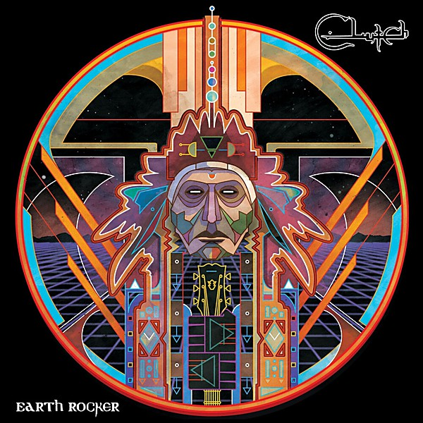

# Earth Rocker

By **Clutch**

## Album Data

- **Catalog:** Beets
- **Format:** Digital, Album
- **Album:** Earth Rocker
- **Artist:** Clutch
- **Albumartist:** Clutch
- **Genre:** Stoner Rock
- **MusicBrainz Album Artist ID:** [0cdb0359-5698-487d-9aae-a25fb4dcdc4d](https://musicbrainz.org/artist/0cdb0359-5698-487d-9aae-a25fb4dcdc4d)
- **MusicBrainz Album ID:** [e7b17e8c-e393-46ee-a4cb-25f5579b1eca](https://musicbrainz.org/release/e7b17e8c-e393-46ee-a4cb-25f5579b1eca)
- **MusicBrainz Release Group ID:** [441ec78e-a844-4858-8b30-45fa54a6c873](https://musicbrainz.org/release-group/441ec78e-a844-4858-8b30-45fa54a6c873)
- **Year:** 2013
- **Catalog #:** WM027
- **Label:** Weathermaker Music
- **Total Tracks:** 11

## Album Tracks

### Track 01 - Earth Rocker

- **Artist:** Clutch
- **Format:** AAC
- **Genre:** Stoner Rock
- **Length:** 3:31
- **MusicBrainz Track ID:** [d6f4f0ad-13b4-4a91-a5f4-92ba59ddf414](https://musicbrainz.org/recording/d6f4f0ad-13b4-4a91-a5f4-92ba59ddf414)
- **Title:** Earth Rocker
- **Track:** 01
- **Year:** 2013

### Track 02 - Crucial Velocity

- **Artist:** Clutch
- **Format:** AAC
- **Genre:** Stoner Rock
- **Length:** 4:00
- **MusicBrainz Track ID:** [5f615b14-c264-4e07-b4c0-da90182b05aa](https://musicbrainz.org/recording/5f615b14-c264-4e07-b4c0-da90182b05aa)
- **Title:** Crucial Velocity
- **Track:** 02
- **Year:** 2013

### Track 03 - Mr. Freedom

- **Artist:** Clutch
- **Format:** AAC
- **Genre:** Alternative Metal
- **Length:** 2:43
- **MusicBrainz Track ID:** [6a42f618-73cf-480a-bb45-3b1ee14aa527](https://musicbrainz.org/recording/6a42f618-73cf-480a-bb45-3b1ee14aa527)
- **Title:** Mr. Freedom
- **Track:** 03
- **Year:** 2013

### Track 04 - D.C. Sound Attack!

- **Artist:** Clutch
- **Format:** AAC
- **Genre:** Stoner Rock
- **Length:** 4:37
- **MusicBrainz Track ID:** [4b576b2e-835e-44c4-a16a-c4014e7cd34e](https://musicbrainz.org/recording/4b576b2e-835e-44c4-a16a-c4014e7cd34e)
- **Title:** D.C. Sound Attack!
- **Track:** 04
- **Year:** 2013

### Track 05 - Unto the Breach

- **Artist:** Clutch
- **Format:** AAC
- **Genre:** Blues
- **Length:** 3:31
- **MusicBrainz Track ID:** [93f836cd-4339-4c63-a51a-5acfc256b1d8](https://musicbrainz.org/recording/93f836cd-4339-4c63-a51a-5acfc256b1d8)
- **Title:** Unto the Breach
- **Track:** 05
- **Year:** 2013

### Track 06 - Gone Cold

- **Artist:** Clutch
- **Format:** AAC
- **Genre:** Stoner Rock
- **Length:** 4:21
- **MusicBrainz Track ID:** [53140fb9-7143-4d66-b8fb-20c8609a63b3](https://musicbrainz.org/recording/53140fb9-7143-4d66-b8fb-20c8609a63b3)
- **Title:** Gone Cold
- **Track:** 06
- **Year:** 2013

### Track 07 - The Face

- **Artist:** Clutch
- **Format:** AAC
- **Genre:** Stoner Rock
- **Length:** 4:22
- **MusicBrainz Track ID:** [e969c1c7-2f8d-4a91-b366-9446ff1ea4bc](https://musicbrainz.org/recording/e969c1c7-2f8d-4a91-b366-9446ff1ea4bc)
- **Title:** The Face
- **Track:** 07
- **Year:** 2013

### Track 08 - Book, Saddle, & Go

- **Artist:** Clutch
- **Format:** AAC
- **Genre:** Stoner Rock
- **Length:** 3:44
- **MusicBrainz Track ID:** [0dc6b666-29ff-428e-8e76-eb79b45167a0](https://musicbrainz.org/recording/0dc6b666-29ff-428e-8e76-eb79b45167a0)
- **Title:** Book, Saddle, & Go
- **Track:** 08
- **Year:** 2013

### Track 09 - Cyborg Bette

- **Artist:** Clutch
- **Format:** AAC
- **Genre:** Stoner Rock
- **Length:** 3:14
- **MusicBrainz Track ID:** [8ba4a25f-c7cf-4f1d-9c7e-c3d1a27bad2f](https://musicbrainz.org/recording/8ba4a25f-c7cf-4f1d-9c7e-c3d1a27bad2f)
- **Title:** Cyborg Bette
- **Track:** 09
- **Year:** 2013

### Track 10 - Oh, Isabella

- **Artist:** Clutch
- **Format:** AAC
- **Genre:** Stoner Rock
- **Length:** 5:17
- **MusicBrainz Track ID:** [d73d6e6f-ebad-42e4-9593-f053d4067990](https://musicbrainz.org/recording/d73d6e6f-ebad-42e4-9593-f053d4067990)
- **Title:** Oh, Isabella
- **Track:** 10
- **Year:** 2013

### Track 11 - The Wolf Man Kindly Requests...

- **Artist:** Clutch
- **Format:** AAC
- **Genre:** Stoner Rock
- **Length:** 5:02
- **MusicBrainz Track ID:** [17453bf8-687a-4929-8bec-716dc0a3e22e](https://musicbrainz.org/recording/17453bf8-687a-4929-8bec-716dc0a3e22e)
- **Title:** The Wolf Man Kindly Requests...
- **Track:** 11
- **Year:** 2013

